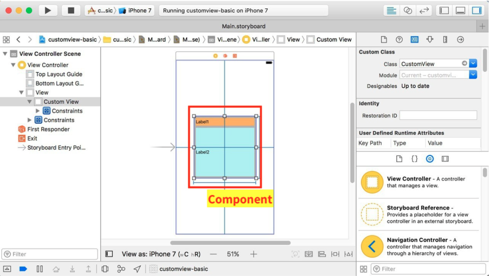
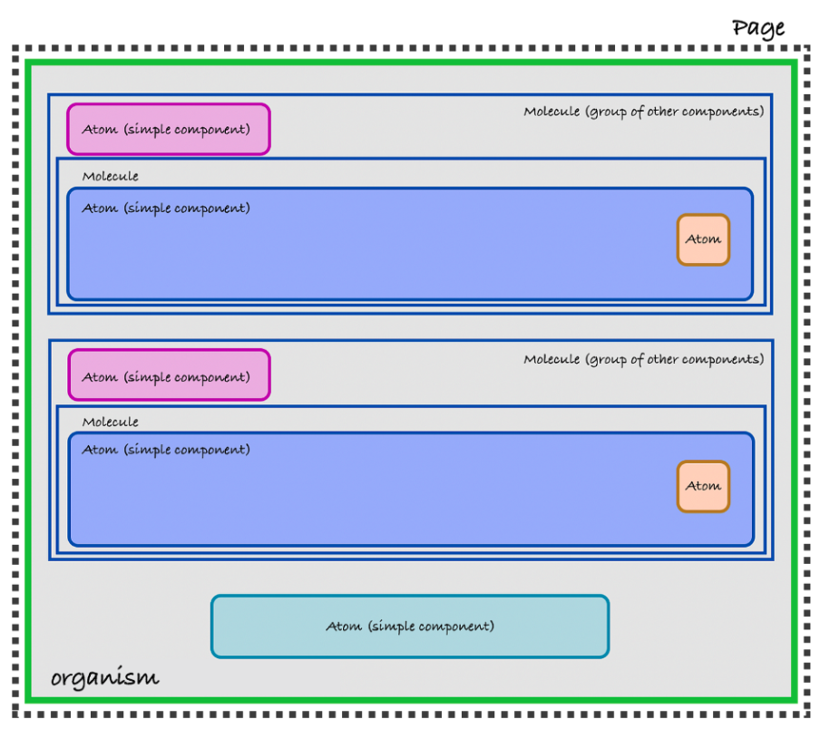

## Tổng Quan

### iOS

- Các phần tử giao diện người dùng trong `ViewController` được coi là các đơn vị.
- Việc tạo tệp Xib và tệp Swift của các thành phần được thực hiện thủ công.
- Ví dụ về các thành phần: `UIView` tuỳ chỉnh, v.v.
- Nếu các phần tử giao diện người dùng trong một thành phần cần được tạo bằng mã, sử dụng SS để tạo mã.
  - Ví dụ: Gradient phức tạp

### Android

- Xử lý tệp XML bố cục và Fragment tương ứng như các đơn vị tương đương với Organisms và bên dưới trong Thiết Kế Nguyên Tử.
- Cả XML bố cục và Fragments đều được tạo thủ công (không cần công cụ SS).
- Nếu các phần tử giao diện người dùng trong một thành phần cần được tạo bằng mã, sử dụng SS để tạo mã.
  - Ví dụ: Gradient phức tạp

**Lưu Ý:** Các chuyển đổi điều hướng được biểu diễn bởi `nav_graph.xml` nên được tạo thủ công.
