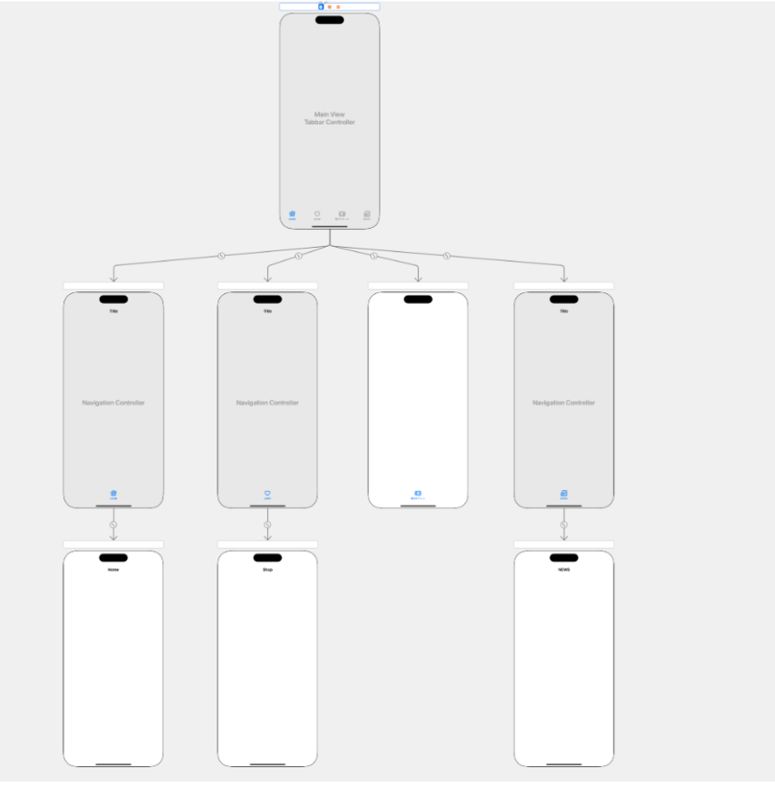

## Tổng Quan

### iOS

- Mỗi `ViewController` được coi như một đơn vị của một trang.
- Việc tạo tệp Xib và tệp Swift của `ViewController` được thực hiện thủ công (không cần công cụ SS).

### Android

- Tệp XML bố cục tương đương với một trang (khái niệm cao nhất trong Thiết Kế Nguyên Tử) và Fragment tương ứng được coi là các đơn vị.
- Mỗi trang hoạt động như một container cho các thành phần dưới cấp độ Organism.
- Cả việc tạo XML bố cục và Fragment đều được thực hiện thủ công (không cần công cụ SS).
