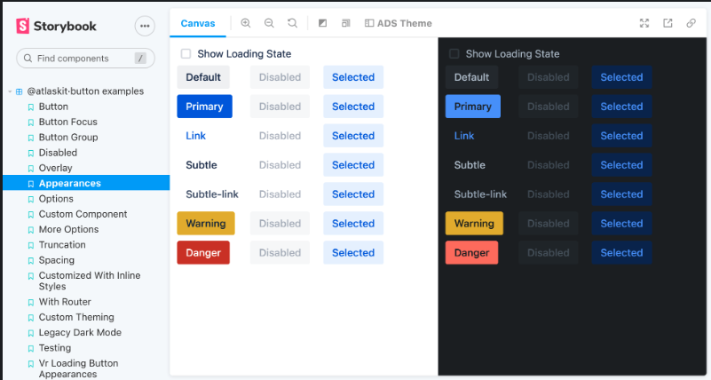
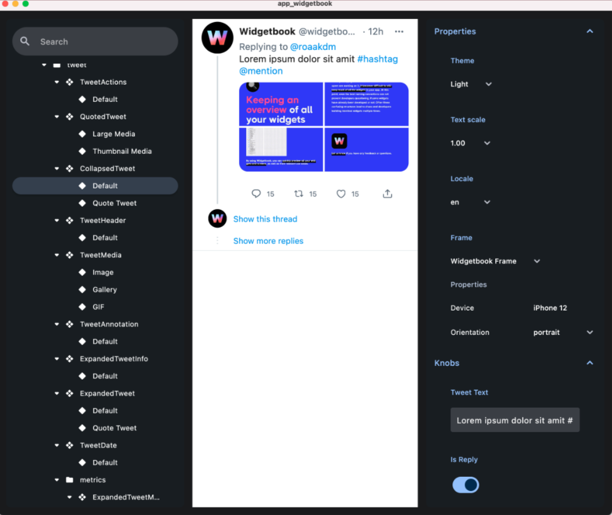

## Tổng Quan

Thư viện thành phần giao diện người dùng là một tập hợp các phần tử giao diện có thể tái sử dụng, có thể được chia sẻ qua nhiều dự án, đơn giản hóa quá trình thiết kế và đảm bảo trải nghiệm người dùng nhất quán.

## Mục Tiêu

- Tạo một kho lưu trữ tập trung các thành phần giao diện người dùng.
- Nâng cao sự nhất quán của giao diện người dùng trên các ứng dụng khác nhau.
- Tăng tốc quá trình thiết kế và phát triển.

## Điểm Quan Trọng

- **Nếu có một thư viện thành phần giao diện người dùng đã tồn tại trong dự án, hãy tái sử dụng để duy trì tính nhất quán và hiệu quả.**
- Thiết kế các thành phần để có thể tái sử dụng và điều chỉnh.
- Đảm bảo tài liệu đầy đủ cho mỗi thành phần.
- Tích hợp thư viện thành phần một cách liền mạch với các công cụ phát triển.

## Mã Mẫu

**Lưu Ý: Các ví dụ được cung cấp chỉ nhằm mục đích định dạng. Hãy điều chỉnh chúng để tạo thư viện thành phần giao diện người dùng của riêng bạn.**

### Storybook Cho Web

Storybook là một môi trường phát triển tương tác cho các thành phần giao diện người dùng. Nó cho phép các nhà phát triển duyệt qua thư viện thành phần, xem các trạng thái khác nhau của mỗi thành phần và phát triển, kiểm thử chúng một cách tương tác.



Để thiết lập và sử dụng Storybook:

1. Cài đặt Storybook trong dự án của bạn.
2. Tạo stories cho các thành phần của bạn.
3. Chạy Storybook để xem và kiểm thử các thành phần tương tác.

```bash
// Cài đặt Storybook
npx sb init

// Chạy Storybook
npm run storybook
```

### Widgetbook Cho Di Động

Widgetbook được sử dụng để tổ chức và kiểm thử các widget Flutter một cách có thể phản hồi. Nó giúp các nhà phát triển và thiết kế hợp tác hiệu quả.



Để tích hợp Widgetbook:

1. Thêm `widgetbook` làm phụ thuộc trong tệp `pubspec.yaml`.
2. Định nghĩa các widget và thuộc tính của chúng.
3. Chạy Widgetbook để kiểm thử các widget trên nhiều kích thước màn hình và nền tảng.

```yaml
dependencies:
  widgetbook: latest_version
```

Sử dụng các frameworks này để xây dựng và duy trì thư viện thành phần giao diện người dùng của bạn, nâng cao quy trình phát triển và sự nhất quán giao diện trên các dự án.
