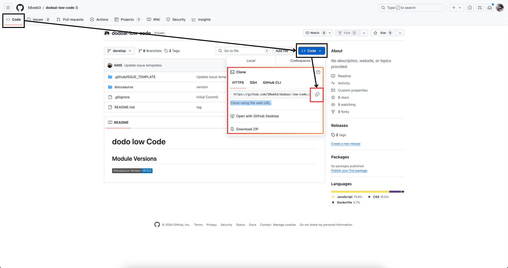
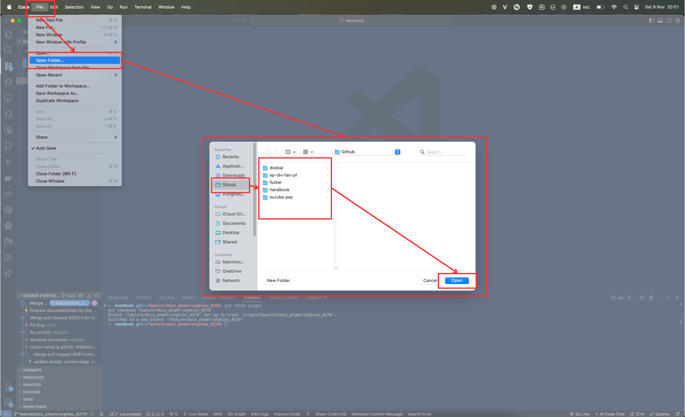
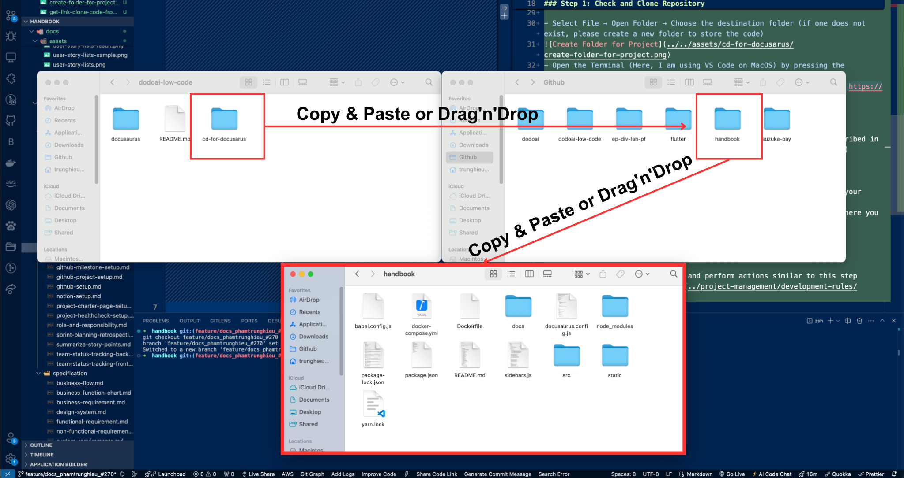
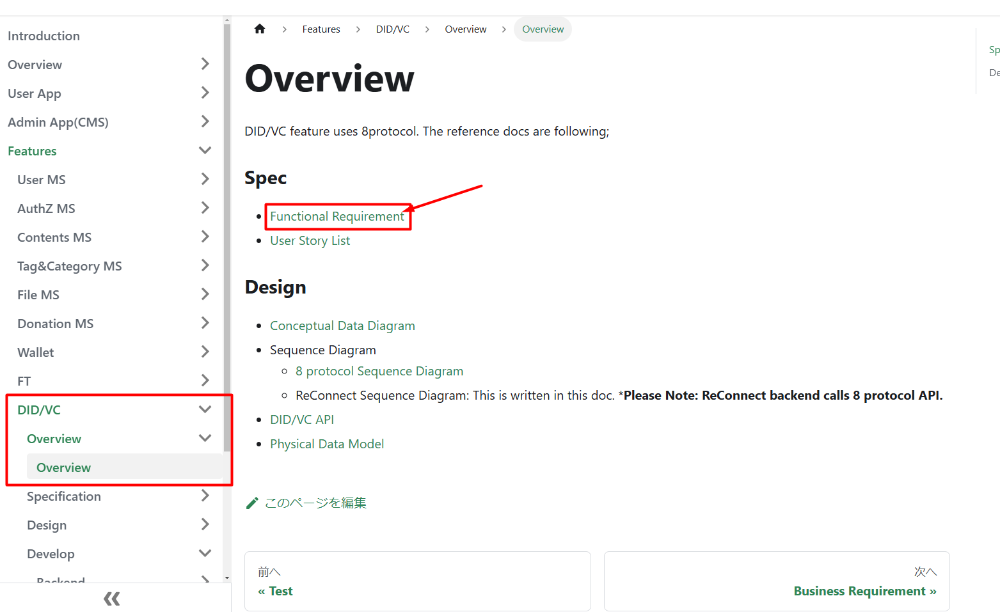
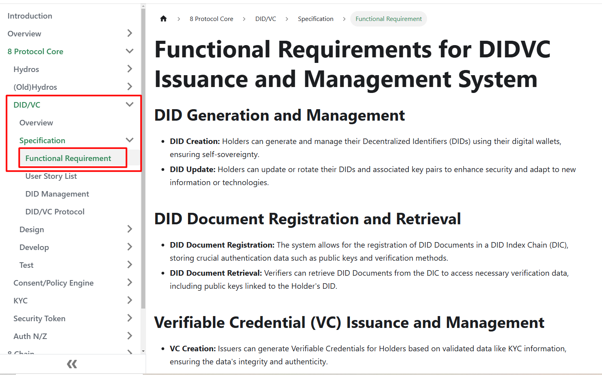

## Tổng Quan

Để tạo điều kiện thuận lợi cho việc thiết lập Triển Khai Liên Tục (CD) cho tài liệu dự án, `CD cho Docusaurus` đã được cấu hình sẵn trong dự án `dodoAI-low-code` để sử dụng ngay mà không cần cài đặt, qua đó đẩy nhanh tiến độ làm việc và thời gian của dự án, đồng thời giảm thiểu sự cố có thể xảy ra trong quá trình thiết lập CD trong tương lai.

## Thông Tin Cần Thiết

- Đảm bảo rằng bạn có quyền truy cập cần thiết vào các kho lưu trữ.
- Xác minh rằng kho lưu trữ dự án được liên kết với dự án GitHub tương ứng.
- Nhận biết rằng một kho lưu trữ có thể chứa nhiều dự án GitHub, mỗi dự án phục vụ một chức năng khác nhau.

## Cách Thực Hiện Thiết Lập Đơn Giản `CD Cho Docusaurus`

### Bước 1: Kiểm Tra Và Clone Kho Lưu Trữ

1.1. Truy cập vào liên kết [CD cho Docusaurus](https://github.com/58web3/dodoai-low-code/tree/develop/cd-for-docusarus) để xác định xem `CD cho Docusaurus` đã tồn tại chưa.

1.2. Điều hướng đến kho lưu trữ bằng liên kết này [kho lưu trữ dodoAI Low Code](https://github.com/58web3/dodoai-low-code/); chọn **Code** và sau đó sao chép liên kết HTTPS (clone bằng URL web).



1.3. Quay lại Môi Trường Phát Triển Tích Hợp (IDE) của bạn.

1.4. Mở terminal và thực hiện lệnh sau để clone kho lưu trữ (ở đây, tôi đang sử dụng VS Code trên macOS) bằng cách nhấn tổ hợp phím tắt

```markdown
Shift Control `
```

- Chọn File → Open Folder. Chọn thư mục đích (nếu không tồn tại, vui lòng tạo mới thư mục để lưu mã).
  
- Thực thi lệnh để clone mã từ kho lưu trữ:

```markdown
git clone https://github.com/58web3/dodoai-low-code.git
```

### Bước 2: Clone Kho Lưu Trữ Bản Làm Việc Của Bạn

2.1. Clone mã từ kho lưu trữ bạn đang làm việc bằng phương pháp mô tả trong *[Bước 1: Kiểm Tra Và Clone Kho Lưu Trữ](#step-1-check-and-clone-repository)*.

### Bước 3: Sao Chép Cấu Hình CD

3.1. Mở thư mục `dodoai-low-code` bạn vừa clone, trong Finder hoặc trên máy tính của bạn (Windows).

3.2. Sao chép phần `cd-for-docusarus` và dán vào thư mục nơi bạn đã clone mã trong *[Bước 2: Clone Kho Lưu Trữ Bản Làm Việc Của Bạn](#step-2-clone-your-working-repository)*.
   

### Bước 4: Hoàn Tất Thiết Lập Trong IDE

4.1. Quay lại VS Code (IDE) của bạn và thực hiện các hành động tương tự như trong bước này: [Quy Trình Yêu Cầu Kéo Tài Liệu](../project-management/development-rules/documenting-pr-procedure.md)

### ***Lưu Ý Đặc Biệt*** : Khi Tài Liệu Hóa Một Tính Năng Đã Có Từ Dự Án Khác

- Thêm một file tổng quan dưới tính năng đó.
- Trong file tổng quan, bao gồm các liên kết đến tài liệu Docusaurus của dự án gốc.

***Ví Dụ*** :
Nếu tính năng DID/VC đã được sử dụng trong Dự Án A, thì khi tạo tư liệu cho DID/VC trong Dự Án B, chỉ cần thêm các liên kết đến tài liệu DID/VC đã tồn tại từ Dự Án A trong file tổng quan của DID/VC trong Dự Án B.



