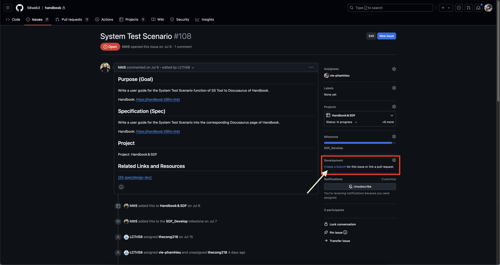

## Mục Đích

Mục đích của tài liệu này là cung cấp hướng dẫn chi tiết để tạo Yêu Cầu Kéo (PR) trên GitHub. Điều này đảm bảo rằng các nhà phát triển tuân theo một quy trình nhất quán cho việc thay đổi mã, cải thiện sự hợp tác và chất lượng mã.

## Quy Trình Yêu Cầu Kéo

### Giới Thiệu

Phần này trình bày các bước chi tiết để tạo Yêu Cầu Kéo (PR) trên GitHub. Nó bao gồm các lệnh Git cần thiết và yêu cầu PR để đảm bảo một quy trình làm việc trơn tru.

### Các Bước Tạo Yêu Cầu Kéo

1. **Cập Nhật Mã Nguồn**:
   - Đảm bảo kho lưu trữ địa phương của bạn được cập nhật với nhánh chính:

     ```sh
     git checkout develop
     git pull origin develop
     ```

2. **Tạo Nhánh Mới (Sử Dụng Màn Hình Vấn Đề)**:
   - Điều hướng đến màn hình vấn đề của kho lưu trữ GitHub của bạn.
   - Sử dụng chức năng có sẵn để tạo một nhánh trực tiếp từ vấn đề. Điều này đảm bảo liên kết theo ngữ cảnh mà không bị rò rỉ.

     

   - Ngoài ra, bạn có thể tạo một nhánh sử dụng dòng lệnh nếu quy trình làm việc của bạn không hỗ trợ trực tiếp.

     ```sh
     git checkout -b <branch-name>
     ```

   - **Lưu ý:** Không khuyến khích sử dụng `git checkout -b <branch-name>` do nguy cơ rò rỉ liên kết tới Vấn Đề. Thay vào đó, tốt hơn là tạo một nhánh trực tiếp từ Màn Hình Vấn Đề và sau đó kiểm tra Vấn Đề.

3. **Thực Hiện Thay Đổi Và Cam Kết**:
   - Thêm tất cả các tệp đã sửa đổi vào khu vực chuẩn bị:

     ```sh
     git add .
     ```

   - Hoặc thêm các tệp cụ thể nếu cần:

     ```sh
     git add <file>
     ```

   - Cam kết thay đổi của bạn với một thông điệp mô tả:

     ```sh
     git commit -m "Miêu tả thay đổi của bạn"
     ```

4. **Đẩy Nhánh Lên GitHub**:
   - Đẩy nhánh của bạn đến kho lưu trữ điều khiển:

     ```sh
     git push origin <branch-name>
     ```

   - **Đẩy Lực (Tuỳ Chọn)**: Nếu cần ghi đè nhánh điều khiển với thay đổi địa phương của bạn, sử dụng:

     ```sh
     git push origin <branch-name> -f
     ```

   - **`-f` (force)**: Tuỳ chọn này ép buộc đẩy ngay cả khi nó dẫn đến hợp nhất không nhanh với nhánh điều khiển. Sử dụng cẩn thận vì nó có thể ghi đè thay đổi của người khác.

5. **Tạo Yêu Cầu Kéo**:
   - Đi tới trang kho lưu trữ GitHub của bạn.
   - Chọn nhánh của bạn và tạo Yêu Cầu Kéo mới từ nhánh của bạn.
   - Điền tiêu đề và mô tả PR.
   - Chọn người đánh giá và gửi PR.

### Yêu Cầu Và Hướng Dẫn PR

- **Tiêu Đề PR**: Đảm bảo tiêu đề mô tả và tóm tắt mục đích của PR.
- **Mô Tả PR**: Bao gồm một mô tả rõ ràng về những thay đổi đã thực hiện và bất kỳ thông tin liên quan đến việc xem xét.
- **Quy Trình Đánh Giá**: Cho phép thời gian để các thành viên nhóm xem xét và cung cấp phản hồi. Giải quyết bất kỳ nhận xét hoặc thay đổi cần thiết nào.

## Xem Xét Và Phê Duyệt

- Xem xét tài liệu để đảm bảo tất cả thông tin đã đầy đủ và rõ ràng.
- Yêu cầu phản hồi từ các thành viên trong nhóm để xác thực tính chính xác và sự hữu ích của tài liệu.

## Xuất Bản

- Xuất bản tài liệu lên kho lưu trữ GitHub của bạn hoặc nền tảng tài liệu nội bộ.

## Liên Kết Và Tài Nguyên Liên Quan

- [Tài Liệu Yêu Cầu Kéo Của GitHub](https://docs.github.com/en/pull-requests)
- [Tham Chiếu Lệnh Git](https://git-scm.com/docs)
