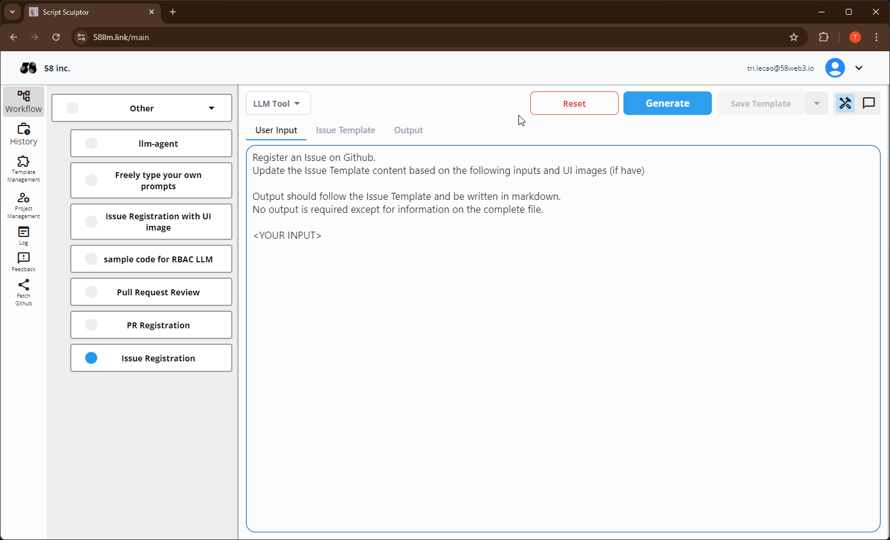

Tài liệu này phác thảo quy trình đăng ký vấn đề trên GitHub và chi tiết thông tin cần thiết cho mỗi nhiệm vụ.

## Mục Đích

Hướng dẫn được cung cấp ở đây đảm bảo rằng mỗi vấn đề đăng ký trên GitHub đều rõ ràng và có thể thực hiện được, giúp xử lý một cách hiệu quả.

## Trạng Thái Vấn Đề

- **Todo**  
  Ước tính hoặc chưa sẵn sàng để bắt đầu.
- **In Progress**  
  Đang phát triển hoặc hỗ trợ.
- **In Review**  
  Đang được đồng nghiệp hoặc trưởng nhóm đánh giá.
- **Done**  
  Hoàn thành với một Yêu Cầu Kéo (PR) kèm theo.

**Lưu ý**: Thông thường, các vấn đề sẽ được đóng tự động khi PR liên quan được hợp nhất. Hãy xử lý cài đặt này một cách cẩn thận.

## Quy Tắc

1. **Tiêu Đề Vấn Đề**
   - Cung cấp một tiêu đề ngắn gọn và rõ ràng, phản ánh chính xác nội dung của vấn đề.

2. **Mục Đích (Goal)**
   - Rõ ràng trình bày mục tiêu của vấn đề.
   - Ví dụ: "Mục đích của vấn đề này là sửa lỗi đăng nhập làm giảm trải nghiệm người dùng."

3. **Đặc Tả (Spec)**
   - **Tính Năng Mới**: Liệt kê các yêu cầu chi tiết cho tính năng mới.
   - **Lỗi**: Cung cấp các bước để tái hiện lỗi, hành vi mong đợi và hành vi thực tế.

4. **Dự Án**
   - Chọn dự án liên quan.

5. **Liên Kết Và Tài Nguyên Liên Quan**
   - Bao gồm bất kỳ tài liệu, liên kết, ảnh chụp màn hình, đoạn mã nào liên quan.

6. **Danh Sách Kiểm Tra (nếu cần thiết)**
   - Sử dụng danh sách kiểm tra để liệt kê các bước hoặc nhiệm vụ.
   - Ví dụ:
     - [ ] Tái hiện lỗi
     - [ ] Sửa mã
     - [ ] Viết kiểm thử đơn vị
     - [ ] Thực hiện đánh giá mã

### Sau khi điền đầy đủ các thông tin bên trên, chọn 'Submit new issue' để lưu. Tiến hành thiết lập thông tin vấn đề sau:

1. **Người Được Giao**
   - Chỉ định thành viên xử lý vấn đề.
   - Ví dụ: `@username`

2. **Nhãn**
   - Áp dụng nhãn phù hợp như lỗi, yêu cầu tính năng hoặc tài liệu.
   - Ví dụ: `bug, high priority`

3. **Mốc Thời Gian**
   - Liên kết vấn đề với một cột mốc nếu có thể.

## Tạo Vấn Đề Sử Dụng Công Cụ

Để giảm thiểu nhập liệu thủ công, cân nhắc việc sử dụng các công cụ ghi chú (SS). Đảm bảo rằng hình ảnh được dán đúng cách bằng cách tham khảo hình dưới đây.



[Mẫu trong SS](https://58llm.link/main/restore/28c911c2-4060-45f2-81c0-2609dfbc7c82)

## Mẫu Vấn Đề

### Mẫu Tính Năng Mới

```markdown
# Tiêu Đề Vấn Đề

## Mục Đích (Goal)  
Mục đích của vấn đề này là đạt được [mục tiêu cụ thể].

## Đặc Tả (Spec)
- Yêu cầu:
  1. [Yêu cầu 1]
  2. [Yêu cầu 2]
  3. [Yêu cầu 3]

## Dự Án
- Dự án: [Tên dự án]

## Liên Kết Và Tài Nguyên Liên Quan
- [Tài liệu và liên kết liên quan]

## Danh Sách Kiểm Tra (nếu cần thiết)
- [ ] [Nhiệm vụ 1]
- [ ] [Nhiệm vụ 2]
- [ ] [Nhiệm vụ 3]
```

### Mẫu Lỗi

```markdown
# Tiêu Đề Vấn Đề

## Mục Đích (Goal)  
Mục đích của vấn đề này là đạt được [mục tiêu cụ thể].

## Đặc Tả (Spec)
- Các bước để tái hiện:
  1. [Bước 1]
  2. [Bước 2]
  3. [Bước 3]
- Hành vi mong đợi: [Hành vi mong đợi]
- Hành vi hiện tại: [Hành vi hiện tại]

## Dự Án
- Dự án: [Tên dự án]

## Liên Kết Và Tài Nguyên Liên Quan
- [Tài liệu và liên kết liên quan]

## Danh Sách Kiểm Tra (nếu cần thiết)
- [ ] Tái hiện lỗi
- [ ] Sửa mã
- [ ] Viết kiểm thử đơn vị
- [ ] Thực hiện đánh giá mã
```
