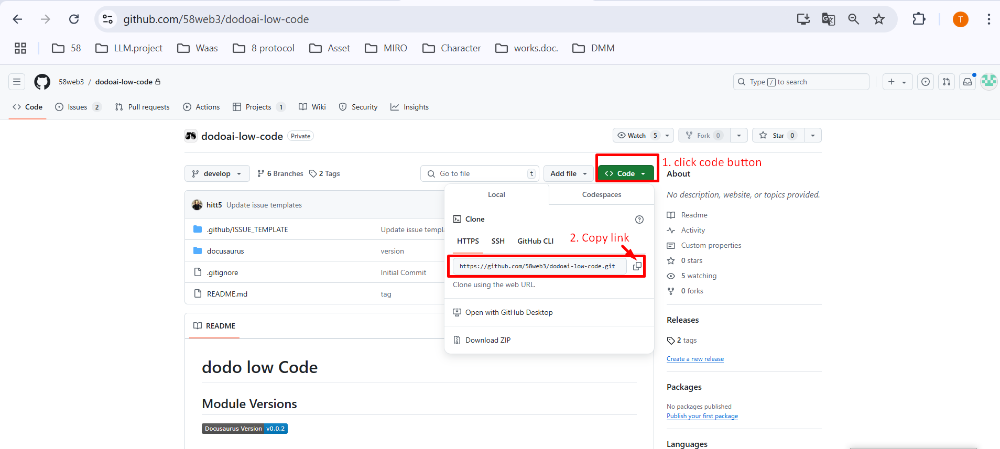
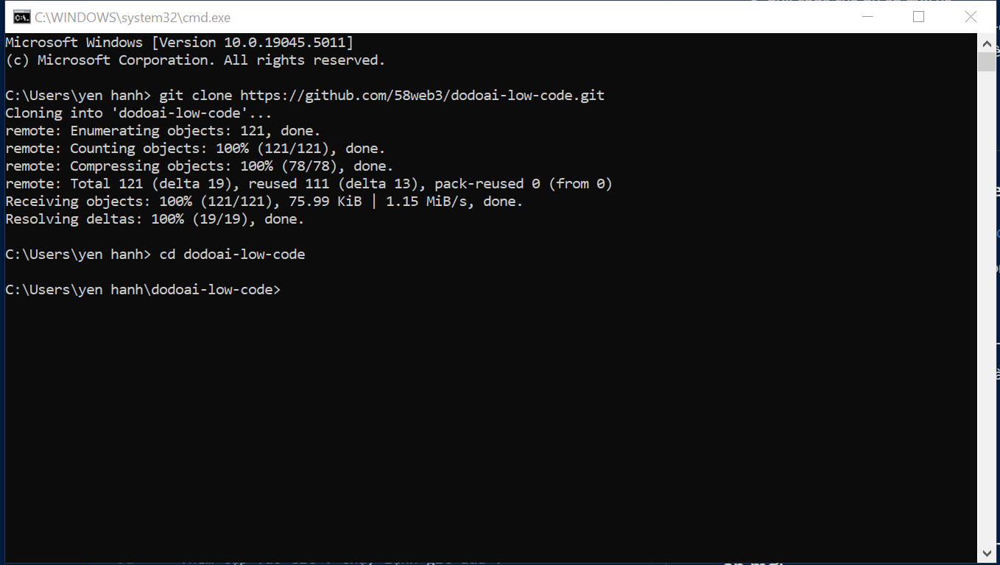
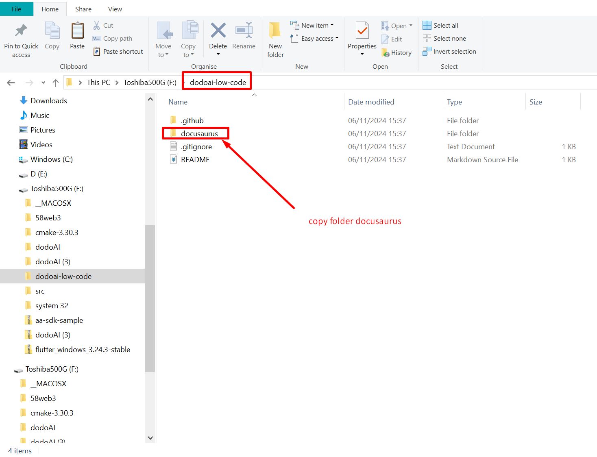
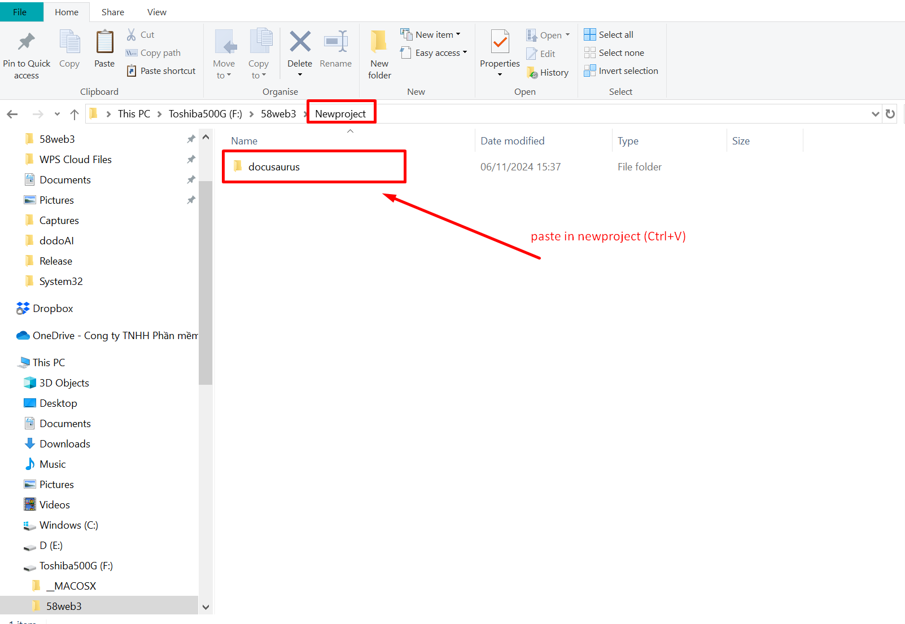

Tại 58, Các Tác Nhân AI hoạt động dựa trên sự hiểu biết chính xác về thiết kế. Do đó, việc quản lý tài liệu từ định nghĩa yêu cầu đến thiết kế ở định dạng có thể đọc bởi máy là vô cùng quan trọng. Quản lý tất cả tài liệu liên quan đến hệ thống cho dự án bằng Markdown sử dụng Docusaurus.

Nếu cần nộp cho khách hàng, xuất Markdown và nộp qua Google Docs hoặc tương tự.

## Tổng Quan

- [Tổng Quan](#tổng-quan)
- [Cách Tạo Docusaurus](#cách-tạo-docusaurus)
  - [1. Kéo mã từ dodoai-low-code về máy cục bộ của bạn](#1-kéo-mã-từ-dodoai-low-code-về-máy-cục-bộ-của-bạn)
  - [2. Kéo mã của dự án mới](#2-kéo-mã-của-dự-án-mới)
  - [3. Sao chép Docusaurus từ dodoai-low-code sang dự án mới](#3-sao-chép-docusaurus-từ-dodoai-low-code-sang-dự-án-mới)
  - [4. Đẩy Docusaurus của dự án mới lên GitHub](#4-đẩy-docusaurus-của-dự-án-mới-lên-github)
  - [5. Tạo PR (Yêu cầu Kéo)](#5-tạo-pr-yêu-cầu-kéo)

## Cách Tạo Docusaurus

### 1. Kéo mã từ dodoai-low-code về máy cục bộ của bạn

- Truy cập vào [***dodoai-low-code***](https://github.com/58web3/dodoai-low-code).
- Sao chép URL của kho lưu trữ.

  

- Mở Terminal hoặc Git Bash.
- Chạy lệnh git clone với URL bạn vừa sao chép: `git clone URL`
- Điều hướng đến thư mục (Thư mục sẽ có cùng tên với kho lưu trữ): `cd project-name`

  

### 2. Kéo mã của dự án mới

Các bước tương tự như trong bước 1 [Kéo mã từ dodoai-low-code về máy cục bộ của bạn](#1-keo-ma-tu-dodoai-low-code-ve-may-cuc-bo-cua-ban).

### 3. Sao chép Docusaurus từ dodoai-low-code sang dự án mới

- Sao chép thư mục docusaurus từ `dodoai-low-code` (Ctrl+C).

  

- Dán thư mục `docusaurus` đã sao chép vào thư mục dự án mới tạo (Ctrl+V).

  

### 4. Đẩy Docusaurus của dự án mới lên GitHub

Mở terminal và chạy các lệnh sau:

- Thêm tệp vào Git: chạy lệnh `git add .`
- Cam kết thay đổi: chạy lệnh `git commit -m "Thông điệp cam kết của bạn"`
- Đẩy mã lên GitHub: chạy lệnh `git push`

### 5. Tạo PR (Yêu cầu Kéo)

- Bắt đầu tạo Yêu cầu Kéo: đi đến tab `Pull requests` và chọn `New pull request`.
- Chọn nhánh chính và nhánh bạn muốn hợp nhất vào.
- Điền thông tin Yêu cầu Kéo: Tiêu đề, Mô tả...
- Gửi Yêu cầu Kéo: nhấp vào `Create pull request` để gửi.
