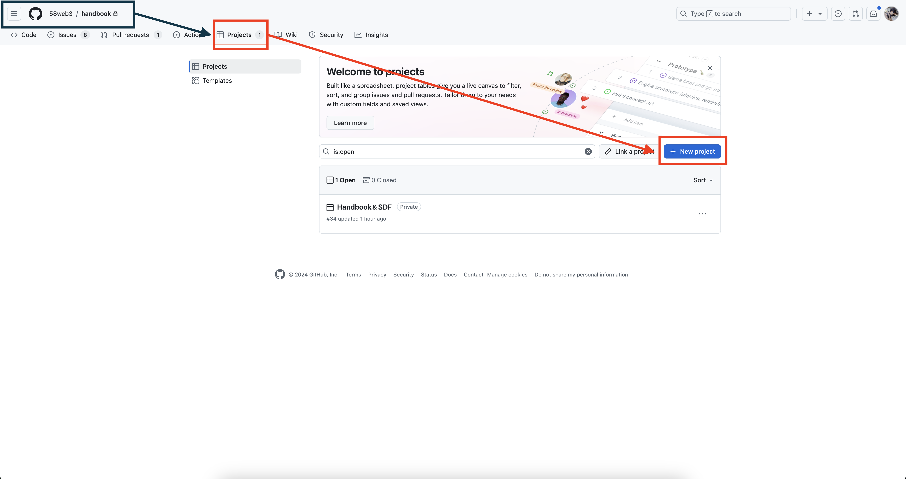
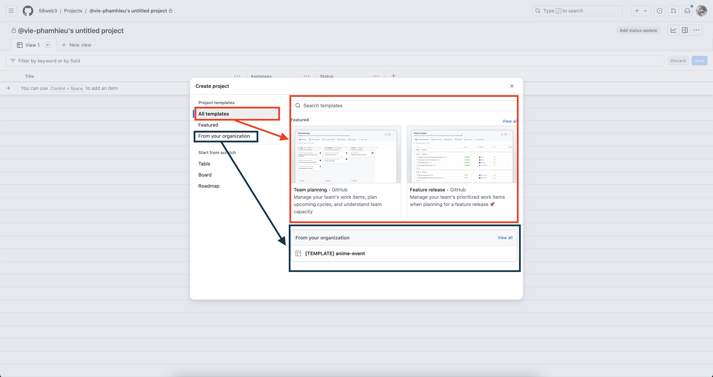
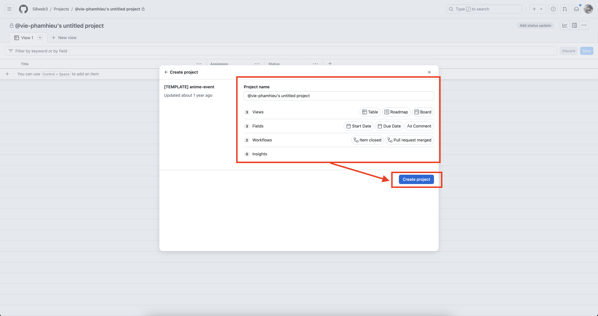
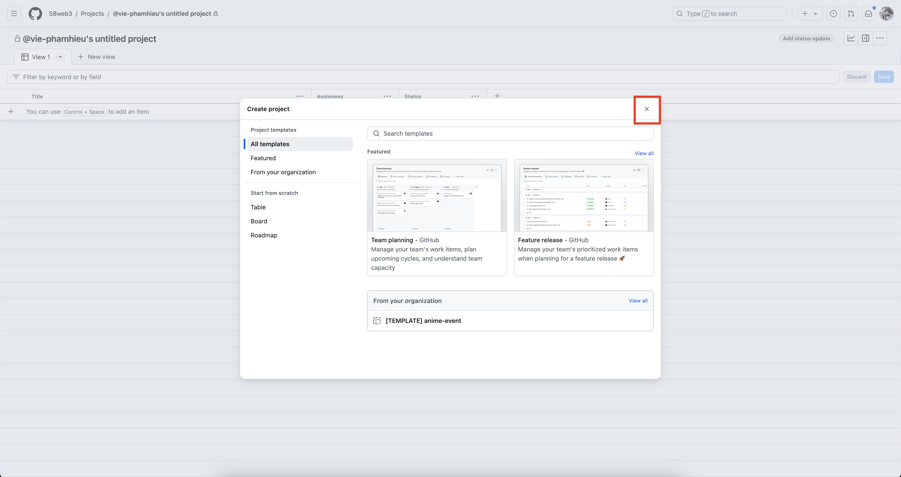
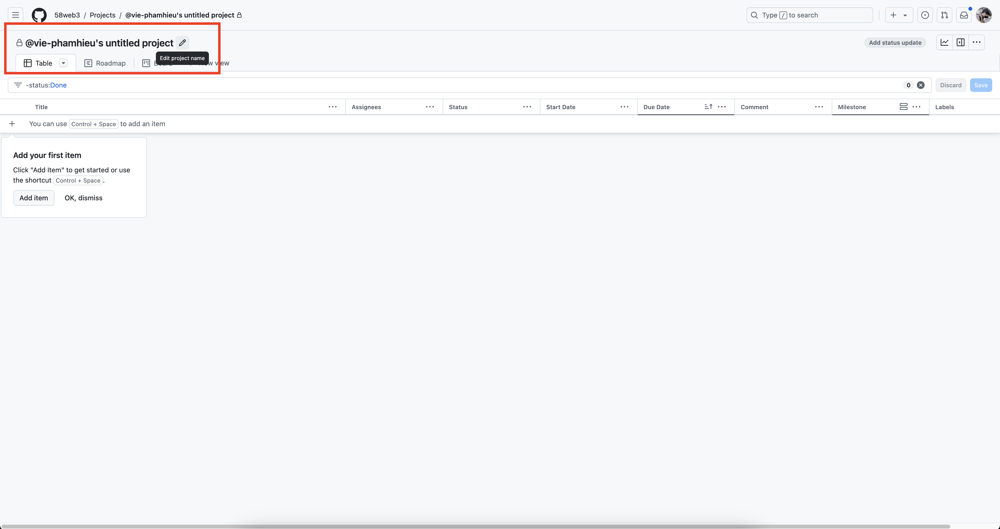
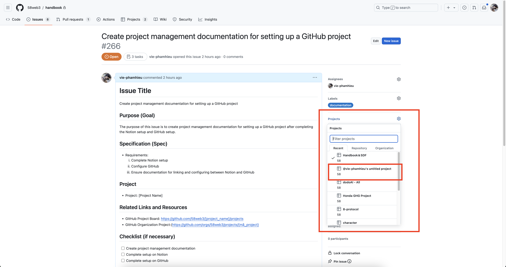
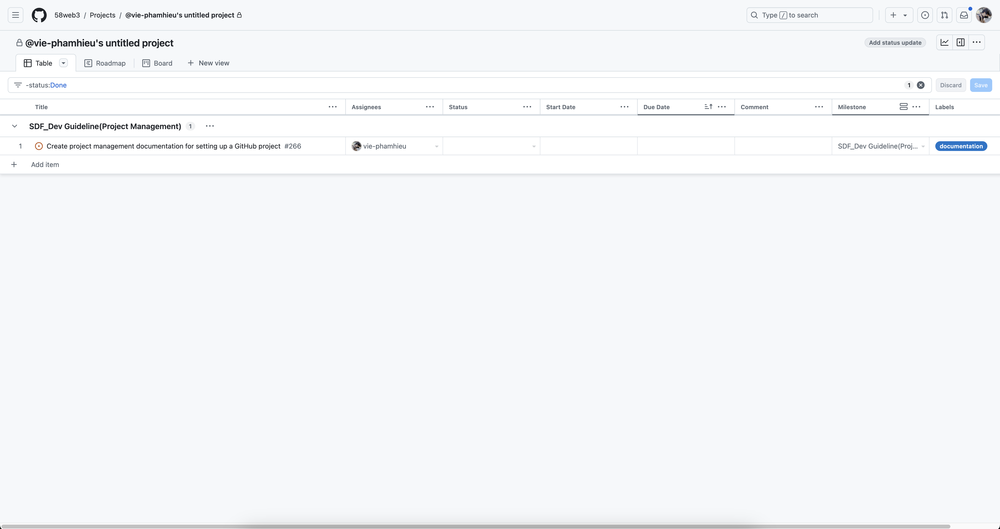

## Tổng Quan

Trước khi bắt đầu với Thiết Lập Dự Án Trên GitHub, điều quan trọng là phải đảm bảo rằng bạn đã hoàn tất thiết lập cho cả GitHub và Notion. Các bước chuẩn bị này rất quan trọng để có sự tích hợp và quy trình làm việc mượt mà.

- [Thiết Lập GitHub](../project-management/github-setup.md)
- [Thiết Lập Notion](../project-management/notion-setup.md)

Khi đã thiết lập ban đầu cho GitHub và Notion, bạn có thể tiến hành cấu hình dự án GitHub của mình. Mục tiêu là tạo ra một môi trường trực quan và thân thiện với người dùng để quản lý tiến độ dự án. Nó cung cấp hỗ trợ mạnh mẽ cho các nhà phát triển, giúp đơn giản hóa việc cập nhật trạng thái công việc của họ. Với một giao diện được thiết kế hiệu quả, mở ra vô số tùy chọn quản lý cho người dùng, nâng cao trải nghiệm quản lý dự án. Các công cụ tích hợp trong GitHub giúp theo dõi lộ trình và tiến trình của dự án không gặp rắc rối, thúc đẩy các đội nhóm tối ưu hóa quy trình phát triển của họ và đạt được mục tiêu với hiệu quả gia tăng.

## Thông Tin Cần Thiết

- Cấu hình cài đặt quyền riêng tư của dự án.
- Liên kết dự án GitHub với kho lưu trữ liên quan.
- Hãy nhớ rằng một kho lưu trữ có thể chứa nhiều dự án GitHub, mỗi dự án có mục đích riêng biệt.

## Cách Thiết Lập Dự Án GitHub

### Bước 1: Khởi Tạo Dự Án Của Bạn

- Bắt đầu bằng cách điều hướng đến phần "Projects" trên kho lưu trữ và nhấp vào "New Project."

  

### Bước 2: Cấu Hình Cài Đặt Dự Án

- Tiếp tục tùy chỉnh cấu trúc dự án của bạn:
  - Bạn có thể bắt đầu với một mẫu tiêu chuẩn hoặc một mẫu được cung cấp bởi tổ chức của bạn.
  
    
  - Nếu bạn sử dụng một mẫu tổ chức, đặt tên cho dự án của bạn một cách hợp lý và sau đó chọn "Create Project." Nếu bạn sử dụng các mẫu mặc định của GitHub, thực hiện quy trình đặt tên tương tự.
    
  - Bỏ qua cửa sổ lựa chọn mẫu nếu bạn không chọn sử dụng một mẫu có sẵn.
    

※ Lưu ý: Bạn có thể thay đổi tên dự án của mình bất kỳ lúc nào, như minh họa dưới đây.

  

### Bước 3: Quản Lý Vấn Đề Và Luồng Phát Triển

- Để tổ chức các vấn đề và phân công nhiệm vụ, liên kết mỗi vấn đề trực tiếp với dự án.

  

- Khi đã được liên kết, các vấn đề sẽ hiển thị trong bảng điều khiển của dự án, đơn giản hóa quy trình theo dõi và quản lý.

  

### Bước 4: Đánh Dấu Cột Mốc

- Tiến hành tạo các Cột Mốc GitHub để duy trì một dòng thời gian rõ ràng cho dự án của bạn. Tham khảo hướng dẫn này cho quy trình chi tiết: [Cột Mốc Trên GitHub](../project-management/github-milestone-setup.md)
