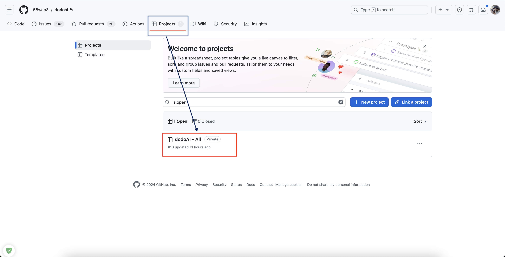
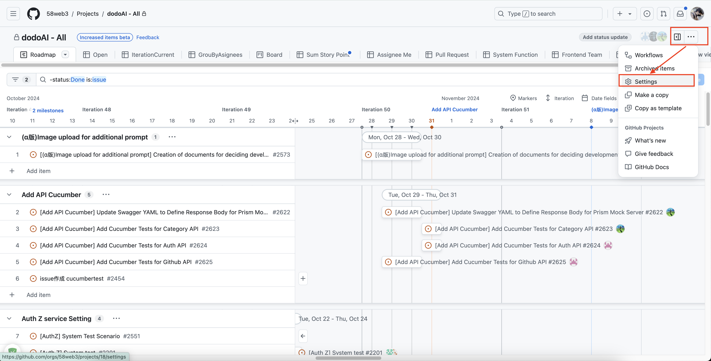
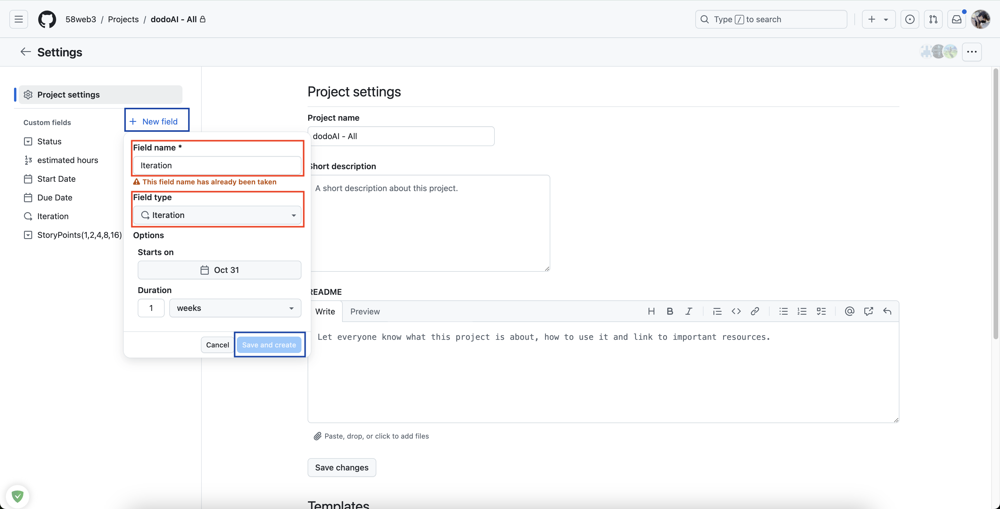
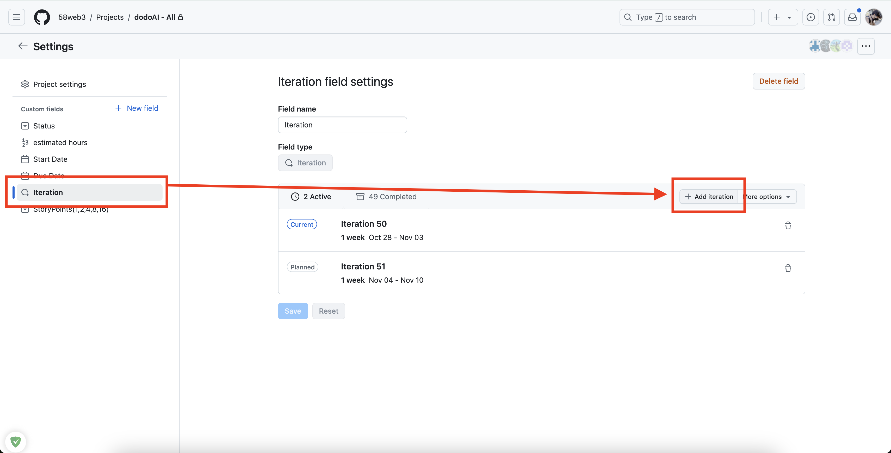
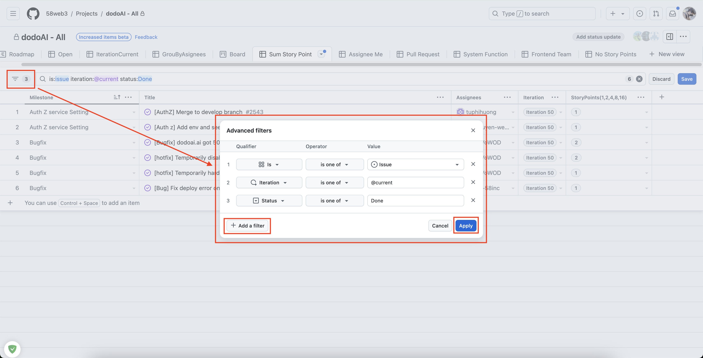

## Tổng Quan

Sau khi hoàn tất đăng ký GitHub, vui lòng thiết lập dự án GitHub của bạn. Bao gồm một biểu đồ Gantt để cung cấp cho các nhà phát triển một cái nhìn rõ ràng, trình bày các lần lặp (đơn vị Scrum) và tổ chức các nhiệm vụ thành các cột mốc để quản lý hiệu quả. Ngoài ra, cài đặt các lần lặp và một tab để quản lý điểm câu chuyện của các nhà phát triển theo từng lần lặp.

## Mục Đích

- Để đo lường hiệu suất cho mỗi dự án.
- Để theo dõi tốc độ phát triển hàng tuần.

## Các Bước Cài Đặt Lần Lặp và Thiết Lập Tab Quản Lý Điểm Câu Chuyện

### Bước 1: Truy Cập Dự Án

- Sử dụng liên kết này để truy cập dự án: [link to project](https://github.com/orgs/58web3/projects/{project_number}).
- Ngoài ra, tham khảo hướng dẫn trong hình dưới đây:

### Bước 2: Cài Đặt Lần Lặp

- Nhấp vào nút "..." ở góc phải phía trên và chọn "Cài đặt."

- Nếu trường "Iteration" thiếu trong "Cài đặt," thêm nó như sau:

1. Nhấp vào "Trường Mới" để mở một cửa sổ pop-up.
2. Trong "Tên Trường," nhập "Lần Lặp" và chọn "Lần Lặp" cho "Loại Trường".
3. Nhấp vào "Lưu" để thêm trường Lần Lặp vào cài đặt.

- Nếu "Iteration" đã tồn tại hoặc được thêm, nhấp vào "Thêm Lần Lặp" để tạo một lần lặp mới.

### Bước 3: Thiết Lập Tabview Tổng Điểm Câu Chuyện

1. Trở lại màn hình dự án và chọn "+ Tab Mới," sau đó chọn tabview để tạo tabview mới.
2. Đặt tên tabview là "Tổng Điểm Câu Chuyện".
3. Sử dụng bộ lọc Nâng Cao để điền chi tiết như trong hình ảnh.

