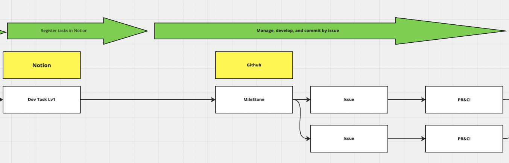

## Đăng Ký Các Mốc Dự Án Trong Notion

Tạo một Teamspace trong Notion cho mỗi dự án. Để bảo mật, hãy đặt Teamspace là Teamspace Riêng Tư. Các nhiệm vụ được đăng ký bằng cơ sở dữ liệu nhiệm vụ (task DB) trong Notion. Task DB là một cơ sở dữ liệu quản lý nhiệm vụ được sử dụng rộng rãi trong 58.

Sử dụng chế độ xem Timeline trong Notion để hiển thị các nhiệm vụ dưới dạng biểu đồ Gantt, giúp dễ dàng nhìn thấy tất cả nhiệm vụ một cách tổng quan.

Khi đăng ký nhiệm vụ, hãy lưu ý các điểm sau:

- Nhiệm vụ phát triển nên được giới hạn ở các nhiệm vụ cấp 1.
- Nhiệm vụ phi phát triển nên được giới hạn ở các nhiệm vụ cấp 2.

