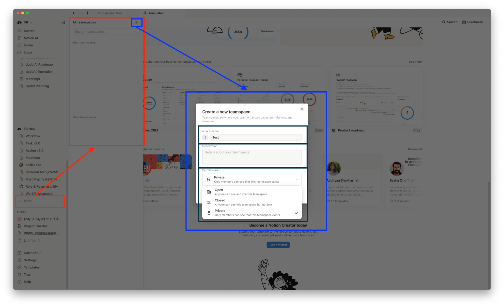
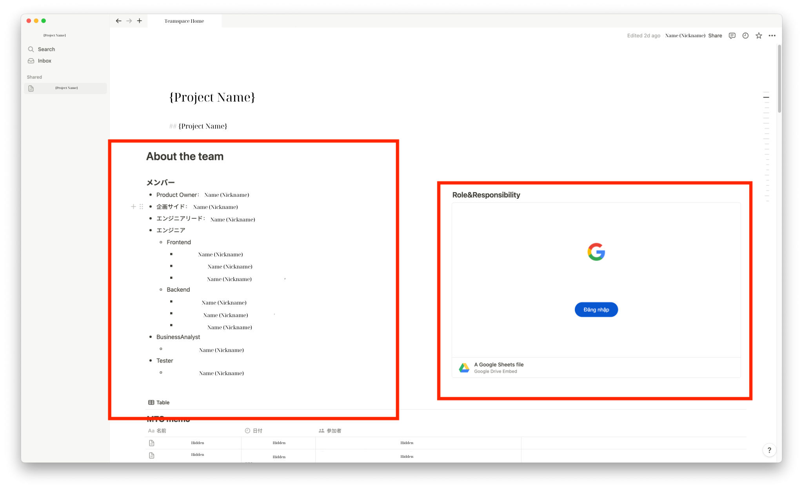
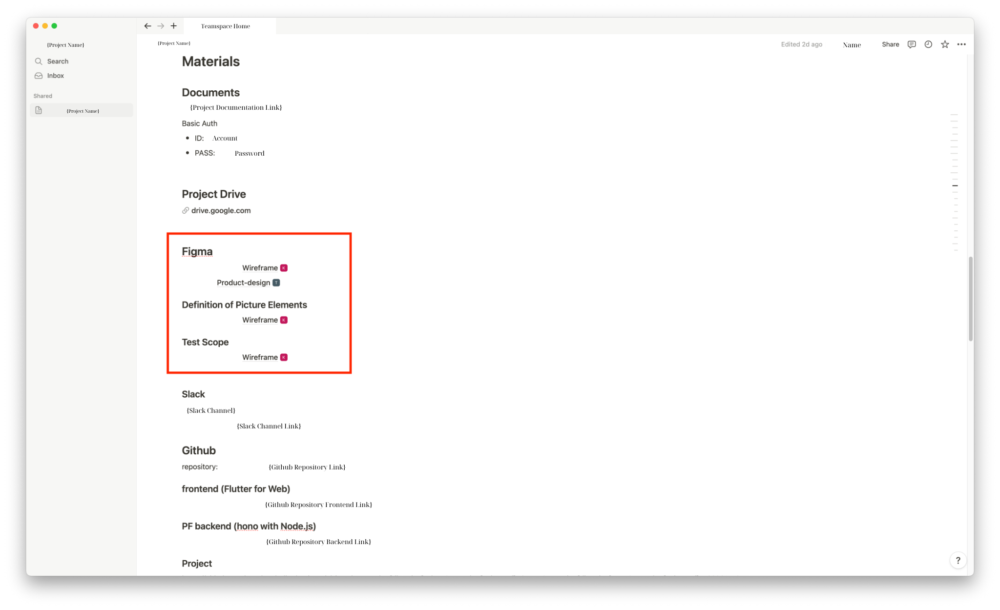
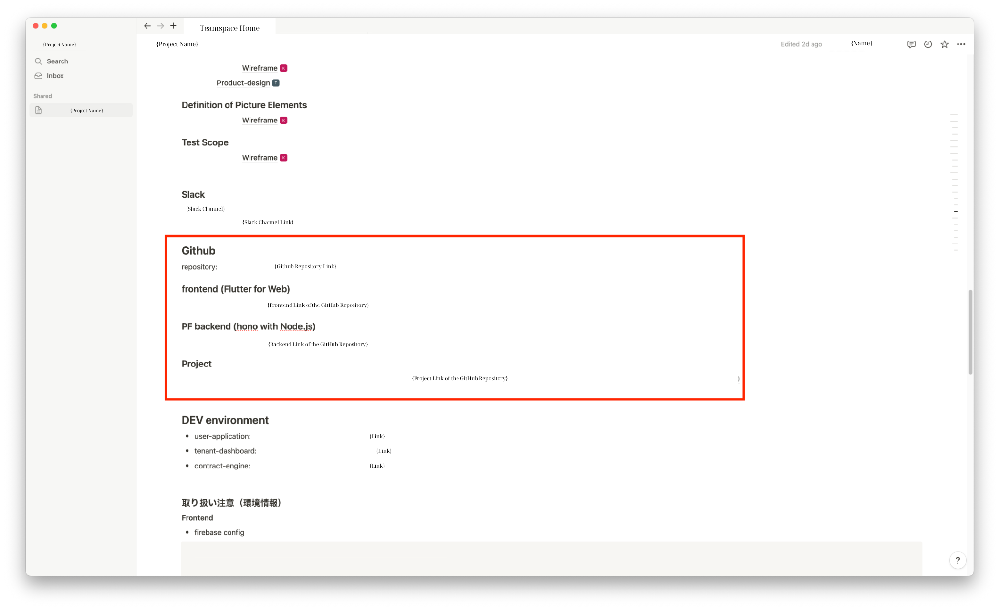
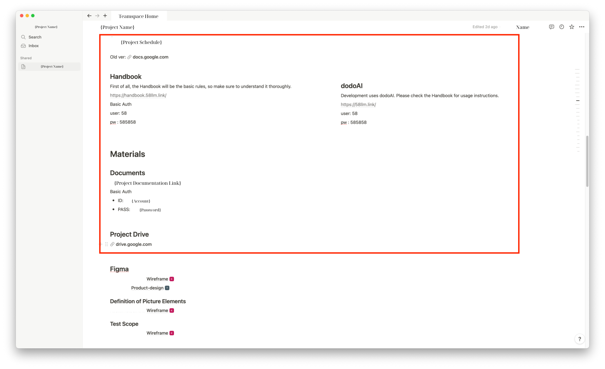
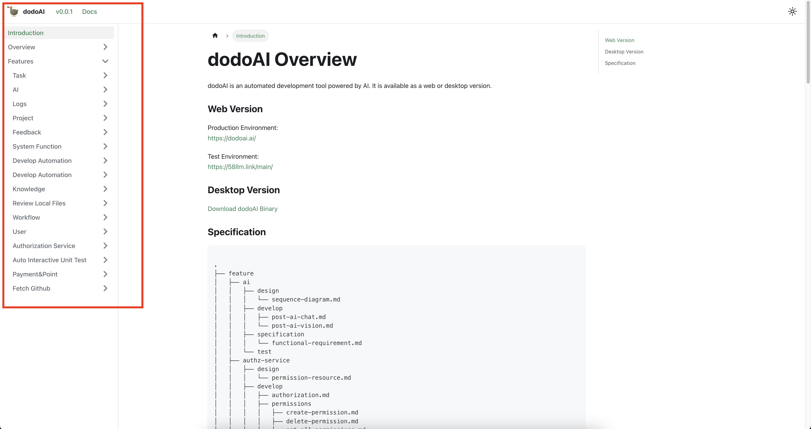
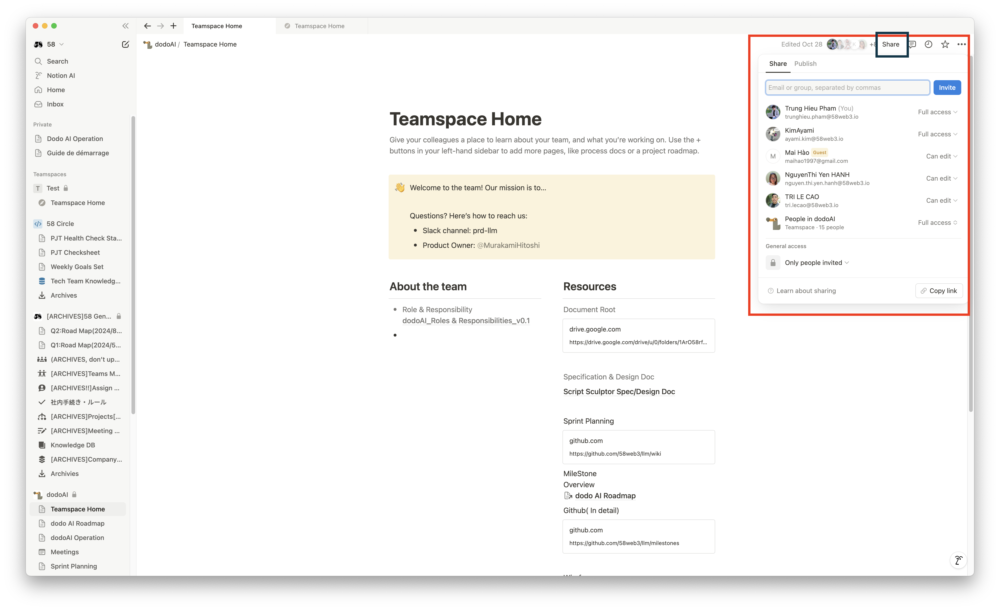

## Tổng Quan

Thiết lập Trang Điều Lệ Dự Án là bước quan trọng trong việc tổ chức và tài liệu hóa các thông tin cần thiết cho dự án. Bố cục này phục vụ như một nguồn thông tin trung tâm, giúp dễ dàng truy cập và giao tiếp giữa tất cả các bên liên quan trong dự án.

Một Trang Điều Lệ Dự Án được cấu trúc tốt giúp xác định rõ trách nhiệm, theo dõi tiến độ dự án một cách dễ dàng, và cung cấp cái nhìn tổng quan về vòng đời dự án.

Để tham khảo cấu trúc một Trang Điều Lệ Dự Án mẫu, truy cập: [Sample Project Charter Page](https://www.notion.so/Teamspace-Home-72edbd69dac14fb7ac039a6a4384fdb2?pvs=4)

## Thông Tin Cần Thiết

- Cấu trúc trang chủ Notion để cung cấp tóm tắt súc tích về mục đích và mục tiêu của dự án.
- Bao gồm các phần chi tiết về vai trò và trách nhiệm, tiến độ dự án, và tài liệu thiết kế.
- Duy trì các liên kết tới các tài nguyên bên ngoài như kho lưu trữ GitHub và Google Drive để mở rộng tài nguyên.
- Đảm bảo trang có thể truy cập bởi tất cả các thành viên và bên liên quan bằng cách chia sẻ các quyền truy cập phù hợp.

## Cách Thiết Lập Trang Điều Lệ Dự Án

### Bước 1: Tạo Trang Chủ Notion

- Bắt đầu bằng việc tạo không gian mới trong Notion dành riêng cho dự án. Đặt thông tin liên quan đến dự án như tên và mô tả, sau đó chọn quyền truy cập cho dự án (đề xuất để ở chế độ riêng tư).

  

- Nhấp vào "Tạo không gian nhóm" để tạo trang dự án.
- Bạn có thể thêm ngay thành viên bằng cách nhập tên hoặc email của họ vào ô tìm kiếm, hoặc sao chép liên kết và gửi cho các thành viên của mình. Nếu bạn chỉ cần thiết lập không gian nhóm ban đầu, chọn "Bỏ qua cho bây giờ" và tiếp tục với thiết lập tiếp theo.

- Chỉ định không gian này là trang chính cho Điều Lệ Dự Án, đảm bảo rằng nó phản ánh các mục tiêu và dữ liệu cần thiết của dự án.

### Bước 2: Điền Các Phần Cần Thiết

- **Vai Trò và Trách Nhiệm:** 
  - Xác định rõ vai trò của từng thành viên trong nhóm tham gia dự án.
  
  

- Đảm bảo rằng bạn đã hoàn thành bước này như mô tả trong [Vai Trò Và Trách Nhiệm](../project-management/role-and-responsibility.md) và đã được đưa vào trang này.

- **Tài Liệu Thiết Kế:**
  - Nhúng hoặc liên kết các wireframes từ Miro và thiết kế cuối từ Figma để dễ dàng hình dung.

  

- **Kho Lưu Trữ GitHub:**
  - Tích hợp liên kết đến kho lưu trữ GitHub của dự án để theo dõi mã nguồn.

  

- **Thông Tin Cần Thiết Khác:**
  - Bên cạnh thông tin cần thiết cho các nhà phát triển và dự án, bạn có thể thêm các chi tiết liên quan khác như Lịch Trình, Memo Cuộc Họp, Tổng Quan Dự Án, WBS, Thông Tin Kỹ Thuật (Công Nghệ), v.v.

### Bước 3: Liên Kết Tài Liệu Dự Án

- Tích hợp tài liệu dự án theo quy trình phát triển chuẩn để đảm bảo tính nhất quán với quy trình làm việc tổng thể.

  

- Thêm tài liệu xây dựng và thiết kế để có cái nhìn sâu hơn về dự án.

  

### Bước 4: Chia Sẻ và Hợp Tác

- Chia sẻ trang Notion đã hoàn thành với tất cả các thành viên và bên liên quan để tạo điều kiện hợp tác và đảm bảo sự tham gia đầy đủ vào các hoạt động dự án.

  

### Bước 5: Bảo Trì và Cập Nhật

- Thường xuyên cập nhật trang Notion để phản ánh bất kỳ thay đổi nào trong phạm vi, thiết kế, hoặc cấu trúc đội ngũ của dự án để giữ tất cả các bên liên quan được thông báo.
