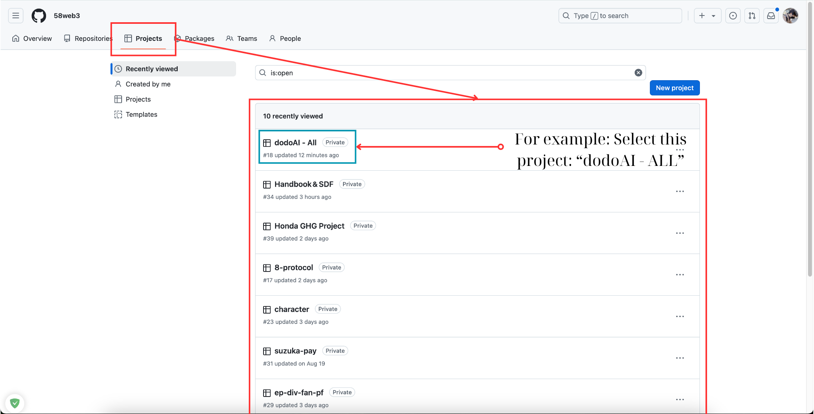
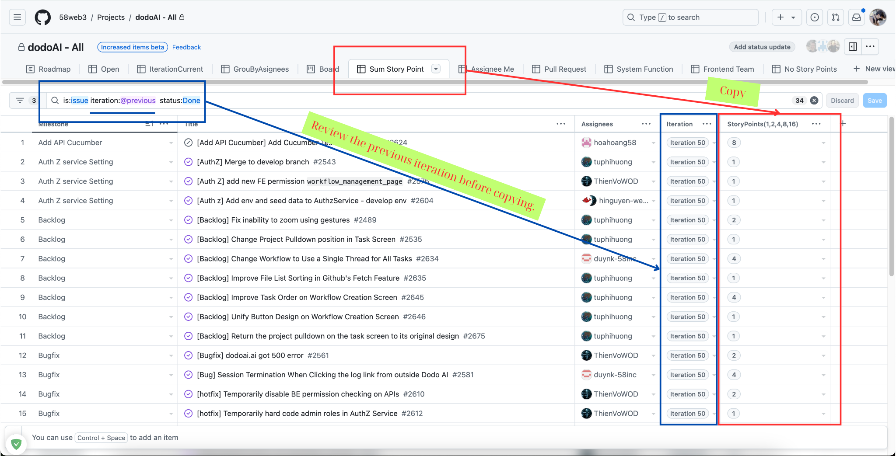
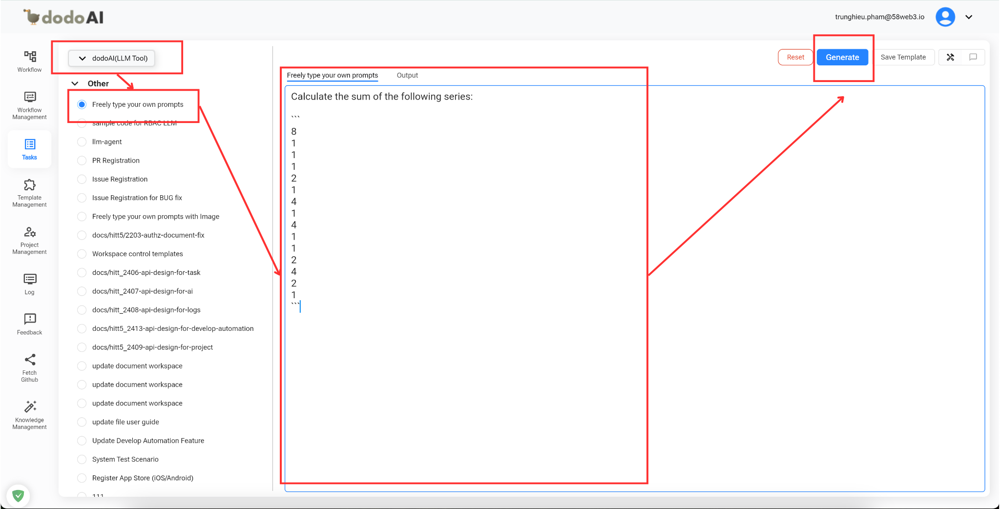
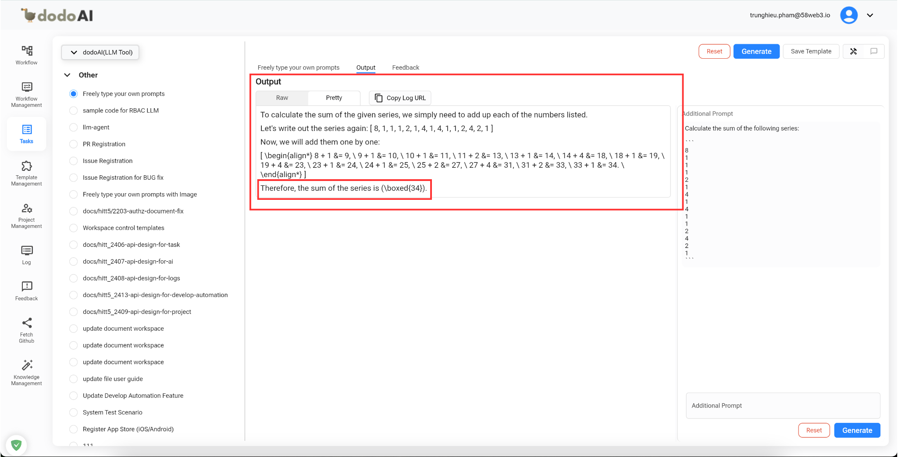
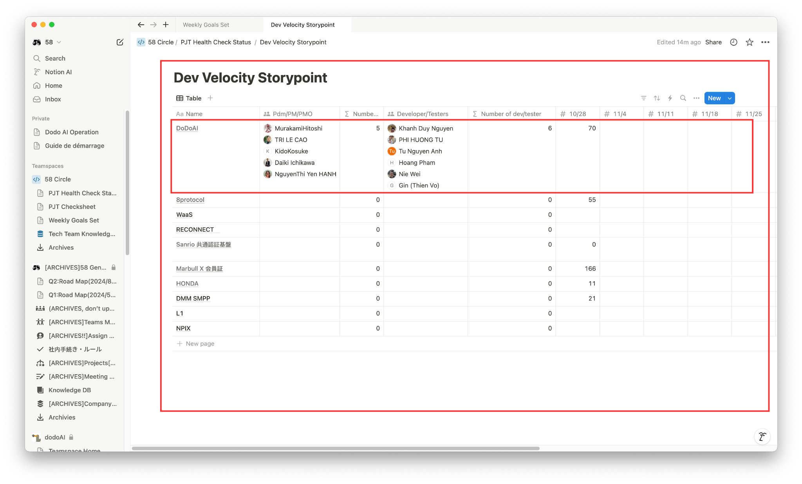

Story points được hiểu nôm na là một cách ước lượng nguồn lực phải bỏ ra để hoàn thành nhiệm vụ

## Tham Khảo

Để hiểu sâu hơn về tính năng phản hồi, vui lòng tham khảo video minh họa dưới đây.

<div style={{ position: 'relative', paddingBottom: '56.25%', height: '0', overflow: 'hidden', maxWidth: '100%' }}>
  <iframe
    src="https://drive.google.com/file/d/1Pti0X6RJ2Y48Vzo3-iWxaApX9bLhoJrB/preview"
    style={{ position: 'absolute', top: '0', left: '0', width: '100%', height: '100%' }}
    frameBorder="0"
    allow="autoplay; encrypted-media"
    allowFullScreen
    loading="lazy"
    title="Story Points Video"
  ></iframe>
</div>

## Mục Đích

Mục đích chính của việc tóm tắt Story Point trên GitHub là để đánh giá khối lượng công việc, theo dõi tiến độ dự án, và quản lý tài nguyên một cách hiệu quả. Bằng cách phân tích Story Point từ các nhiệm vụ trước đây, bạn có thể cải thiện độ chính xác của ước lượng công việc trong tương lai.

## Cách Tóm Tắt Story Point Trong GitHub

### 1. Chọn Dự Án

1.1. Truy cập liên kết này để điều hướng đến trang danh sách dự án của tổ chức bạn: [GitHub Projects](https://github.com/orgs/58web3/projects).

Lưu ý: Đối với các tổ chức khác, chỉ cần thay thế tên tổ chức trong URL này `https://github.com/orgs/{organization_name}/projects`.



### 2. Tóm Tắt Story Point

- Kiểm tra xem tab Tóm Tắt Story Point đã có hay chưa. Nếu chưa, hãy đọc tài liệu liên quan để tiếp tục [GitHub Setup](github-setup.md).
- Trong tab `Sum Story Point`, kiểm tra xem lần lặp có khớp với tuần bạn cần tính toán hay không. Nếu không, có lỗi trong bước [GitHub Setup](github-setup.md); vui lòng xem lại.

Ví dụ: `Iteration 50` từ 28 Tháng 10 - 03 Tháng 11 → Xác nhận nó khớp với khung thời gian thực tế.



- Tô sáng trường `StoryPoints(1,2,4,8,16)` và sao chép, sau đó sử dụng công cụ [`dodoAI`](https://dodoai.ai/) để tính toán chúng:

```markdown
Môi Trường Phát Hành: https://dodoai.ai/
Môi Trường Kiểm Thử: https://58llm.link/
```

Vì lý do bảo mật, vui lòng truy cập liên kết Notion sau để thành công thu nhận xác thực môi trường: [Notion](https://www.notion.so/Basic-Auth-Info-14634bff208b80758e32fb17c6bb941c?pvs=4)



- Xem lại đầu ra và kết quả do dodoAI cung cấp.



Cuối cùng, nhập Tóm Tắt Story Point vào bảng quản lý [Dev Velocity Story Point](https://www.notion.so/PJT-Health-Check-Status-3e9024b67ffd4f1e8d1a4ce3435240c7) với thông tin cần thiết theo bảng.


