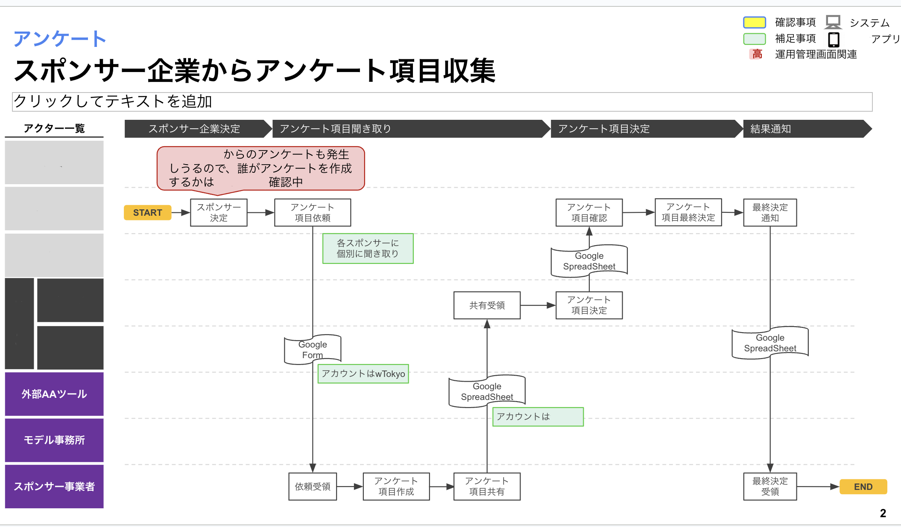

## Tổng Quan

**Quy Trình Kinh Doanh** là mô tả cấp cao về các bước và quy trình từ khi bắt đầu đến hoàn thành một nhiệm vụ hoặc mục tiêu kinh doanh. Nó phác thảo trình tự các hành động, các hoạt động cần thiết và các yếu tố liên quan để đảm bảo rằng quy trình được thực hiện hiệu quả và nhất quán.

## Mục Tiêu

- **Minh Họa Quy Trình**: Tạo ra bức tranh rõ ràng về các bước và giai đoạn của quy trình làm việc.
- **Xác Định Trách Nhiệm**: Làm rõ vai trò và trách nhiệm của từng cá nhân, nhóm, hoặc phòng ban trong quy trình.
- **Tăng Hiệu Quả**: Nhận diện và loại bỏ các nút thắt và các bước không cần thiết để tối ưu hóa quy trình.
- **Cải Thiện Giao Tiếp**: Tạo ra ngôn ngữ chung để cải thiện sự phối hợp và giao tiếp giữa các thành viên trong tổ chức.
- **Giám Sát và Kiểm Soát**: Cung cấp các điểm kiểm tra và theo dõi để đảm bảo chất lượng và tiến độ công việc.
- **Tài Liệu Hóa và Lưu Trữ**: Tạo tài liệu tham khảo chính thức để hỗ trợ đào tạo nhân viên mới và cải tiến quy trình liên tục.

### Tại Sao Chúng Ta Cần Quy Trình Kinh Doanh?

**Sự cần thiết của Quy Trình Kinh Doanh có thể thấy từ nhiều góc độ:**

1. **Làm Rõ Các Bước**: Nó phác thảo các bước cụ thể cần thiết để hoàn thành một nhiệm vụ, giảm thiểu sự mơ hồ và nhầm lẫn.
2. **Cải Thiện Hiệu Quả**: Bằng cách xác định trình tự hành động, nó giúp tối ưu hóa luồng công việc và tránh các trì hoãn không cần thiết.
3. **Tạo Điều Kiện Giao Tiếp**: Nó cung cấp một khung rõ ràng để các nhóm hiểu vai trò và trách nhiệm của họ, cải thiện sự hợp tác.
4. **Tăng Cường Giám Sát**: Nó cho phép theo dõi tiến độ tốt hơn và xác định các nút thắt hoặc vấn đề trong quy trình.
5. **Hỗ Trợ Cải Tiến Liên Tục**: Nó cho phép đánh giá quy trình để tìm kiếm những cải tiến tiềm năng, giúp tối ưu hóa hiệu suất theo thời gian.

## Sơ Đồ Quy Trình

Sơ Đồ Quy Trình minh họa một chiến lược cụ thể từ lúc khởi đầu đến khi hoàn thành một nhiệm vụ hoặc dự án. Một sơ đồ quy trình thông thường bao gồm các thành phần sau:

1. **Bắt Đầu**:
   - Điểm khởi đầu của quy trình, thường được biểu diễn bằng một hình đặc biệt, chẳng hạn như vòng tròn hoặc hình chữ nhật với chữ “Bắt Đầu.”

2. **Các Bước**:
   - Một chuỗi hành động hoặc các giai đoạn được biểu thị bằng các ô vuông hoặc hình hộp nối với nhau. Mỗi bước mô tả một giai đoạn cụ thể của quy trình.

3. **Điểm Quyết Định**:
   - Hình thoi hoặc ký hiệu đặc biệt đại diện cho những điểm trong quy trình yêu cầu quyết định, thường dẫn đến các nhánh khác nhau trong sơ đồ.

4. **Vai Trò và Trách Nhiệm**:
   - Được ghi chú trong các bước hoặc một phần riêng biệt, chỉ rõ ai chịu trách nhiệm cho mỗi giai đoạn của quy trình.

5. **Công Cụ và Tài Nguyên**:
   - Ghi chú về các công cụ (như Google Forms, Google Sheets) hoặc tài nguyên cần thiết ở mỗi bước của quy trình.

6. **Điểm Kiểm Soát và Xác Minh**:
   - Các điểm yêu cầu kiểm soát chất lượng, xác minh, hoặc phê duyệt trước khi tiến đến bước tiếp theo.

7. **Kết Thúc**:
   - Điểm kết thúc của quy trình, thường được biểu diễn bằng vòng tròn hoặc hình chữ nhật với chữ “Kết Thúc.”

### Ví Dụ Cụ Thể:

Sơ đồ quy trình hình dung các bước và quyết định trong quy trình kinh doanh của bạn. Dưới đây là một ví dụ minh họa:

Sơ đồ quy trình không chỉ là công cụ để tổ chức công việc mà còn là phương tiện hiệu quả để cải thiện giao tiếp, tăng hiệu quả, và đảm bảo chất lượng trong mọi khía cạnh của tổ chức.
