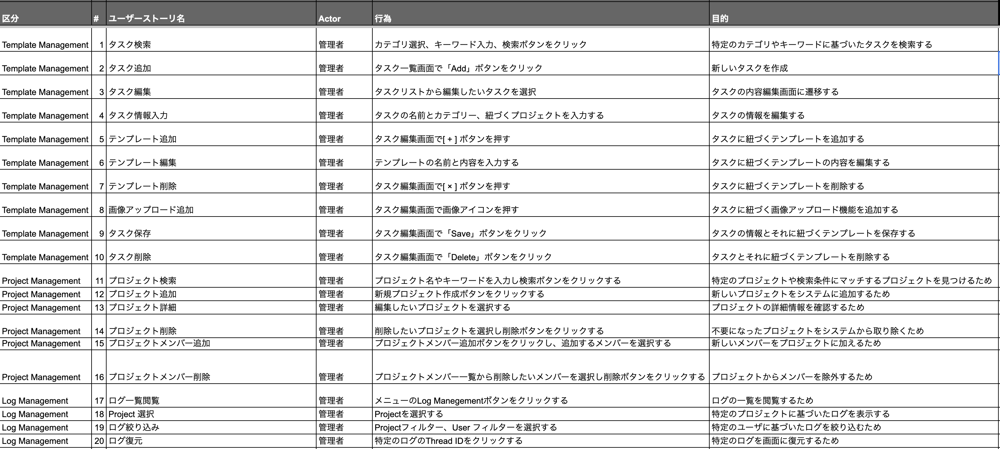
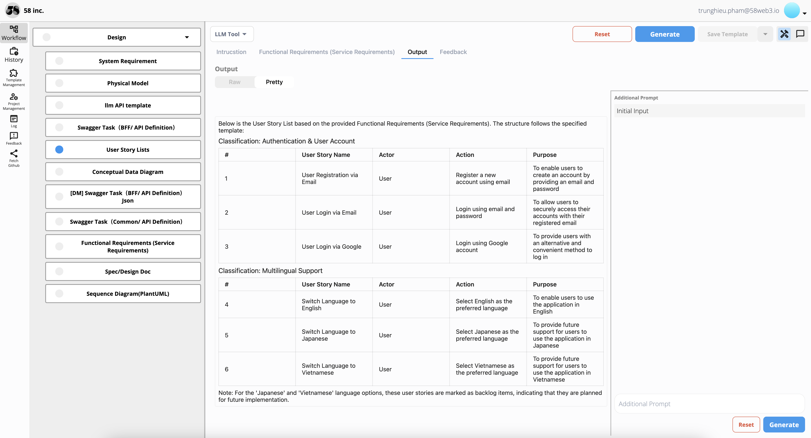

## Hướng Dẫn

Tạo Danh Sách Câu Chuyện Người Dùng bằng Markdown theo định dạng sau.

## Tổng Quan

Danh Sách Câu Chuyện Người Dùng đóng vai trò quan trọng trong phát triển phần mềm hiện đại. Chúng chi tiết yêu cầu từ góc nhìn người dùng, giúp đạt được các mục tiêu chính.

### Mục Tiêu

1. **Rõ Ràng**: Mô tả rõ yêu cầu của người dùng.
2. **Ưu Tiên**: Xếp hạng tính năng theo tầm quan trọng.
3. **Liên Kết**: Đảm bảo hiểu biết nhất quán trong nhóm.
4. **Phát Triển Từng Bước**: Hỗ trợ tiến trình từng bước.
5. **Tập Trung Vào Người Dùng**: Mang lại giá trị thực cho người dùng.
6. **Linh Hoạt**: Thích ứng với thay đổi và phản hồi.

#### Tại Sao Cần Danh Sách Câu Chuyện Người Dùng?

1. **Giao Tiếp Yêu Cầu**: Ghi lại và truyền đạt nhu cầu của người dùng một cách rõ ràng.
2. **Ưu Tiên Công Việc**: Tập trung vào các tính năng có giá trị cao trước.
3. **Đảm Bảo Sự Thống Nhất**: Giữ nhóm cùng hướng đi.
4. **Hỗ Trợ Phát Triển Agile**: Cho phép tiến bộ lặp đi lặp lại và gia tăng.
5. **Thích Ứng Với Thay Đổi**: Nhanh chóng điều chỉnh theo thông tin mới.
6. **Tăng Sự Hài Lòng Của Người Dùng**: Xây dựng sản phẩm đáp ứng kỳ vọng của người dùng.

**Ví Dụ:**

Dưới đây là một mẫu Câu Chuyện Người Dùng. Bạn có thể tham khảo Câu Chuyện Người Dùng tại đây:
[Danh Sách Câu Chuyện Người Dùng](https://docs.google.com/spreadsheets/d/1kURKsfy2XeguJnUo4cXGgNYaTeWzJ2WsMLAO5uYoSJo/edit?gid=1310947896#gid=1310947896)



## Cách Sử Dụng dodo AI Cho Nhiệm Vụ Danh Sách Câu Chuyện Người Dùng

Tôi đã tạo một chức năng trên Công Cụ SS để xử lý nhiệm vụ này. Nhập Yêu Cầu Chức Năng của bạn (Yêu Cầu Dịch Vụ) để hoàn thành nó. Dưới đây là hướng dẫn sử dụng và thông tin cần thiết.

Danh Sách Câu Chuyện Người Dùng được tạo ra bởi Công Cụ SS (Thiết Kế → Danh Sách Câu Chuyện Người Dùng) từ nhiều đầu vào.



- Mẫu Gợi Ý: [Danh Sách Câu Chuyện Người Dùng](https://58llm.link/main/restore/30367bc6-06a3-4b95-9c1e-37f7e583f7c2)

### Đầu Vào

- Hướng dẫn
- Yêu Cầu Chức Năng (Yêu Cầu Dịch Vụ)

### Hướng Dẫn

```plantext
Yêu Cầu: Bạn là Nhà Phân Tích Kinh Doanh (BA) với nhiều năm kinh nghiệm và có thể xử lý bất kỳ nhiệm vụ nào liên quan đến vị trí Nhà Phân Tích Kinh Doanh (BA) của bạn. Tạo Danh Sách Câu Chuyện Người Dùng từ Yêu Cầu Chức Năng (Yêu Cầu Dịch Vụ) mà tôi đã cung cấp trước đó.

Dưới đây, tôi đã cung cấp các tiêu đề bạn cần tuân theo. Tạo Danh Sách Câu Chuyện Người Dùng theo mẫu với các tiêu đề dưới đây để đảm bảo kết quả chính xác và tuân theo sát mẫu đã cung cấp.

Phân Loại | # | Tên Câu Chuyện Người Dùng | Nhân Vật | Hành Động | Mục Đích
```

### Yêu Cầu Chức Năng (Yêu Cầu Dịch Vụ) (Chỉ Là Mẫu)

```plantext
Vui lòng thu thập câu chuyện người dùng dựa trên các yêu cầu dịch vụ sau.

Dưới đây là Yêu Cầu Chức Năng (Yêu Cầu Dịch Vụ):

# Xác Thực & Tài Khoản Người Dùng
## Xác Thực Firebase 
- Sử dụng Xác Thực Firebase làm phương thức xác thực.
- Email / Mật khẩu 
- Đăng nhập Google 
## Hỗ Trợ Đa Ngôn Ngữ
- Có thể chuyển đổi sang các ngôn ngữ sau
  - Tiếng Anh 
  - Tiếng Nhật 
  - Tiếng Việt 
```

## Đầu Ra

```plantext
Dưới đây là Danh Sách Câu Chuyện Người Dùng dựa trên Yêu Cầu Chức Năng (Yêu Cầu Dịch Vụ) đã cung cấp. Cấu trúc tuân theo mẫu đã chỉ định:

### Phân Loại: Xác Thực & Tài Khoản Người Dùng

| #  | Tên Câu Chuyện Người Dùng        | Nhân Vật | Hành Động                                | Mục Đích                                                                           |
|----|----------------------------------|----------|------------------------------------------|-------------------------------------------------------------------------------------|
| 1  | Đăng Ký Người Dùng Qua Email     | Người Dùng| Đăng ký tài khoản mới bằng cách sử dụng email | Cho phép người dùng tạo tài khoản bằng cách cung cấp email và mật khẩu         |
| 2  | Đăng Nhập Người Dùng Qua Email   | Người Dùng| Đăng nhập sử dụng email và mật khẩu      | Cho phép người dùng truy cập an toàn vào tài khoản của họ bằng email đã đăng ký    |
| 3  | Đăng Nhập Người Dùng Qua Google  | Người Dùng| Đăng nhập sử dụng tài khoản Google       | Cung cấp phương thức tiện lợi giúp người dùng đăng nhập                             |

### Phân Loại: Hỗ Trợ Đa Ngôn Ngữ

| #  | Tên Câu Chuyện Người Dùng         | Nhân Vật    | Hành Động                                | Mục Đích                                                              |
|----|----------------------------------|-------------|------------------------------------------|-----------------------------------------------------------------------|
| 4  | Chuyển Ngôn Ngữ Sang Tiếng Anh   | Người Dùng  | Chọn Tiếng Anh làm ngôn ngữ ưu tiên      | Cho phép người dùng sử dụng ứng dụng bằng Tiếng Anh                   |
| 5  | Chuyển Ngôn Ngữ Sang Tiếng Nhật  | Người Dùng  | Chọn Tiếng Nhật làm ngôn ngữ ưu tiên     | Cung cấp hỗ trợ tương lai cho người dùng sử dụng ứng dụng bằng Tiếng Nhật    |
| 6  | Chuyển Ngôn Ngữ Sang Tiếng Việt  | Người Dùng  | Chọn Tiếng Việt làm ngôn ngữ ưu tiên     | Cung cấp hỗ trợ tương lai cho người dùng sử dụng ứng dụng bằng Tiếng Việt    |

Lưu ý: Đối với các tùy chọn ngôn ngữ 'Tiếng Nhật' và 'Tiếng Việt', các câu chuyện người dùng này đang được đánh dấu là mục backlog, có nghĩa rằng chúng dự kiến sẽ được thực hiện trong tương lai.
```
