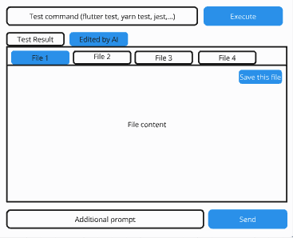

## Tổng Quan

Wireframe được sử dụng để xây dựng cấu trúc khung xương của giao diện người dùng ứng dụng, tập trung vào cấu trúc và trải nghiệm người dùng nhằm định hình quá trình thiết kế và phát triển dự án.

## Mục Tiêu

Việc tạo Wireframe tập trung vào:

- Xây dựng các thành phần cơ bản của bố cục giao diện người dùng.
- Hỗ trợ phản hồi lặp đi lặp lại từ các bên liên quan ngay từ giai đoạn đầu.
- Xác định các vấn đề về khả năng sử dụng để giải quyết sớm.
- Đảm bảo tất cả các thành viên trong nhóm dự án có cùng hướng đi và tầm nhìn chung.

## Phương Pháp Tạo Wireframe

Có hai phương pháp chính để tạo Wireframe:

1. **Tạo Từ Đầu:**
   Thực hiện theo hướng dẫn chi tiết tại [Hướng Dẫn Từng Bước Của Uizard Về Wireframing](https://uizard.io/blog/website-wireframing-a-step-by-step-guide/) để tạo Wireframe từ nền tảng, điều này cho phép bạn tùy chỉnh hoàn toàn và phát triển ý tưởng thiết kế độc đáo.

2. **Sử Dụng Hệ Thống Thiết Kế (Design System):**
   Nếu dự án có sẵn một Design System, hãy tận dụng các thành phần và bố cục đã được định sẵn để tạo Wireframe. Điều này giúp đảm bảo tính nhất quán với các tiêu chuẩn thiết kế hiện có và đẩy nhanh quá trình tạo Wireframe.

## Công Cụ Tạo Wireframe

Từ bây giờ, tất cả Wireframe sẽ được tạo và quản lý bằng **Figma**. Figma cung cấp một nền tảng cộng tác và hiệu quả để tạo Wireframe, đảm bảo tính nhất quán và khả năng truy cập cho tất cả các thành viên trong nhóm.

- **Truy Cập Figma**: Đảm bảo bạn có quyền truy cập vào không gian làm việc Figma của dự án. Nếu cần quyền truy cập, hãy liên hệ với quản lý dự án.
- **Mẫu (Templates)**: Sử dụng các mẫu có sẵn trong Figma nếu có, hoặc tạo Wireframe mới trực tiếp trong nền tảng.

## Mẫu Sản Phẩm (Output Sample)

**Lưu ý: Ví dụ đầu ra được cung cấp dưới đây chỉ mang tính chất minh họa. Hãy tham khảo cấu trúc như một hướng dẫn và điều chỉnh nội dung của nó theo nhu cầu cụ thể của dự án của bạn.**

*Miêu tả: Ví dụ tham khảo này minh họa cấu trúc cơ bản của một Wireframe giao diện người dùng, bao gồm vị trí của các phần tử chính thường thấy trong thiết kế các ứng dụng kỹ thuật số.*

Tùy thuộc vào tài nguyên và yêu cầu của dự án, hãy chọn phương pháp tạo phù hợp nhất với nhu cầu của bạn để sản xuất các Wireframe hiệu quả và chất lượng.
