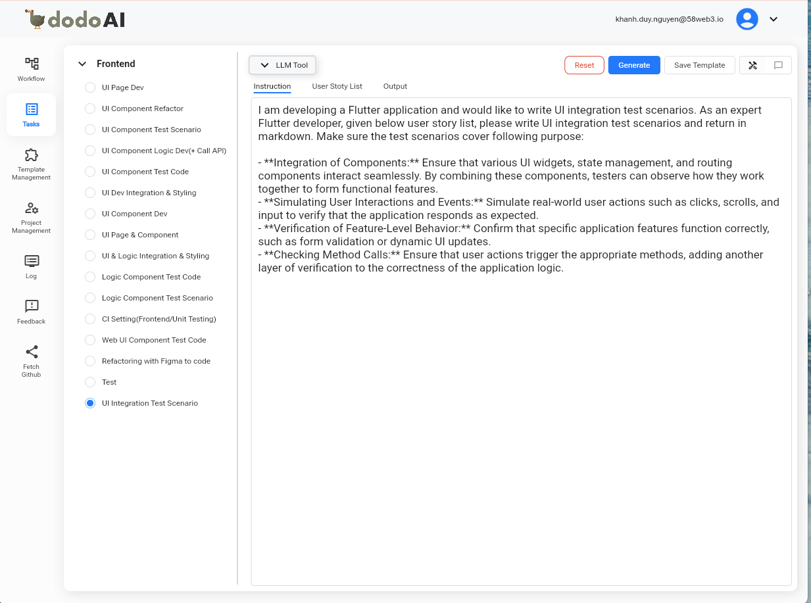

## Tổng Quan

Kiểm Thử Tích Hợp UI là một giai đoạn quan trọng trong vòng đời phát triển phần mềm để đảm bảo sự tương tác liền mạch của nhiều thành phần giao diện. Sau khi phát triển các thành phần và trang riêng lẻ, các thành phần này cần được kiểm tra đồng thời để đảm bảo chúng tích hợp chính xác, cung cấp các chức năng mong đợi, và phản hồi chính xác với các tương tác của người dùng. Hướng dẫn này sẽ cung cấp cách tiếp cận chi tiết để tạo ra các kịch bản kiểm thử tích hợp hiệu quả.

## Mục Đích

Mục tiêu chính của Kịch Bản Kiểm Thử Tích Hợp UI là xác thực việc tích hợp các thành phần và toàn bộ chức năng của ứng dụng trong môi trường người dùng thực tế. Các mục tiêu chính bao gồm:

- **Tích Hợp Các Thành Phần:** Đảm bảo rằng các widget UI khác nhau, quản lý trạng thái, và các thành phần định tuyến tương tác liền mạch. Bằng cách kết hợp các thành phần này, người kiểm thử có thể quan sát cách chúng hoạt động cùng nhau để tạo thành các tính năng chức năng.
- **Mô Phỏng Tương Tác Và Sự Kiện Của Người Dùng:** Mô phỏng các hành động thực tế của người dùng như nhấp chuột, cuộn trang và nhập liệu để xác minh rằng ứng dụng phản hồi như mong đợi.
- **Xác Minh Hành Vi Cấp Tính Năng:** Xác nhận rằng các tính năng cụ thể của ứng dụng hoạt động chính xác, như xác thực biểu mẫu hoặc cập nhật UI động.
- **Kiểm Tra Gọi Phương Thức:** Đảm bảo rằng các hành động của người dùng kích hoạt các phương thức thích hợp, thêm một lớp xác minh khác cho sự chính xác của logic ứng dụng.

## Cách Tạo Kịch Bản Kiểm Thử Tích Hợp

Kịch Bản Kiểm Thử Tích Hợp UI được tạo bởi dodoAI (Frontend > UI Integration Test Scenario) từ các đầu vào khác nhau.



### Đầu Vào

- Hướng Dẫn
- Danh Sách User Story
- Ví Dụ Prompt: [Sample Prompt](https://58llm.link/main/restore/10fc2caf-c9e2-479b-892e-4d0fbd42998a)

Nội dung chi tiết của từng đầu vào như sau:

### Hướng Dẫn

```plaintext
Tôi đang phát triển một ứng dụng Flutter và muốn viết các kịch bản kiểm thử tích hợp UI. Là một nhà phát triển Flutter chuyên nghiệp, dựa trên danh sách user story dưới đây, vui lòng viết các kịch bản kiểm thử tích hợp UI và trả về ở định dạng markdown. Đảm bảo rằng các kịch bản kiểm thử bao gồm các mục đích sau:

- **Tích Hợp Các Thành Phần:** Đảm bảo rằng các widget UI khác nhau, quản lý trạng thái, và các thành phần định tuyến tương tác liền mạch. Bằng cách kết hợp các thành phần này, người kiểm thử có thể quan sát cách chúng hoạt động cùng nhau để tạo thành các tính năng chức năng.
- **Mô Phỏng Tương Tác Và Sự Kiện Của Người Dùng:** Mô phỏng các hành động thực tế của người dùng như nhấp chuột, cuộn trang và nhập liệu để xác minh rằng ứng dụng phản hồi như mong đợi.
- **Xác Minh Hành Vi Cấp Tính Năng:** Xác nhận rằng các tính năng cụ thể của ứng dụng hoạt động chính xác, như xác thực biểu mẫu hoặc cập nhật UI động.
- **Kiểm Tra Gọi Phương Thức:** Đảm bảo rằng các hành động của người dùng kích hoạt các phương thức thích hợp, thêm một lớp xác minh khác cho sự chính xác của logic ứng dụng.
```

### Danh Sách User Story

```markdown
| Phân Loại              | #  | Tên User Story               | Vai Trò     | Hành Động                                                                            | Mục Đích                                                                         |
|------------------------|----|------------------------------|-------------|--------------------------------------------------------------------------------------|----------------------------------------------------------------------------------|
| Quản Lý Quy Trình      | 1  | Xem Các Quy Trình Hiện Có    | Người Dùng  | Xem danh sách các quy trình hiện có                                                  | Để hiển thị tất cả các quy trình được lưu trong hệ thống, bao gồm các chi tiết của quy trình |
| Quản Lý Quy Trình      | 2  | Tạo Quy Trình Mới            | Người Dùng  | Tạo một quy trình mới bằng cách chỉ định tên, danh sách nhiệm vụ, kết nối nhiệm vụ, và đầu vào/đầu ra | Để cho phép người dùng định nghĩa và thiết lập các quy trình mới trong hệ thống           |
| Quản Lý Quy Trình      | 3  | Chỉnh Sửa Quy Trình Hiện Có  | Người Dùng  | Chỉnh sửa một quy trình hiện có bằng cách cập nhật chi tiết như tên, nhiệm vụ, kết nối nhiệm vụ, và đầu vào/đầu ra | Để cho phép người dùng thay đổi và cập nhật các quy trình                         |
| Quản Lý Quy Trình      | 4  | Xóa Quy Trình                | Người Dùng  | Xóa một quy trình hiện có bằng cách sử dụng ID của quy trình                         | Để xóa các quy trình cùng dữ liệu liên quan khỏi hệ thống                         |
| Thực Thi Quy Trình     | 5  | Chọn Quy Trình Để Thực Thi    | Người Dùng  | Chọn một quy trình đã định trước để thực thi bằng cách sử dụng ID của quy trình      | Để tải quy trình đã chọn cùng các nhiệm vụ liên quan để thực thi                  |
| Thực Thi Quy Trình     | 6  | Thực Thi Nhiệm Vụ Trong Quy Trình | Người Dùng | Thực thi một nhiệm vụ trong quy trình dựa trên ID nhiệm vụ và giá trị đầu vào        | Để thực hiện các nhiệm vụ trong quy trình và tạo ra các đầu ra tương ứng          |
| Thực Thi Quy Trình     | 7  | Cung Cấp Thêm Dữ Liệu        | Người Dùng  | Nhập thêm dữ liệu cho một nhiệm vụ trước khi thực thi                                 | Để tinh chỉnh và nâng cao đầu ra của nhiệm vụ bằng cách thêm đầu vào từ người dùng |
| Thực Thi Quy Trình     | 8  | Lưu Đầu Ra Của Nhiệm Vụ      | Người Dùng  | Xác nhận và lưu đầu ra của nhiệm vụ vào bảng đầu ra                                  | Để lưu kết quả thực thi nhiệm vụ trong hệ thống, bao gồm các chi tiết như tên nhiệm vụ và nội dung đã tạo |
| Thực Thi Quy Trình     | 9  | Chuyển Sang Nhiệm Vụ Tiếp Theo | Người Dùng | Tự động di chuyển sang nhiệm vụ tiếp theo sau khi nhiệm vụ hiện tại hoàn thành        | Để đảm bảo quy trình tiếp tục sang nhiệm vụ tiếp theo bằng cách sử dụng đầu ra từ nhiệm vụ đã hoàn thành |
```

## Sau Khi Bạn Nhập Thông Tin Cần Thiết Vào Mẫu Như Trên, Nhấp Vào Tạo Và Nó Sẽ Tạo Ra Kết Quả Như Dưới Đây:

### Kết Quả: Kịch Bản Kiểm Thử Tích Hợp UI

```markdown
# Kịch Bản Kiểm Thử Tích Hợp UI

## Quản Lý Quy Trình

### Kịch Bản 1: Xem Các Quy Trình Hiện Có
- **Mục Đích**: Đảm bảo tất cả các quy trình được hiển thị đúng.
- **Các Bước**:
  1. Khởi chạy ứng dụng.
  2. Chuyển đến trang "Quy Trình".
  3. Xác minh rằng một danh sách các quy trình được hiển thị với chi tiết chính xác.
  4. Kiểm tra rằng mỗi mục quy trình hiển thị tên và ID.
  5. Mô phỏng cuộn để xem thêm các quy trình.
  6. *Mong Đợi*: Chi tiết quy trình nên chính xác, và quy trình mới tải khi cuộn.

### Kịch Bản 2: Tạo Quy Trình Mới
- **Mục Đích**: Xác minh chức năng tạo quy trình mới và xác thực biểu mẫu.
- **Các Bước**:
  1. Chuyển đến trang "Tạo Quy Trình Mới".
  2. Điền vào biểu mẫu với tên quy trình, nhiệm vụ, kết nối, đầu vào, và đầu ra.
  3. Để trống một trường và cố gắng gửi.
  4. *Mong Đợi*: Biểu mẫu nên hiển thị lỗi xác thực.
  5. Sửa lỗi và gửi biểu mẫu.
  6. *Mong Đợi*: Quy trình mới được tạo thành công và hiển thị thông báo thành công.
  7. Đảm bảo rằng một cuộc gọi API back-end được thực hiện với tham số chính xác.

### Kịch Bản 3: Chỉnh Sửa Quy Trình Hiện Có
- **Mục Đích**: Đảm bảo các quy trình có thể được chỉnh sửa và cập nhật chính xác.
- **Các Bước**:
  1. Xem danh sách các quy trình hiện có.
  2. Chọn một quy trình để chỉnh sửa.
  3. Thay đổi chi tiết quy trình như nhiệm vụ, kết nối, v.v.
  4. Gửi quy trình đã cập nhật.
  5. *Mong Đợi*: Quy trình cập nhật thành công, và các thay đổi được phản ánh trong danh sách quy trình.
  6. Xác minh rằng phương thức thích hợp để cập nhật được gọi.

### Kịch Bản 4: Xóa Quy Trình
- **Mục Đích**: Xác thực rằng các quy trình có thể bị xóa.
- **Các Bước**:
  1. Xem danh sách các quy trình hiện có.
  2. Chọn một quy trình để xóa.
  3. Xác nhận việc xóa.
  4. *Mong Đợi*: Quy trình bị xóa khỏi danh sách với xác nhận.
  5. Xác minh rằng hành động xóa kích hoạt tương tác back-end chính xác.

## Thực Thi Quy Trình

### Kịch Bản 5: Chọn Quy Trình Để Thực Thi
- **Mục Đích**: Đảm bảo việc chọn quy trình để thực thi hoạt động chính xác.
- **Các Bước**:
  1. Xem danh sách các quy trình.
  2. Chọn một quy trình bằng ID của nó.
  3. *Mong Đợi*: Quy trình đã chọn tải đúng, hiển thị các nhiệm vụ sẵn sàng để thực thi.

### Kịch Bản 6: Thực Thi Nhiệm Vụ Trong Quy Trình
- **Mục Đích**: Xác minh việc thực thi nhiệm vụ trong một quy trình.
- **Các Bước**:
  1. Chọn một nhiệm vụ từ quy trình đã tải.
  2. Nhập các giá trị đầu vào cần thiết.
  3. Thực thi nhiệm vụ.
  4. *Mong Đợi*: Nhiệm vụ thực thi và tạo ra đầu ra thích hợp.
  5. Xác nhận rằng việc thực thi một nhiệm vụ gọi phương thức mong đợi.

### Kịch Bản 7: Cung Cấp Thêm Dữ Liệu
- **Mục Đích**: Kiểm tra việc cung cấp thêm các lời nhắc nhập liệu trước khi thực thi nhiệm vụ.
- **Các Bước**:
  1. Chọn một nhiệm vụ để thực thi.
  2. Cung cấp thêm lời nhắc như cần thiết.
  3. Thực thi nhiệm vụ với các lời nhắc đã thêm.
  4. *Mong Đợi*: Việc thực thi nhiệm vụ được cải thiện bởi các đầu vào bổ sung.

### Kịch Bản 8: Lưu Đầu Ra Của Nhiệm Vụ
- **Mục Đích**: Xác thực rằng đầu ra của nhiệm vụ có thể được lưu thành công.
- **Các Bước**:
  1. Thực thi một nhiệm vụ trong quy trình.
  2. Xác nhận và lưu đầu ra của nhiệm vụ.
  3. *Mong Đợi*: Đầu ra được lưu trữ ở định dạng đúng với chi tiết nhiệm vụ.
  4. Kiểm tra bảng đầu ra để xác minh thông tin đã lưu.

### Kịch Bản 9: Chuyển Sang Nhiệm Vụ Tiếp Theo
- **Mục Đích**: Đảm bảo rằng quy trình chuyển tiếp giữa các nhiệm vụ đúng cách.
- **Các Bước**:
  1. Hoàn thành một nhiệm vụ trong quy trình.
  2. *Mong Đợi*: Ứng dụng tự động di chuyển sang nhiệm vụ tiếp theo.
  3. Xác minh logic và phương thức chịu trách nhiệm chuyển tiếp nhiệm vụ được kích hoạt.
