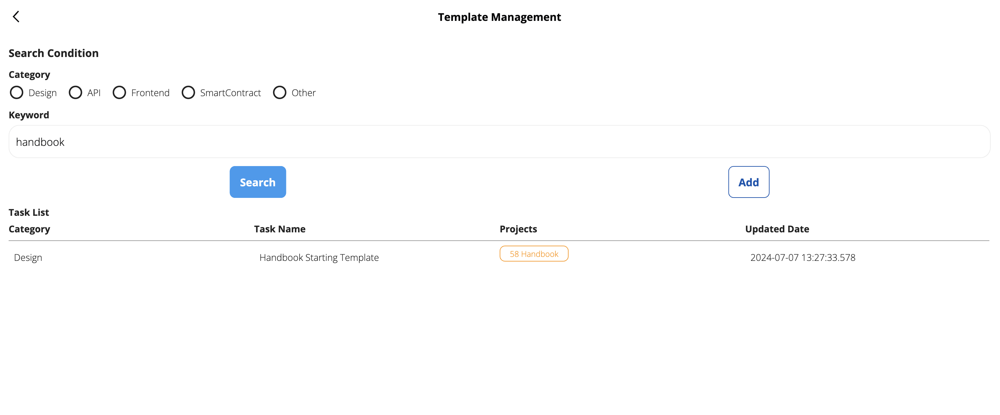

## Giới Thiệu

Hướng dẫn này cung cấp quy trình chi tiết để cập nhật tài liệu Sổ Tay.

## Các Bước Cập Nhật Sổ Tay

### Đăng Ký Một Vấn Đề Trong Kho Lưu Trữ GitHub Của Sổ Tay

1. Tạo một vấn đề trong kho lưu trữ GitHub của Sổ Tay.
   - Truy cập [Kho Lưu Trữ GitHub Của Sổ Tay](https://github.com/58web3/Agentic Dev Framework).
   - Nếu bạn không chắc chắn cách đăng ký một vấn đề, vui lòng liên hệ với Murakami, TRI, Kido, hoặc Han để được hỗ trợ.

### Tạo Một Mẫu Trong SS

1. **Truy Cập Quản Lý Mẫu SS**
   - Truy cập [Quản Lý Mẫu SS](https://58llm.link/template-management/).
   - Bạn sẽ tìm thấy mẫu Sổ Tay. Cập nhật mẫu này hoặc sử dụng nó làm tham chiếu để tạo một mẫu mới.

   

2. **Thiết Lập Mẫu**
   - Mẫu Sổ Tay chứa các tệp cần thiết.
   - Từ nhánh `Develop` của kho lưu trữ GitHub của Sổ Tay, sao chép các tệp liên quan và dán chúng vào mẫu SS. Sau đó lưu các thay đổi.
   - Thực hiện theo quy trình này sẽ cải thiện đáng kể độ chính xác của AI.

   

### Tạo Và Xử Lý Yêu Cầu Kéo (PR) Cho Vấn Đề

1. **Cập Nhật Các Tệp Markdown Liên Quan**
   - Thay đổi các tệp Markdown cụ thể liên quan đến vấn đề của bạn.

2. **Cập Nhật `sidebars.js` nếu Cần**
   - Điều này cần thiết khi thêm tệp mới hoặc thay đổi cấu trúc thanh bên.

3. **Cập Nhật Phiên Bản Docusaurus**
   - Đồng bộ phiên bản Docusaurus với đơn vị triển khai. Không cần phải cập nhật một phiên bản cho mỗi PR.
   - Tính đến ngày 7 tháng 7, 2024, nhiều tệp vẫn chưa được sửa đổi. Do đó, gộp nhiều PR vào một phiên bản là chấp nhận được.

   Sau khi thực hiện các cập nhật này, **đảm bảo rằng tệp README luôn được cập nhật**. Điều này là cần thiết để giữ cho README đồng bộ với các thay đổi mới nhất.
   - **Mẹo:** Sau khi thực hiện một loạt các thay đổi, hãy yêu cầu AI cập nhật README cho kết quả tốt nhất.

4. **Gửi PR**
   - Đặt Murakami và TRI làm người đánh giá.

## Mẹo

- Một khi bạn đã chuẩn bị phác thảo ban đầu, bạn có thể yêu cầu SS điều chỉnh cấu trúc bằng tiếng Anh để cho ra kết quả tinh chỉnh hơn.
- Nếu có các tệp tương tự, sao chép và dán chúng vào lời nhắc làm dữ liệu đầu vào để AI làm theo.

---

Bằng cách tuân thủ các bước này, bạn có thể cập nhật và duy trì tài liệu Sổ Tay một cách hiệu quả, đảm bảo tính nhất quán và chất lượng cao cho đầu ra.
