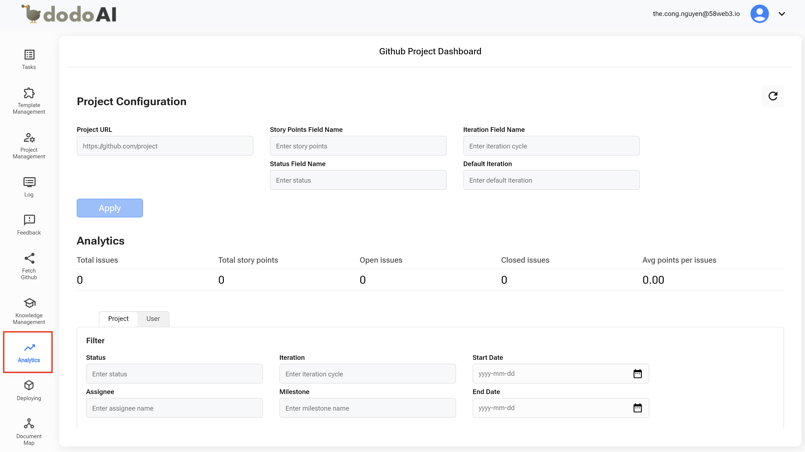
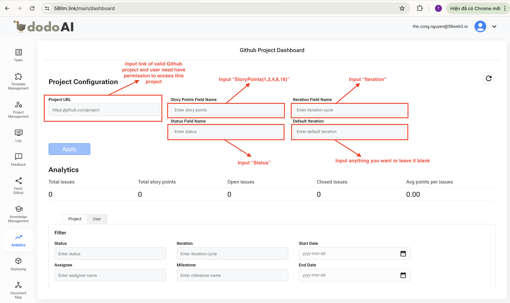
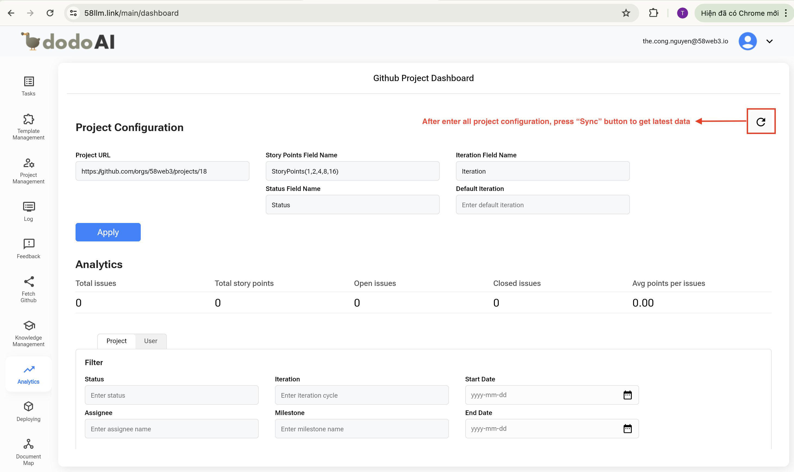
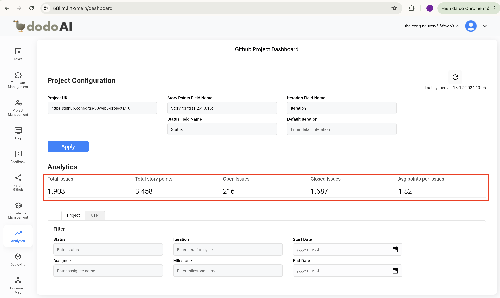
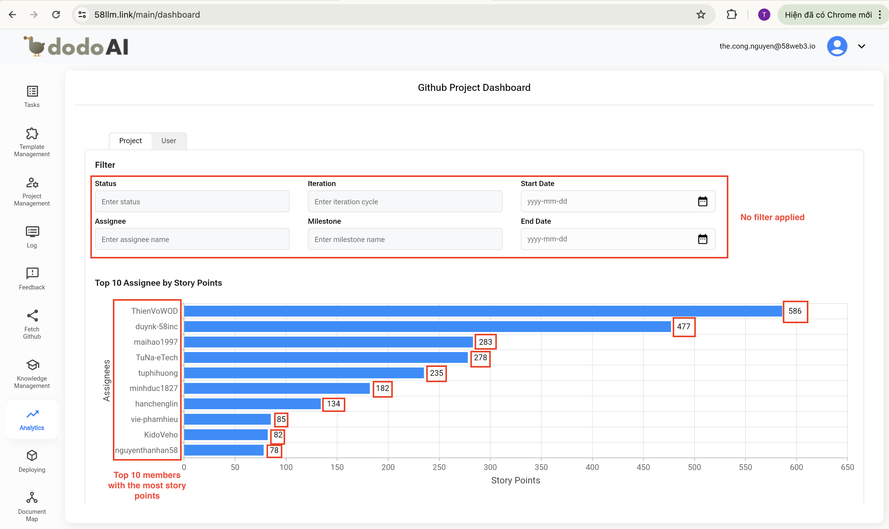
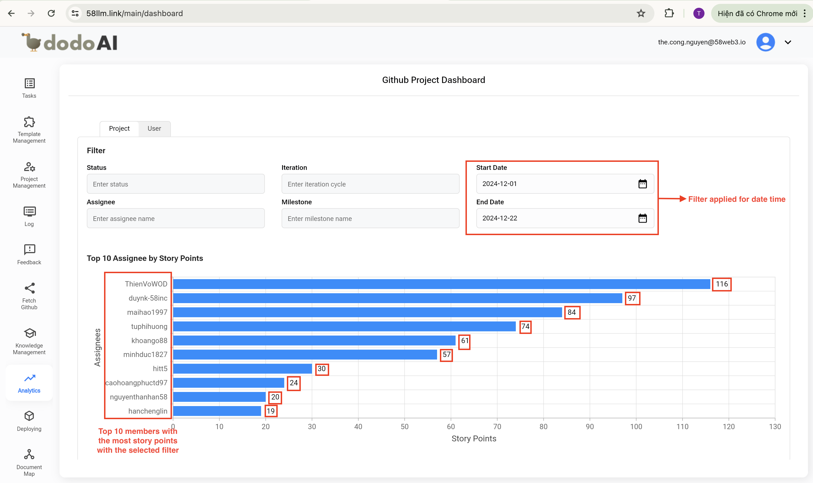
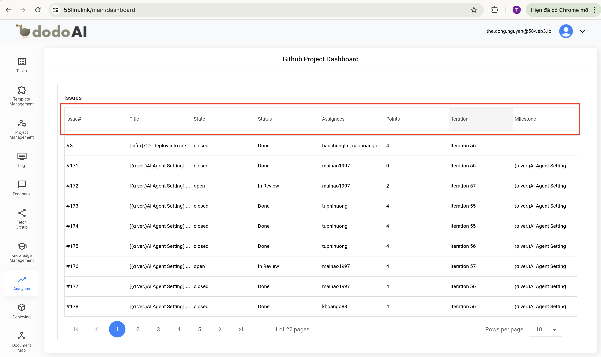
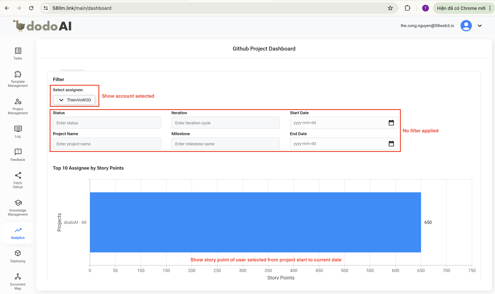
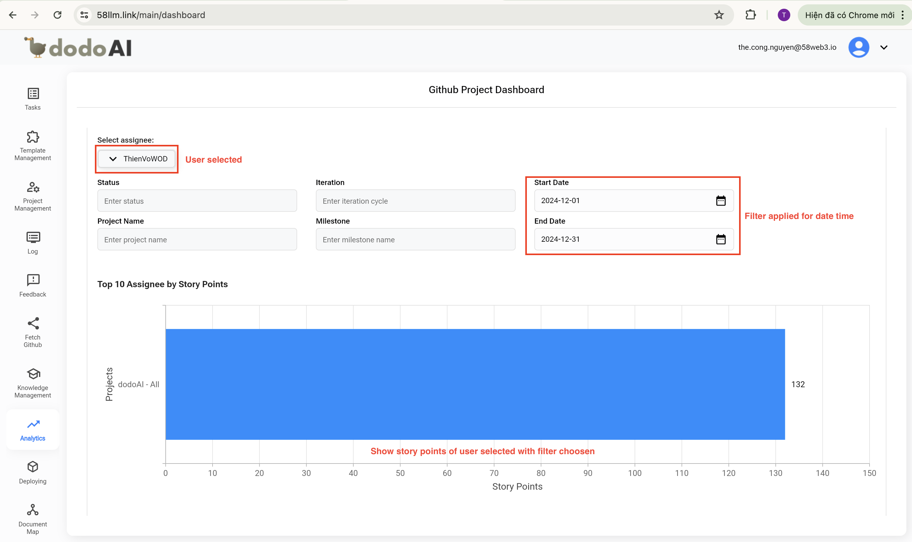

## Giới Thiệu

Chào mừng bạn đến với hướng dẫn sử dụng tính năng **Phân Tích (Analytics)**! Tính năng này được thiết kế nhằm hỗ trợ bạn trong việc tính toán điểm story cho từng thành viên trong nhóm và dự án. Dù bạn là người dùng mới hay đã có kinh nghiệm, hướng dẫn này sẽ giúp tăng hiệu suất làm việc của bạn bằng cách làm cho chức năng phân tích trở nên dễ sử dụng hơn.

## Tham Khảo

Để hiểu rõ hơn về tính năng Phân Tích, bạn có thể tham khảo video bên dưới.

  <iframe
    src="https://drive.google.com/file/d/1j66Pqug8kQPMe7Y6VQi55B4HvQ-hrgLK/preview"
    style={{ position: 'absolute', top: '0', left: '0', width: '100%', height: '100%' }}
    frameBorder="0"
    allow="autoplay; encrypted-media"
    allowFullScreen
    loading="lazy"
    title="Code Review"
  ></iframe>

## Yêu Cầu Trước Khi Sử Dụng

- Một tài khoản email (email và mật khẩu) để đăng ký tài khoản DodoAI.
- Một tài khoản Google để đăng nhập vào DodoAI.
- Chuẩn bị trước các tài liệu cần thiết để sử dụng từng tính năng.

## Hướng Dẫn Sử Dụng

- Truy cập vào tính năng Phân Tích (Analytics)
- Cấu hình dự án
- Đồng bộ điểm story mới nhất
- Xem thông tin phân tích
- Lọc điểm story theo dự án
- Lọc điểm story theo người dùng

### 1. Truy cập vào tính năng Phân Tích (Analytics)

Khi bạn nhấn vào **Phân Tích (Analytics)** trong thanh bên trái, màn hình **Analytics** sẽ được hiển thị.

### 2. Cấu hình dự án

Sau khi truy cập màn hình **Phân Tích (Analytics)**, bạn sẽ thấy phần **Cấu hình Dự Án (Project Configuration)** ở phía trên cùng của màn hình. Phần này sẽ liệt kê 5 cấu hình:

- **URL Dự Án (Project URL)**: Nhập URL của dự án GitHub mà bạn muốn hiển thị điểm story bằng cách truy cập dữ liệu GitHub thông qua tính năng "GitHub Fetch". Ví dụ: bạn nhập URL của dự án GitHub DodoAI: "https://github.com/orgs/58web3/projects/18".
- **Tên Cột Điểm Story (Story Point Field Name)**: Nhập "StoryPoints(1,2,4,8,16)", văn bản này phải giống hoàn toàn với tên cột điểm story trong phần "Sum Story Point" của dự án GitHub.
- **Tên Cột Iteration (Iteration Field Name)**: Nhập "Iteration", văn bản này phải giống hoàn toàn với tên cột iteration trong phần "Sum Story Point" của dự án GitHub.
- **Tên Cột Trạng Thái (Status Field Name)**: Nhập "Status", văn bản này phải giống hoàn toàn với tên cột trạng thái trong phần "Sum Story Point" của dự án GitHub.
- **Iteration Mặc Định (Default Iteration)**: Bạn có thể để trống hoặc nhập một văn bản hợp lệ tại đây. Văn bản này sẽ tự động điền vào các ô Iteration trống trong dự án GitHub để hỗ trợ tìm kiếm các tác vụ không thuộc bất kỳ Iteration nào.

### 3. Đồng bộ điểm story mới nhất

Sau khi điền đầy đủ các trường trong phần **Cấu hình Dự Án (Project Configuration)**, bạn có thể nhấn nút **Sync** ở phía bên phải màn hình. Hệ thống sẽ đánh giá và đồng bộ các thông tin mới nhất tương ứng với các giá trị đã nhập, đồng thời hiển thị thời gian đồng bộ gần nhất để bạn dễ dàng theo dõi.

### 4. Xem thông tin phân tích

Sau khi điền đầy đủ các trường trong phần **Cấu hình Dự Án** và đồng bộ thành công, người dùng nhấn nút **Apply** để tạo kết quả mới nhất phù hợp với cấu hình, và hiển thị trên tab **Phân Tích (Analytics)**:

- **Tổng số issues**: Tính toán và hiển thị tổng số issues, bao gồm cả issues mở và đóng của dự án GitHub đã chọn.
- **Tổng điểm story**: Tính toán và hiển thị tổng số điểm story của tất cả issues của dự án GitHub đã chọn.
- **Issues đang mở**: Tính toán và hiển thị chỉ các issues đang mở của dự án GitHub đã chọn.
- **Issues đã đóng**: Tính toán và hiển thị chỉ các issues đã đóng của dự án GitHub đã chọn.
- **Điểm trung bình mỗi issue**: Tính toán và hiển thị điểm trung bình mỗi issue của dự án GitHub đã chọn.

### 5. Lọc điểm story theo dự án

Trên tab **Dự Án (Project)**, bạn sẽ thấy biểu đồ điểm story cùng với một số bộ lọc sau:

- Trạng thái (Status)
- Người thực hiện (Assignee)
- Iteration
- Milestone
- Ngày bắt đầu (Start Date)
- Ngày kết thúc (End Date)

Nếu không áp dụng bất kỳ bộ lọc nào, biểu đồ sẽ hiển thị top 10 người thực hiện (assignee) với điểm story từ ngày bắt đầu dự án đến hiện tại. Kết quả được sắp xếp theo thứ tự giảm dần từ người có nhiều điểm story nhất đến người có ít điểm nhất.

Nếu áp dụng bộ lọc, biểu đồ sẽ hiển thị top 10 người thực hiện với điểm story khớp với bộ lọc đã chọn.

Trên tab **Issues**, bạn sẽ thấy tất cả thông tin chi tiết dựa trên kết quả được tạo từ biểu đồ. Các thông tin bao gồm:

- ID Issue (issues#)
- Tiêu đề (Title)
- Trạng thái (State)
- Tình trạng (Status)
- Người thực hiện (Assignee)
- Điểm (Points)
- Iteration
- Milestone

### 6. Lọc điểm story theo người dùng

Trên tab **Người Dùng (User)**, người dùng có thể **chọn một người thực hiện cụ thể** và biểu đồ sẽ hiển thị với các bộ lọc sau dành riêng cho người được chọn:

- Trạng thái (Status)
- Iteration
- Milestone
- Ngày bắt đầu (Start Date)
- Ngày kết thúc (End Date)

Nếu không áp dụng bất kỳ bộ lọc nào, biểu đồ sẽ hiển thị điểm story từ ngày bắt đầu dự án đến hiện tại của người được chọn.

Nếu áp dụng bộ lọc, biểu đồ sẽ hiển thị điểm story của người được chọn, khớp với các bộ lọc đã chọn.

Trên tab **Issues**, bạn sẽ thấy tất cả thông tin chi tiết dựa trên kết quả từ biểu đồ. Các thông tin bao gồm:

- ID Issue (issues#)
- Tiêu đề (Title)
- Trạng thái (State)
- Tình trạng (Status)
- Người thực hiện (Assignee)
- Điểm (Points)
- Iteration
- Milestone

