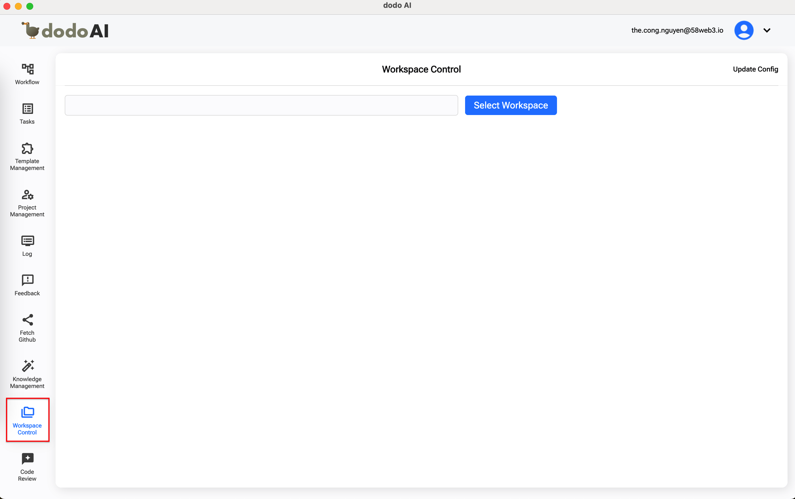
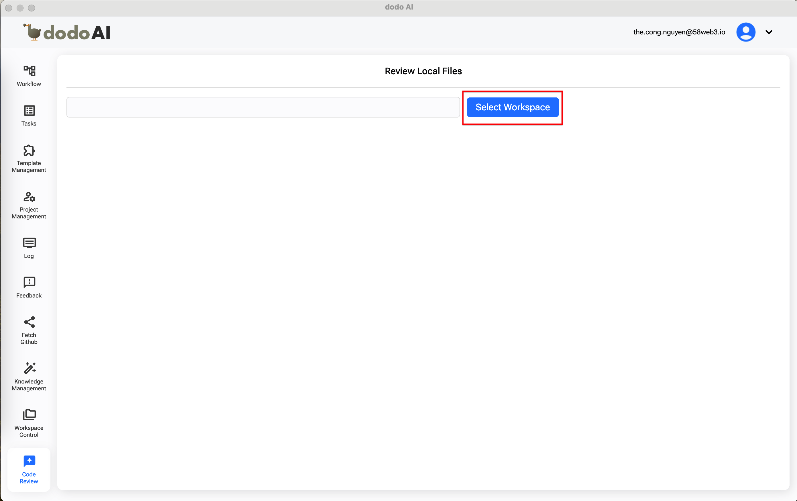
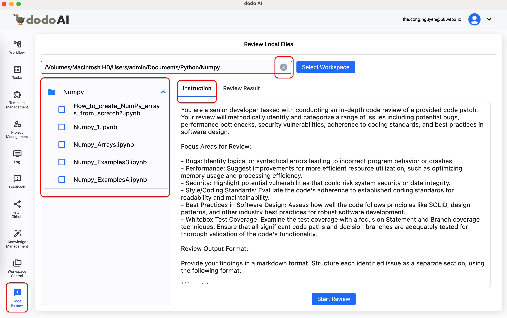
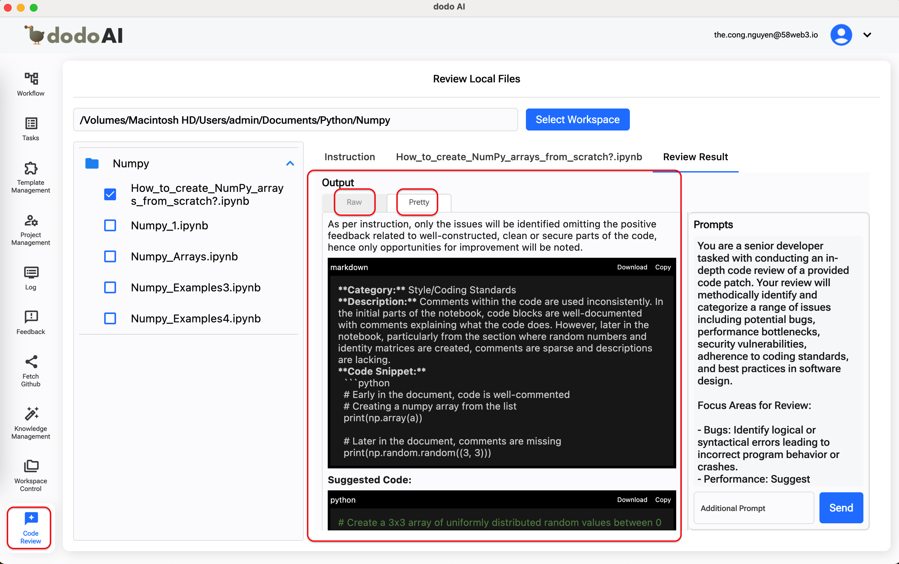
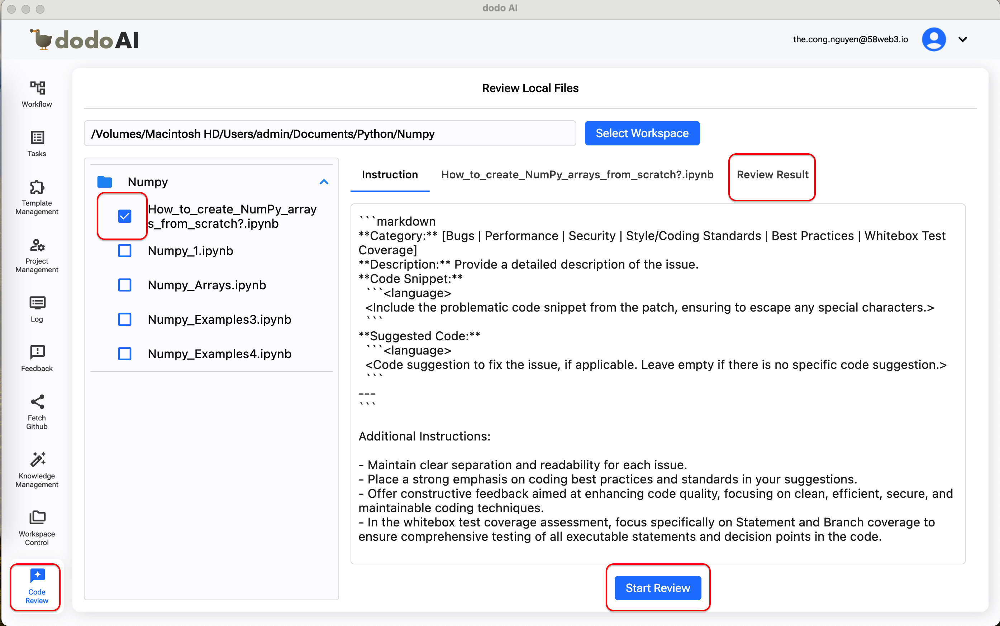
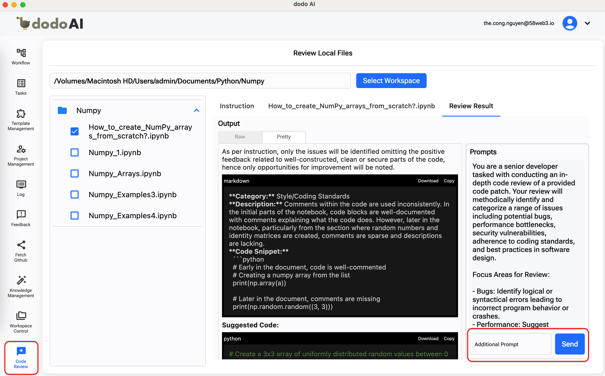

## Giới Thiệu

Chào mừng bạn đến với hướng dẫn sử dụng **Code Review**! Tính năng này được thiết kế nhằm hỗ trợ các nhà phát triển xem xét, đảm bảo hoặc cải thiện chất lượng mã nguồn.

## Tham Khảo

Để hiểu rõ hơn về tính năng Code Review, bạn có thể tham khảo video bên dưới.

  <iframe
    src="https://drive.google.com/file/d/1zhrKgX7ZE-v7Mr_3K_MduFW-jsUMvazO/preview"
    style={{ position: 'absolute', top: '0', left: '0', width: '100%', height: '100%' }}
    frameBorder="0"
    allow="autoplay; encrypted-media"
    allowFullScreen
    loading="lazy"
    title="Code Review"
  ></iframe>

## Yêu Cầu Trước Khi Sử Dụng

- Một tài khoản email (bao gồm email và mật khẩu) để đăng ký tài khoản DodoAI.
- Một tài khoản Google để đăng nhập vào DodoAI.
- Chuẩn bị trước các tài liệu cần thiết để sử dụng từng tính năng.

## Hướng Dẫn Sử Dụng

- Truy cập tính năng Code Review
- Chọn không gian làm việc (workspace)
- Xem xét các tệp mã nguồn cụ thể
- Tạo Prompt bổ sung
- Chỉnh sửa Hướng Dẫn (Instruction)

### 1. Truy cập tính năng Code Review

Khi bạn nhấn vào **Code Review** trong thanh bên trái, màn hình **Chọn Không Gian Làm Việc (Select Workspace)** sẽ được hiển thị.

### 2. Chọn Không Gian Làm Việc

Người dùng nhấn vào nút **Select Workspace**, sau đó chọn các tệp mã nguồn cục bộ. Các thư mục sẽ được hiển thị dưới dạng cây làm việc (working tree). Màn hình cũng hiển thị tab **Instruction** với nội dung mặc định. Người dùng có thể xóa và chọn không gian làm việc khác bằng cách sử dụng nút **x** trong trường Workspace.

### 3. Xem Xét Các Tệp Mã Nguồn Cụ Thể

Người dùng có thể chọn một hoặc nhiều tệp để xem xét bằng cách nhấn vào nút **Start Review**. Hệ thống sẽ đánh giá và tạo kết quả trong tab bên cạnh. Ngoài ra, người dùng có thể xem kết quả theo hai định dạng: **Raw** và **Pretty**.

### 4. Tạo Prompt Bổ Sung

Trên tab **Review Result**, người dùng có thể tạo một Prompt bổ sung để nhận thêm thông tin bằng cách nhập nội dung vào hộp văn bản Prompt và nhấn nút **Send**. Kết quả của Prompt sẽ được hiển thị ngay bên dưới kết quả xem xét.

### 5. Chỉnh Sửa Hướng Dẫn (Instruction)

Trước khi bắt đầu xem xét, người dùng cũng có thể chỉnh sửa nội dung của hướng dẫn (Instruction) để phù hợp hơn với nhu cầu của mình. Hành động này sẽ ảnh hưởng đến kết quả xem xét.
