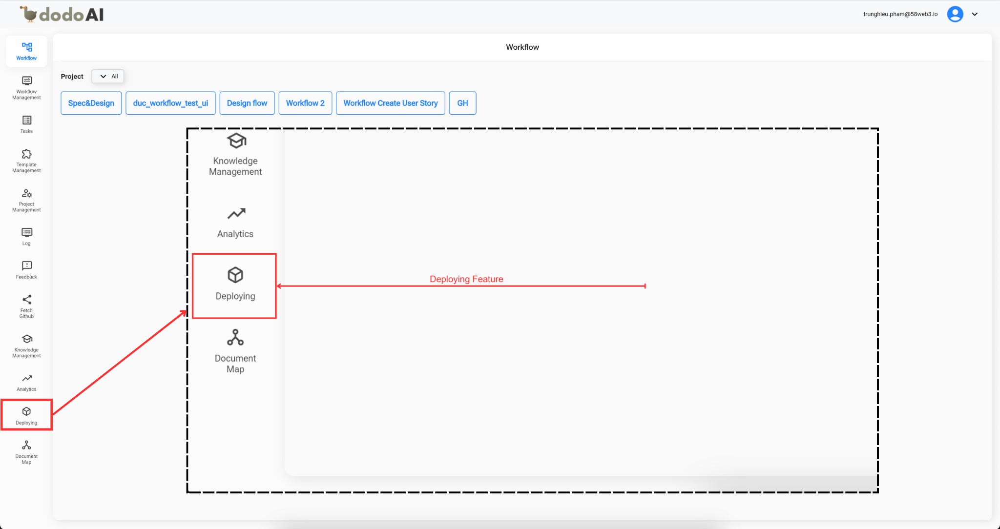
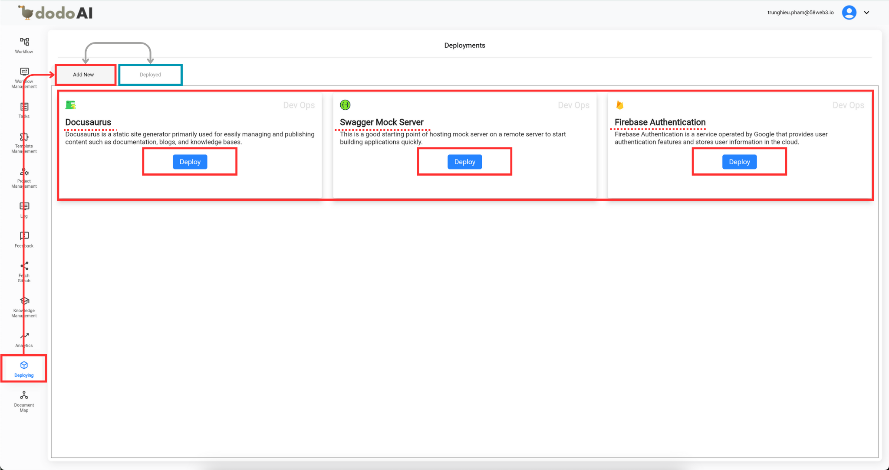
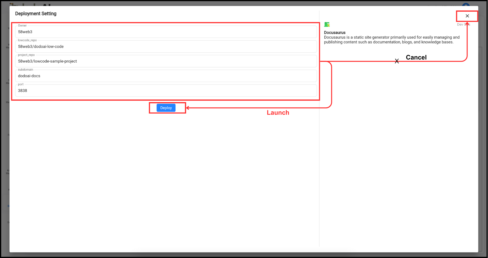
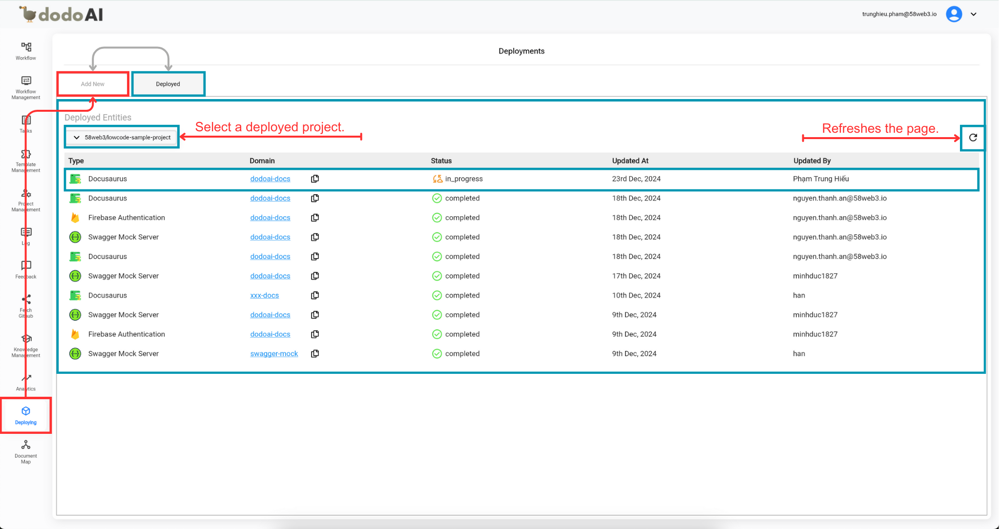

## Hướng Dẫn Sử Dụng Tính Năng `Deploying` Trong dodoAI

Để hiểu rõ hơn về tính năng này, bạn có thể tham khảo video bên dưới.

  <iframe
    src="https://drive.google.com/file/d/17Fg3lS7SJPcP7claF0g5mBbyism8-co2/preview"
    style={{ position: 'absolute', top: '0', left: '0', width: '100%', height: '100%' }}
    frameBorder="0"
    allow="autoplay; encrypted-media"
    allowFullScreen
    loading="lazy"
    title="Deploying Template"
  ></iframe>

Tính năng `Deploying` trong dodoAI cho phép bạn triển khai các tác vụ một cách dễ dàng và hiệu quả. Dưới đây là các bước để sử dụng tính năng này tối ưu nhất:

### Bước 1: Truy Cập Tính Năng `Deploying`

- Mở ứng dụng dodoAI và tìm tùy chọn **Deploying** trên thanh Menu chính.
- Nhấn vào đó để mở giao diện triển khai.

### Bước 2: Khám Phá Các Tác Vụ Sẵn Sàng Triển Khai

- Trên màn hình **Add New**, bạn sẽ thấy danh sách các tác vụ sẵn sàng triển khai:
  - **Docusaurus**: Dễ dàng tạo tài liệu một cách linh hoạt.
  - **Swagger Mock Server**: Dễ dàng mock API của bạn.
  - **Firebase Authentication**: Thiết lập xác thực mạnh mẽ với Firebase.
- Đọc mô tả ngắn để hiểu rõ hơn từng tác vụ.

### Bước 3: Chọn Một Tính Năng Để Triển Khai

- Nhấn vào nút **Deploy** dưới tính năng bạn muốn triển khai, ví dụ: chọn `Docusaurus`.

### Bước 4: Nhập Các Thông Số Kỹ Thuật

- Một cửa sổ pop-up sẽ xuất hiện yêu cầu bạn nhập các thông số cần thiết.
- Nếu cần, hãy tham khảo đội ngũ backend hoặc DevOps để có thông tin chính xác.

### Bước 5: Hoàn Tất Quá Trình Triển Khai

- Sau khi nhập thông số, nhấn nút **Deploy** để tiếp tục.
- Bạn có thể nhấn nút **X** ở góc trên bên phải để hủy nếu cần thay đổi thông tin.

### Bước 6: Xem Trạng Thái Triển Khai

- Khi triển khai thành công, cửa sổ pop-up sẽ tự động đóng lại và đưa bạn đến màn hình **Deployed**.
- Bạn cũng có thể điều hướng đến tab **Deployed** từ menu `Deploying` để theo dõi tiến trình.

### Bước 7: Quản Lý Các Tính Năng Đã Triển Khai

- Trong tab **Deployed**, bạn có thể xem thông tin chi tiết về các tính năng đã triển khai:
  - **Type**: Loại tính năng.
  - **Domain**: Miền nơi tính năng được triển khai.
  - **Status**: Trạng thái hiện tại.
  - **Updated At**: Thời gian cập nhật lần cuối.
  - **Updated By**: Người thực hiện cập nhật lần cuối.
- Các thông tin này được hiển thị dựa trên các dự án mục tiêu bạn đã chọn tại bước 4.
- Bạn có thể quản lý việc triển khai hiệu quả hơn bằng cách chọn các dự án mục tiêu trong phần **Deployed Entities**.

### Bước 8: Làm Mới Danh Sách Triển Khai

- Sử dụng tính năng **Refresh** để cập nhật danh sách với các thay đổi được thực hiện bởi bạn hoặc những người khác.

