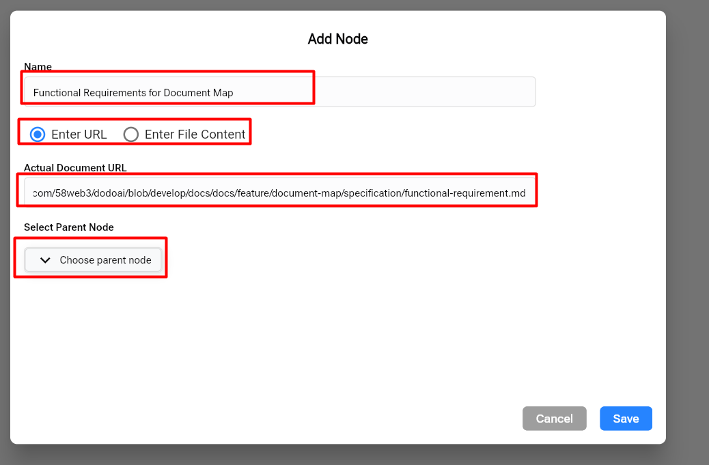
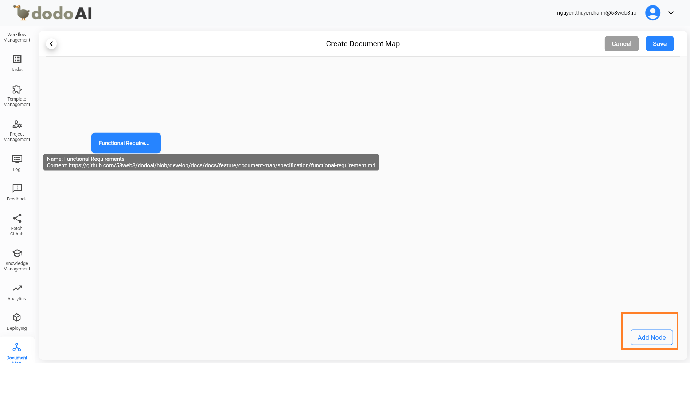
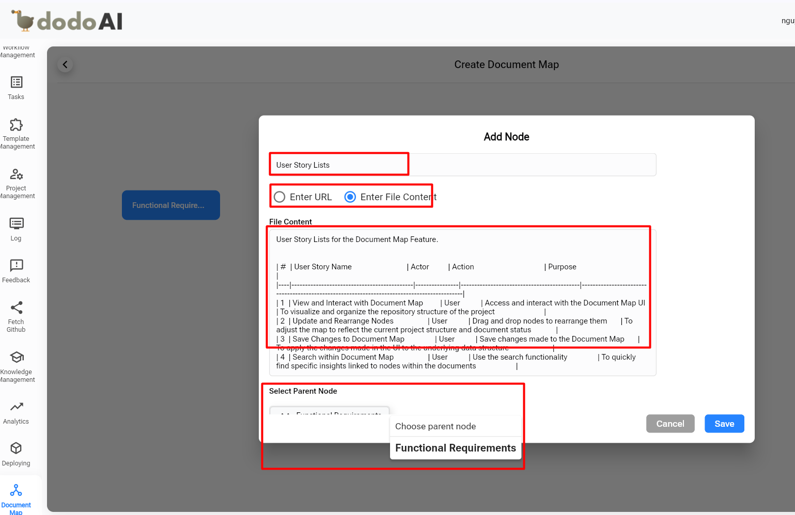
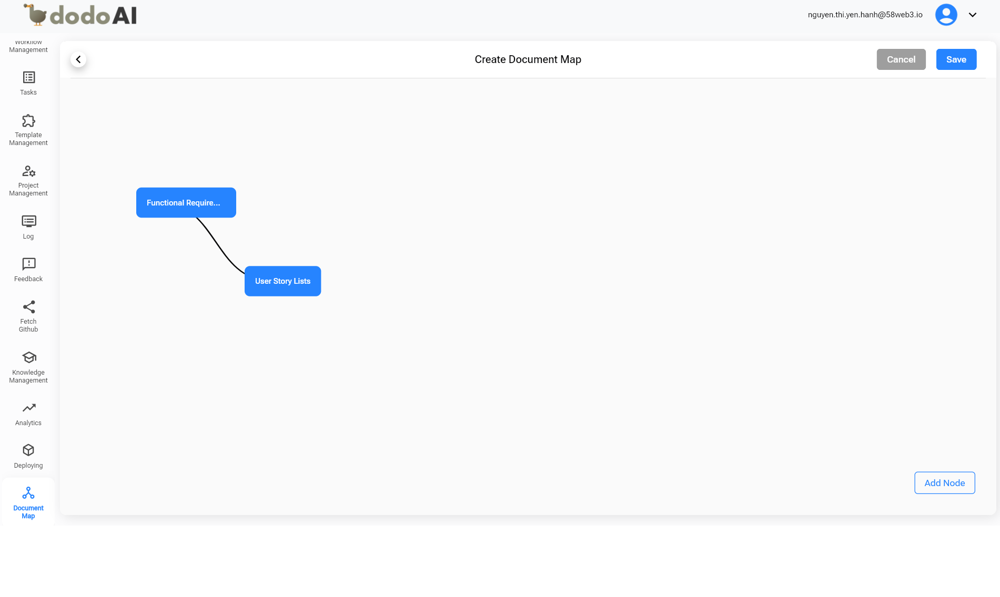
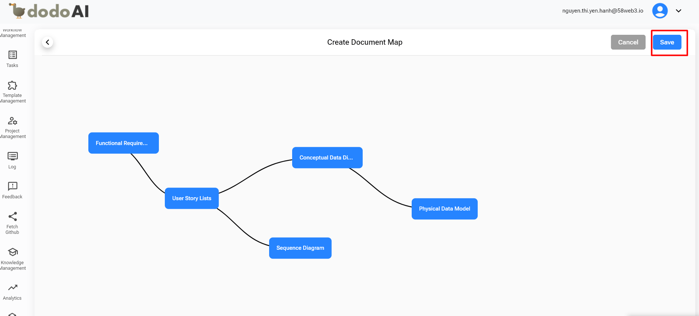
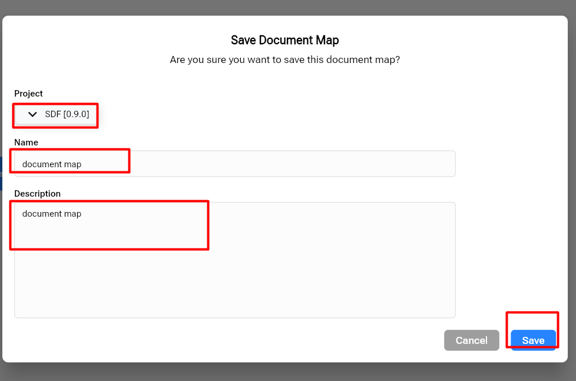
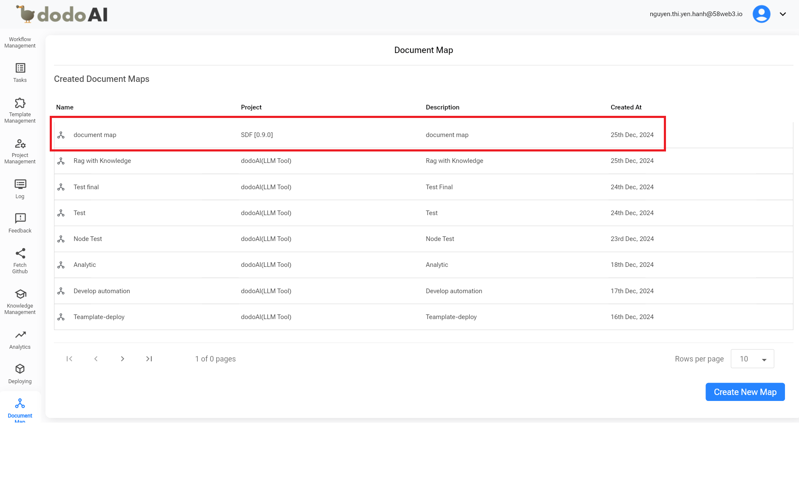

## Hướng Dẫn Sử Dụng Tính Năng Bản Đồ Tài Liệu (Document Map) Trong dodoAI

Để hiểu rõ hơn về tính năng Bản Đồ Tài Liệu, bạn có thể tham khảo video bên dưới.

  <iframe
    src="https://drive.google.com/file/d/1q7HY_MdlF3fIFwFKpZUnpETmHl4OpezT/preview"
    style={{ position: 'absolute', top: '0', left: '0', width: '100%', height: '100%' }}
    frameBorder="0"
    allow="autoplay; encrypted-media"
    allowFullScreen
    loading="lazy"
    title="Document Map"
  ></iframe>

## Tổng Quan

Tính năng **Bản Đồ Tài Liệu (Document Map)** cung cấp cho người dùng một công cụ trực quan và tương tác để xem các mối quan hệ giữa các tài liệu và mã nguồn trong một dự án. Tính năng này được thiết kế để giúp điều hướng, tổ chức và quản lý cấu trúc tài liệu, giúp nhóm làm việc dễ dàng duy trì sự rõ ràng và mạch lạc trong quy trình làm việc.

## Mục Đích

Mục đích của tính năng Bản Đồ Tài Liệu là:

- Tăng cường khả năng điều hướng và tổ chức giữa tài liệu và các mối quan hệ mã nguồn.
- Cải thiện năng suất bằng cách giảm thời gian tìm kiếm và quản lý tài liệu.
- Mang lại sự linh hoạt trong việc tùy chỉnh cấu trúc tài liệu dựa trên nhu cầu của dự án.
- Đảm bảo tính nhất quán bằng cách lưu các thay đổi trực tiếp vào cấu trúc dữ liệu nền tảng.

## Hướng Dẫn Sử Dụng

### 1. Thêm Bản Đồ Tài Liệu

- Truy cập màn hình **Document Map**, sau đó nhấn vào **Create New Map**. Cuối cùng, nhấn vào **Add Node** để thêm tài liệu.
- Trên màn hình Add Node, thêm tài liệu bằng cách sử dụng URL hoặc tệp được nhập từ GitHub.

Ví dụ: chúng ta có thể tạo một sơ đồ từ **Functional Requirement** đến **Physical Data Model** theo cách tiếp cận **SDF (Standard Dev Flow).**

Đầu tiên, chúng ta sẽ thêm tài liệu **Functional Requirement** bằng URL (nội dung tệp):

- **Name**: Tên của tài liệu.
- **Actual Document URL**: Liên kết đến tài liệu trên GitHub.
- **Choose Parent Node**: Chọn một nút cha để làm điểm bắt đầu hoặc nút gốc cho các tài liệu hoặc dữ liệu tiếp theo.

Nhập toàn bộ thông tin yêu cầu, sau đó lưu lại. Trên màn hình **Create Document Map**, thông tin đã nhập (title, URL) sẽ được hiển thị.

Tiếp theo, thêm một tài liệu mới bằng cách nhấn vào **Add Node**.

Sau đó, thêm tài liệu **User Story Lists** bằng nội dung tệp (URL).

Tiếp tục thêm tài liệu mới bằng cách nhấn vào **Add Node**.

Tương tự như **Functional Requirement** và **User Story Lists**, chúng ta thêm các tài liệu sau: Sequence Diagram, Conceptual Data Diagram, Swagger (API Definition), Physical Data Model...

Khi đã thêm tất cả tài liệu, nhấn nút **Save** ở góc trên bên phải màn hình để lưu lại. Chọn dự án và nhập tên tài liệu, tên tính năng và nội dung của tài liệu.

Sau khi lưu Bản Đồ Tài Liệu, một thông báo thành công sẽ xuất hiện, và màn hình sẽ chuyển đến chế độ xem danh sách. Danh sách sẽ hiển thị thông tin chi tiết như tên, dự án, mô tả, và thời gian tạo.

### 2. Chỉnh Sửa và Xóa Bản Đồ Tài Liệu

- **Sắp Xếp Lại**: Cho phép người dùng kéo và thả các nút để tổ chức lại sơ đồ.
- **Thêm và Loại Bỏ**: Cung cấp tùy chọn thêm các nút và cạnh mới hoặc xóa các nút và cạnh hiện có để phản ánh các thay đổi về cấu trúc.

### 3. Lưu Các Thay Đổi Của Bản Đồ Tài Liệu

- Cho phép người dùng lưu những thay đổi đã thực hiện trên Bản Đồ Tài Liệu.
- Đảm bảo rằng các bản cập nhật được lưu trong cấu trúc dữ liệu nền tảng nhằm duy trì tính nhất quán.
