## Giới Thiệu

Chào Mừng Đến Với Hướng Dẫn Sử Dụng **Phản Hồi**! Tính Năng Này Cho Phép Quản Trị Viên Xem, Lọc, Và Quản Lý Phản Hồi Dựa Trên Các Tiêu Chí Khác Nhau Như Dự Án Và Người Dùng. Ngoài Ra, Tính Năng Này Đảm Bảo Rằng Phản Hồi Có Thể Được Lấy Với Thông Tin Chi Tiết Để Xem Xét Hoạt Động Hoặc Khôi Phục Dữ Liệu Phản Hồi.

## Tham Khảo

Để Hiểu Rõ Hơn Về Tính Năng Phản Hồi, Người Dùng Có Thể Tham Khảo Video Dưới Đây.

  <iframe
    src="https://drive.google.com/file/d/1gU81Ef8bekpMsM2Q62gdRjYTBOi-2bE8/preview"
    style={{ position: 'absolute', top: '0', left: '0', width: '100%', height: '100%' }}
    frameBorder="0"
    allow="autoplay; encrypted-media"
    allowFullScreen
    loading="lazy"
    title="Feedback"
  ></iframe>

## Yêu Cầu Trước Khi Sử Dụng

- Một Tài Khoản Email (Email Và Mật Khẩu) Để Đăng Ký Tài Khoản DodoAI.
- Một Tài Khoản Google Để Đăng Nhập Vào DodoAI.
- Chuẩn Bị Tài Liệu Cần Thiết Cho Mỗi Tính Năng Trước.

## Hướng Dẫn Sử Dụng

- Truy Cập Phản Hồi
- Lọc Và Tìm Kiếm Theo Người Dùng
- Thêm Phản Hồi Mới
- Mở Chi Tiết Phản Hồi
- Thêm Phản Hồi Cho Một Chuỗi Cụ Thể
- Thêm Phản Hồi Chung

### 1. Truy Cập Phản Hồi

Khi Người Dùng Nhấp Vào **Phản Hồi** Trong Thanh Bên Trái, Danh Sách Phản Hồi Sẽ Được Hiển Thị. Người Dùng Có Thể Dễ Dàng Xem Tất Cả Phản Hồi Và Thông Tin Cơ Bản Của Chúng Như: Ngày, Người Dùng, Dự Án, Danh Mục, Nhiệm Vụ.

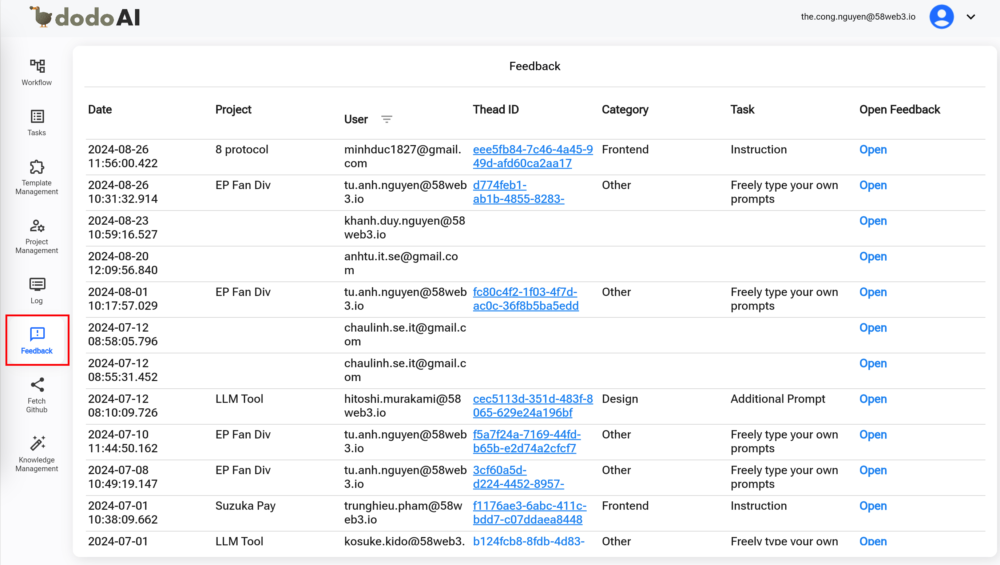

### 2. Lọc Và Tìm Kiếm Theo Người Dùng

Nếu Người Dùng Muốn Tìm Kiếm Một Người Dùng Cụ Thể, Nhấp Vào Biểu Tượng Bộ Lọc Người Dùng, Sau Đó Nhập Một Từ Khóa Trong Trường **Tìm Kiếm** Và Chọn Người Dùng Mong Muốn, Sau Đó Nhấp Nút **OK**. Hệ Thống Sẽ Hiển Thị Các Phản Hồi Liên Quan Đến Từ Khóa Đã Nhập. Người Dùng Có Thể Đóng Hộp Tìm Kiếm Bằng Cách Nhấp Nút **Hủy**.

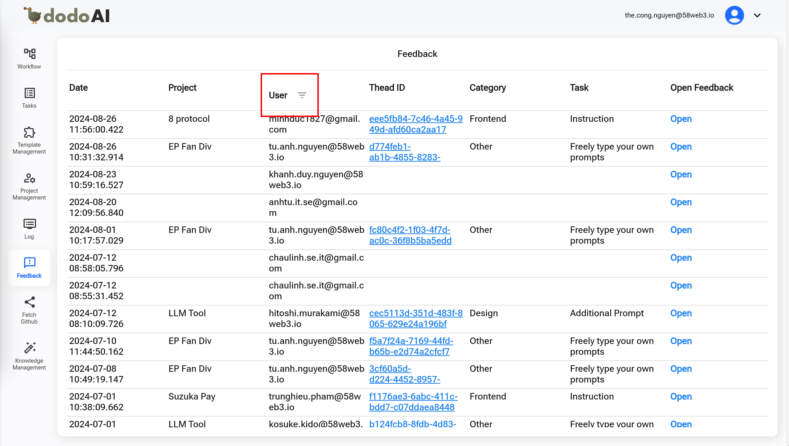
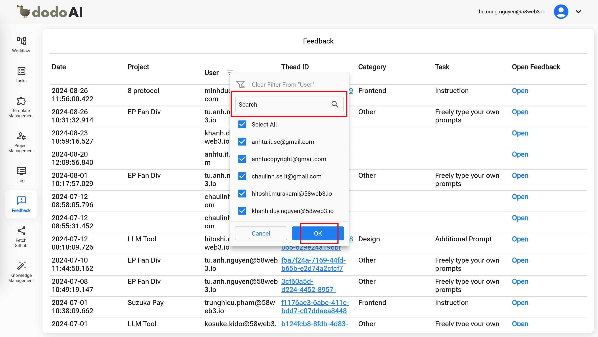

### 3. Thêm Phản Hồi Mới

Khi Người Dùng Chọn Một ID Chuỗi Từ Danh Sách, Hệ Thống Sẽ Điều Hướng Đến Màn Hình Chi Tiết Chuỗi Trên Tính Năng **Nhiệm Vụ**. Trên Màn Hình Này, Người Dùng Có Thể Thêm Và Gửi Phản Hồi. Sau Khi Người Dùng Gửi Phản Hồi Thành Công, Thông Tin Của Phản Hồi Sẽ Được Cập Nhật Như Ngày, Người Dùng, Và Nội Dung Phản Hồi.

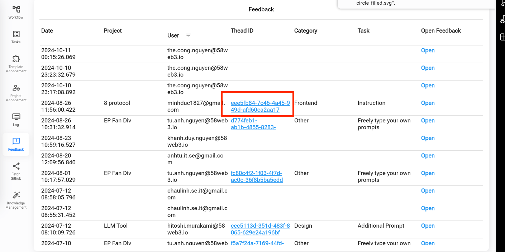
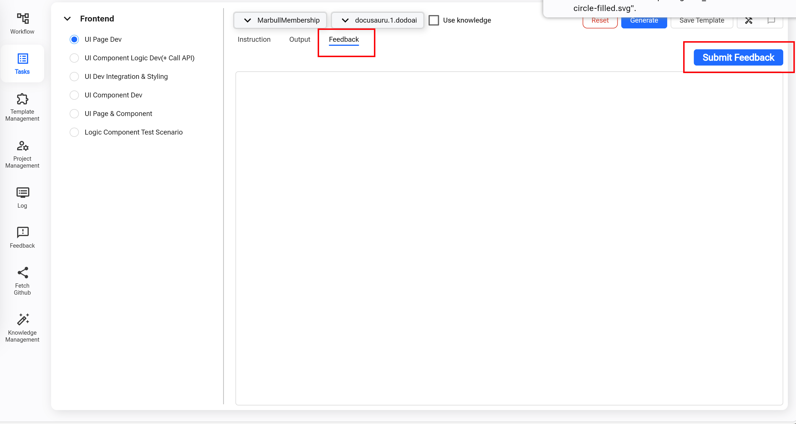

### 4. Mở Chi Tiết Phản Hồi

Khi Người Dùng Nhấp Vào Nút **Mở** Trên Một Dòng Phản Hồi Cụ Thể, Hệ Thống Mở Chi Tiết Của Phản Hồi Trong Một Cửa Sổ Bật Lên Nơi Người Dùng Có Thể Kiểm Tra Nội Dung Của Phản Hồi. Người Dùng Có Thể Đóng Cửa Sổ Bật Lên Này Bằng Cách Nhấp Nút **OK**.

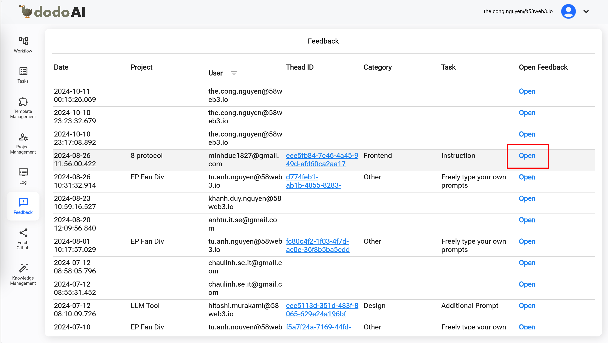
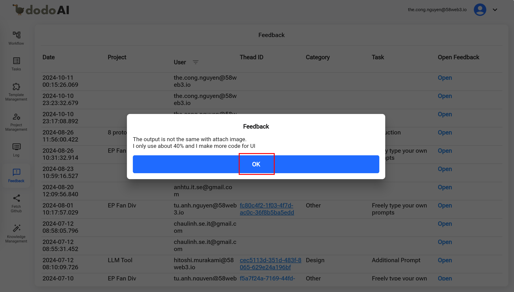

### 5. Thêm Phản Hồi Cho Một Chuỗi Cụ Thể

Sau Khi Người Dùng Đã Hoàn Thành Một Số Tác Vụ, Họ Có Thể Thêm Phản Hồi Về Một Số Khía Cạnh Như Hiệu Suất, UX, Lỗi, V.v., Bằng Cách Nhấp Vào Ô Văn Bản Phản Hồi, Sau Đó Nhấp Nút **Gửi Phản Hồi**. Phản Hồi Này Sẽ Được Hiển Thị Với Đủ Thông Tin Và ID Chuỗi Trong Danh Sách Phản Hồi.

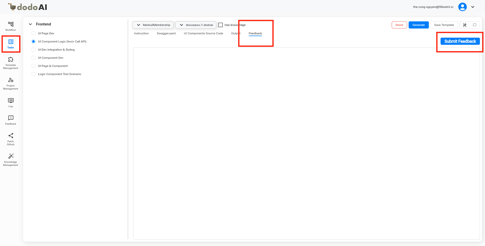
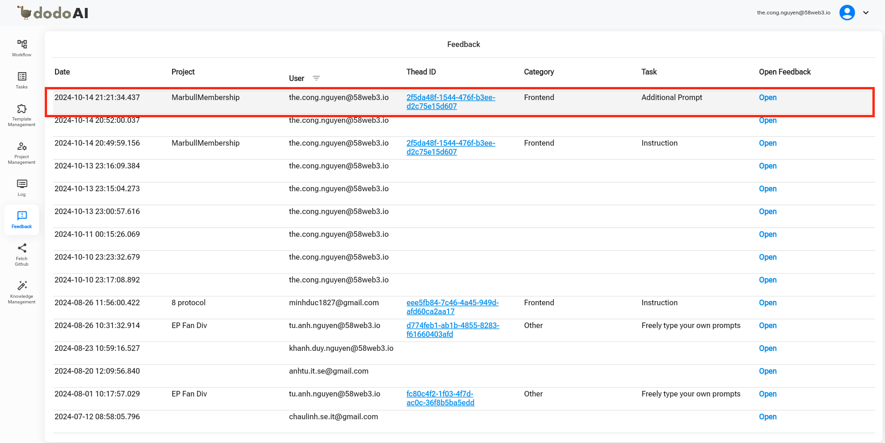

### 6. Thêm Phản Hồi Chung

Hơn Nữa, Trong Tính Năng **Nhiệm Vụ**, Người Dùng Cũng Có Thể Thêm Phản Hồi Chung Bằng Cách Nhấp Nút Đối Thoại. Phản Hồi Này Sẽ Được Hiển Thị Với Đầy Đủ Thông Tin Mà Không Có ID Chuỗi Trong Danh Sách Phản Hồi.

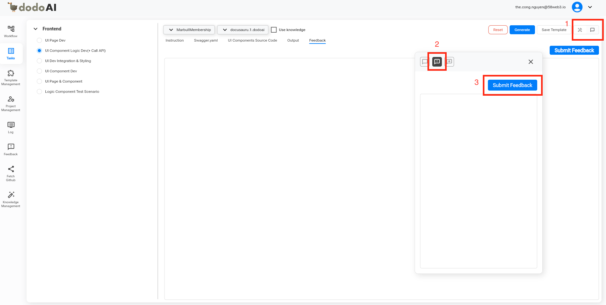
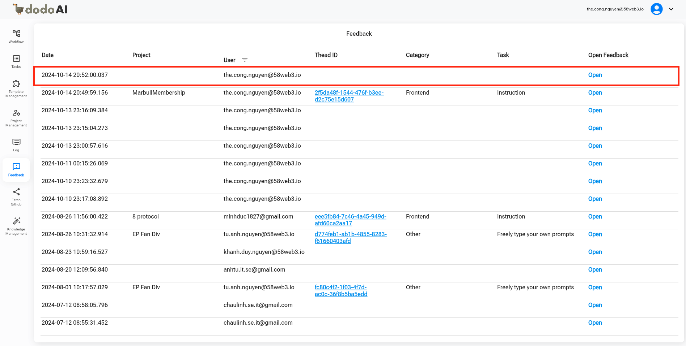
