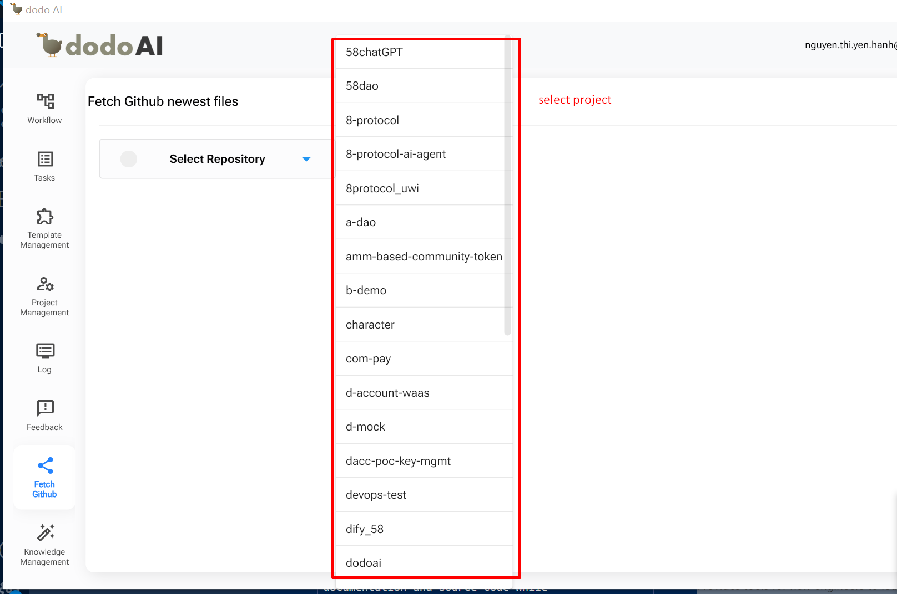
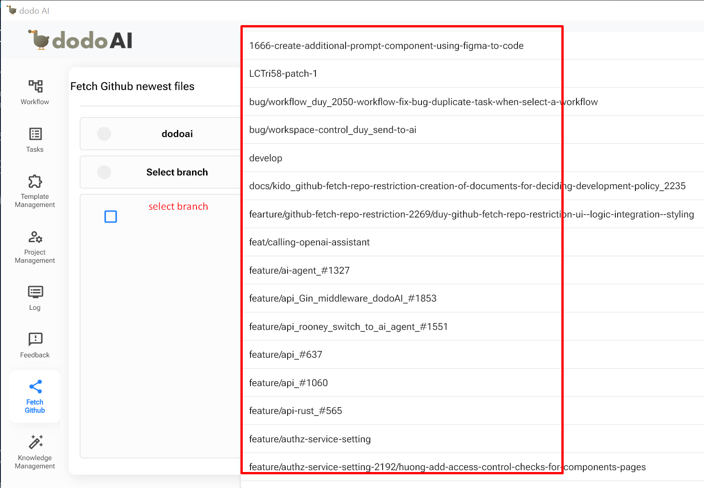
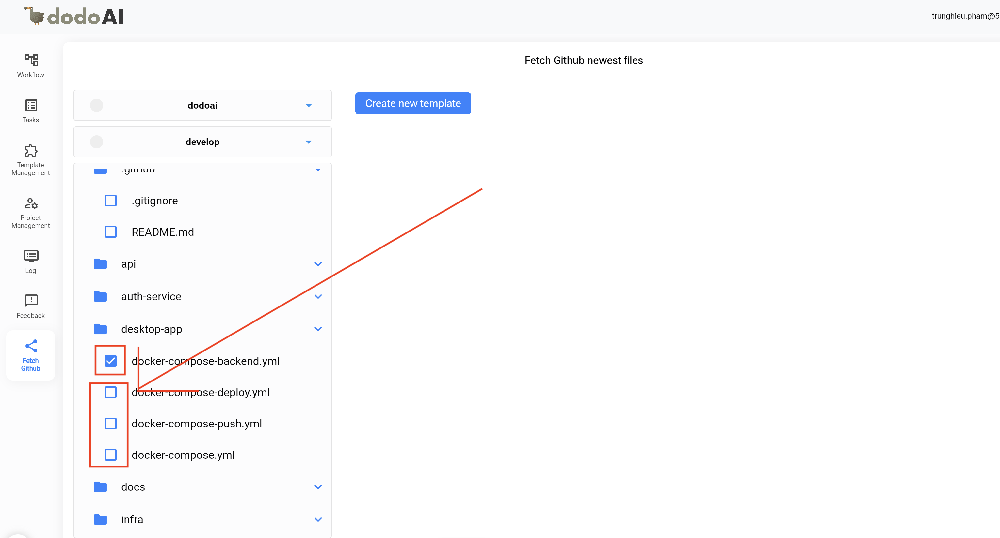
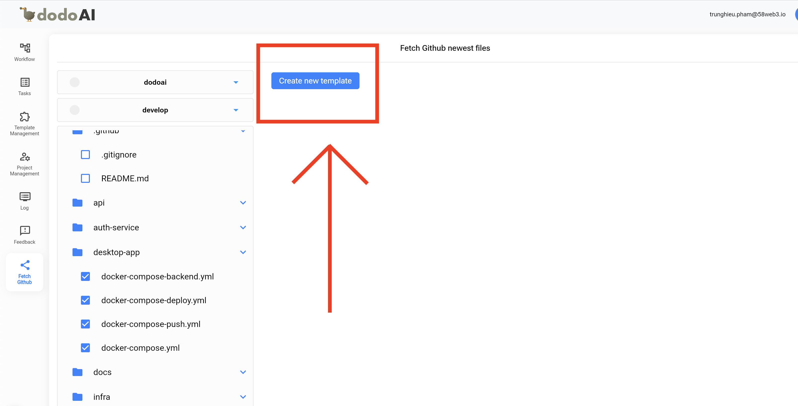
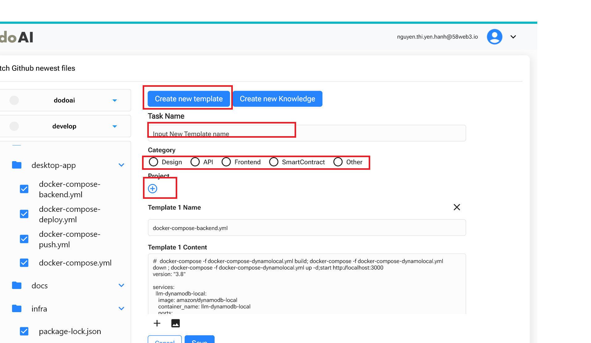
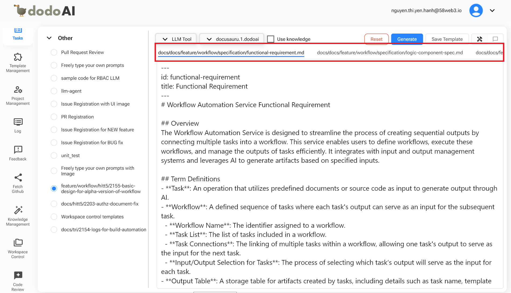

## Giới Thiệu

Tính Năng Fetch GitHub Cho Phép Người Dùng Tinh Giản Quy Trình Làm Việc Dự Án Bằng Cách Tạo Các Mẫu Từ Các Tệp GitHub Đã Lấy. Chức Năng Này Giúp Cải Thiện Hiệu Quả Trong Việc Quản Lý Nhiệm Vụ Và Tài Liệu Bằng Cách Đảm Bảo Rằng Các Tệp Mới Nhất Từ Kho Lưu Trữ Được Sử Dụng Làm Mẫu Cho Các Nhiệm Vụ Khác Nhau. Bằng Cách Làm Theo Các Bước Đơn Giản Được Đề Ra, Người Dùng Có Thể Nhanh Chóng Chọn Dự Án Và Nhánh, Lấy Các Tệp Liên Quan, Và Tạo Các Mẫu Có Thể Tái Sử Dụng. Quy Trình Này Cũng Tích Hợp Với Các Khả Năng AI, Có Thể Hỗ Trợ Cập Nhật, Thêm Hoặc Tạo Tài Liệu Và Mã Dựa Trên Các Mẫu Đã Tạo.

## Tham Khảo

Để Hiểu Rõ Hơn Về Tính Năng Quản Lý Dự Án, Bạn Có Thể Tham Khảo Video Dưới Đây.

  <iframe
    src="https://drive.google.com/file/d/121ql2rIWLW32dK2OpKV_78aF3tqSxXv6/preview"
    style={{ position: 'absolute', top: '0', left: '0', width: '100%', height: '100%' }}
    frameBorder="0"
    allow="autoplay; encrypted-media"
    allowFullScreen
    loading="lazy"
    title="Code Review"
  ></iframe>

## Tạo Mẫu Trong Fetch GitHub

### Chọn Dự Án

Nhấp Vào Fetch GitHub Trong Hệ Thống, Và Nó Sẽ Điều Hướng Đến Màn Hình Lấy Các Tệp Mới Nhất Từ GitHub. Chọn Dự Án Bạn Đang Làm Trong Danh Sách Các Dự Án Có Sẵn.

### Chọn Nhánh

Sau Khi Chọn Dự Án, Chọn Nhánh Bạn Muốn Làm (Ví Dụ: Main, Develop, V.v.).

### Tạo Mẫu

Chọn Tệp Bạn Muốn Sử Dụng Để Tạo Mẫu. Từ Danh Sách Các Tệp Đã Lấy Từ GitHub, Chọn Những Tệp Phù Hợp.

#### Tạo Mẫu Mới

- **Tên Nhiệm Vụ**: Nhập Tên Nhiệm Vụ Bạn Muốn Gán Cho Mẫu.
- **Danh Mục**: Chọn Một Trong Các Danh Mục Hiển Thị Trên Màn Hình.
- **Dự Án**: Nhấp Nút (+) Để Thêm Mẫu Vào Dự Án.

Nhấp Vào "Tạo Mẫu Mới" Và Một Thông Báo Thành Công Sẽ Xuất Hiện.

#### Mở Tính Năng Nhiệm Vụ

- Mở Tính Năng Nhiệm Vụ Để Chọn Danh Mục Và Tên Mẫu Đã Tạo.

- AI Sẽ Hỗ Trợ Chỉnh Sửa, Thêm, Hoặc Tạo Tài Liệu Hoặc Mã.

