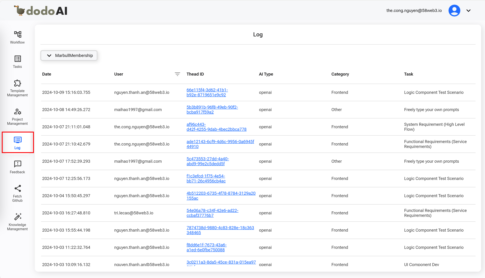
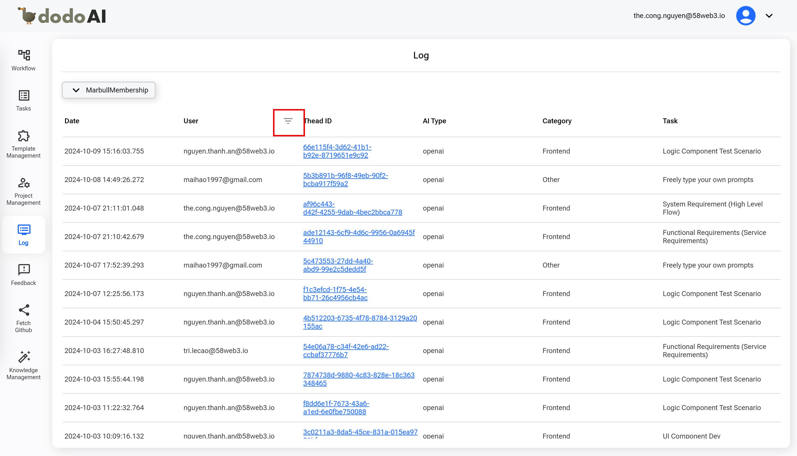
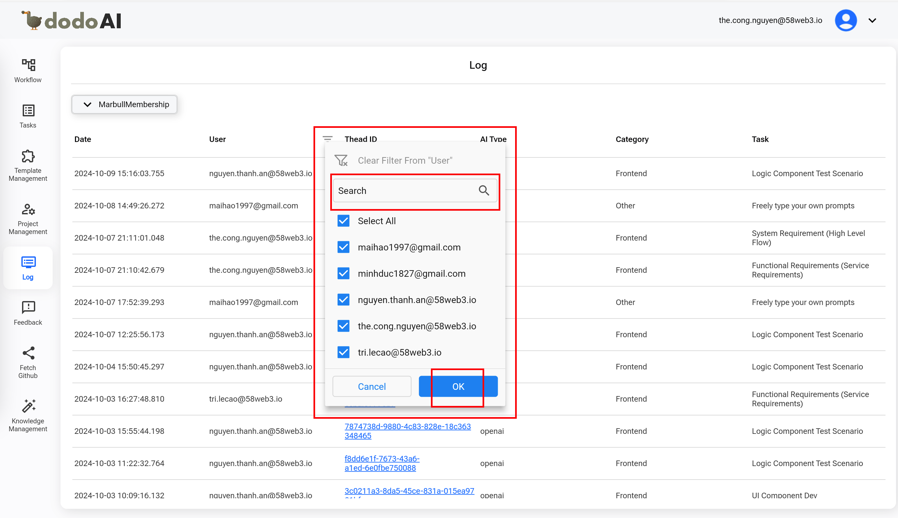
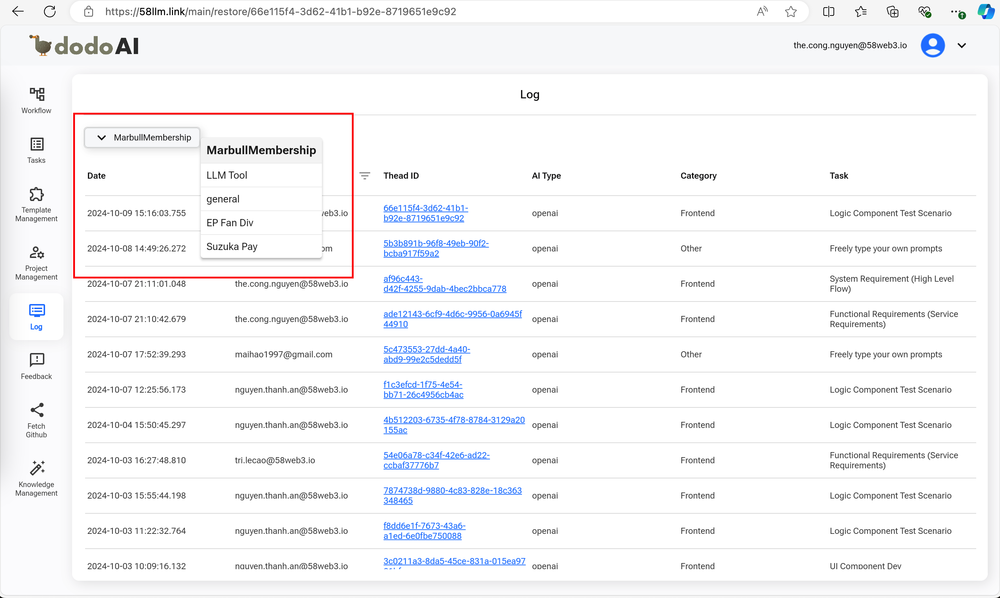
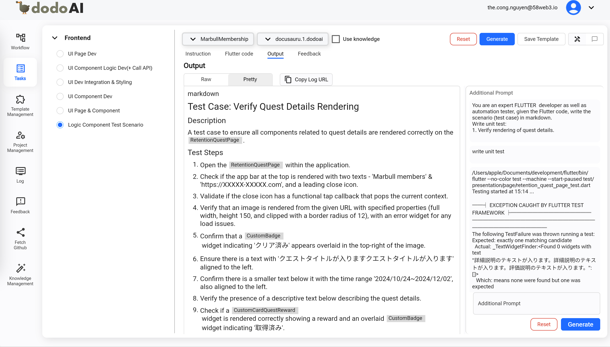

## Giới Thiệu

Chào Mừng Đến Với Hướng Dẫn Sử Dụng **Log**! Tính Năng Này Cho Phép Quản Trị Viên Xem, Lọc, Và Quản Lý Nhật Ký Dựa Trên Các Tiêu Chí Khác Nhau Như Dự Án Và Người Dùng. Ngoài Ra, Tính Năng Này Đảm Bảo Rằng Nhật Ký Có Thể Được Lấy Với Thông Tin Chi Tiết Để Xem Xét Hoạt Động Hoặc Khôi Phục Dữ Liệu Nhật Ký.

## Tham Khảo

Để Hiểu Rõ Hơn Về Tính Năng Log, Bạn Có Thể Tham Khảo Video Dưới Đây.

  <iframe
    src="https://drive.google.com/file/d/1YHs11mpcmkQ2r06uEBjkTrTFpDK6jmE3/preview"
    style={{ position: 'absolute', top: '0', left: '0', width: '100%', height: '100%' }}
    frameBorder="0"
    allow="autoplay; encrypted-media"
    allowFullScreen
    loading="lazy"
    title="Code Review"
  ></iframe>

## Yêu Cầu Trước Khi Sử Dụng

- Một Tài Khoản Email (Email Và Mật Khẩu) Để Đăng Ký Tài Khoản DodoAI.
- Một Tài Khoản Google Để Đăng Nhập Vào DodoAI.
- Chuẩn Bị Tài Liệu Cần Thiết Cho Mỗi Tính Năng Trước.

## Hướng Dẫn Sử Dụng

- Truy Cập Log
- Lọc Và Tìm Kiếm Theo Người Dùng
- Lọc Theo Dự Án
- Xem Chi Tiết Của Một Log
- Ghi Đè Lên Một Log Đã Tồn Tại

### 1. Truy Cập Log

Khi Bạn Nhấp Vào **Log** Trong Thanh Bên Trái, Danh Sách Nhật Ký Sẽ Được Hiển Thị. Bạn Có Thể Dễ Dàng Xem Tất Cả Nhật Ký Và Thông Tin Cơ Bản Của Chúng Như: Ngày, Người Dùng, Loại, Danh Mục, Nhiệm Vụ.

### 2. Lọc Và Tìm Kiếm Theo Người Dùng

Nếu Bạn Muốn Tìm Kiếm Người Dùng Cụ Thể, Nhấp Vào Biểu Tượng Bộ Lọc Người Dùng, Sau Đó Nhập Một Từ Khóa Trong Trường **Tìm Kiếm** Và Chọn Người Dùng Bạn Muốn, Sau Đó Nhấp Nút **OK**. Hệ Thống Sẽ Hiển Thị Các Nhật Ký Liên Quan Đến Từ Khóa Đã Nhập. Người Dùng Có Thể Đóng Hộp Tìm Kiếm Bằng Cách Nhấp Nút **Hủy**.

### 3. Lọc Theo Dự Án

Nếu Bạn Muốn Tìm Kiếm Dự Án Cụ Thể, Nhấp Vào Menu Thả Xuống Của Dự Án Trên Danh Sách Và Chọn Một. Danh Sách Sẽ Hiển Thị Chỉ Các Nhật Ký Của Dự Án Đó.

### 4. Xem Chi Tiết Của Một Log

Khi Bạn Chọn Một ID Chuỗi Từ Danh Sách, Hệ Thống Sẽ Điều Hướng Tới Màn Hình Chi Tiết Nhật Ký Trên Tính Năng **Nhiệm Vụ**.

### 5. Ghi Đè Lên Một Log Đã Tồn Tại

Khi Bạn Đi Đến Chi Tiết Của Một Log Và Tạo Một Đề Xuất Mới Từ Log Này, Thông Tin Sẽ Bị Ghi Đè Như Ngày Và Người Dùng Đã Thay Đổi Nhật Ký Hiện Tại.
