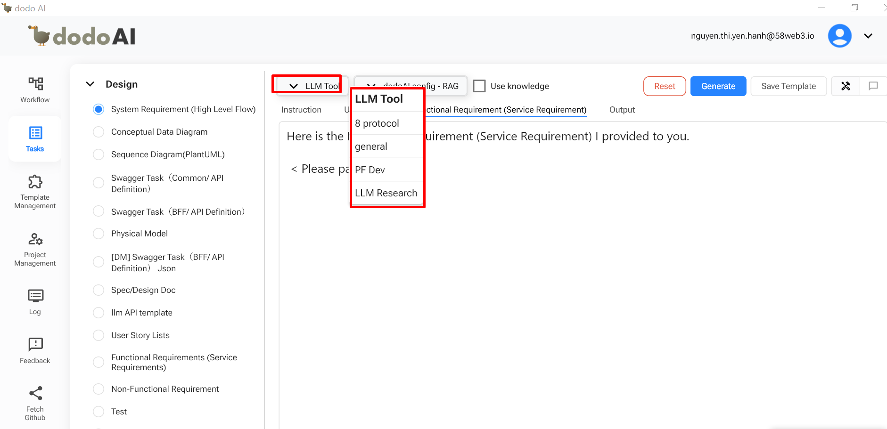
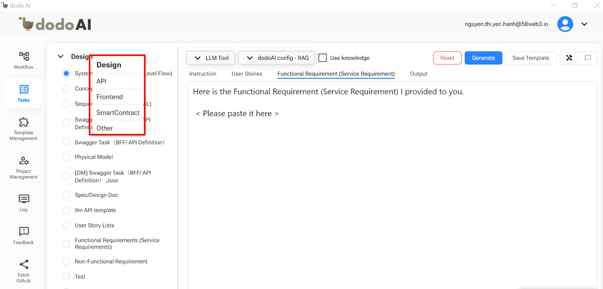
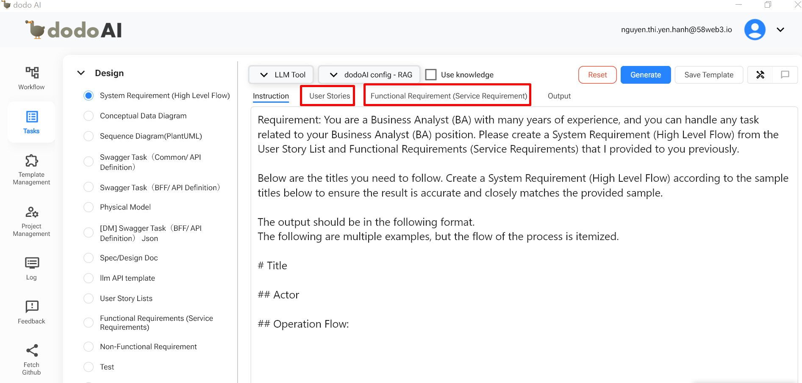
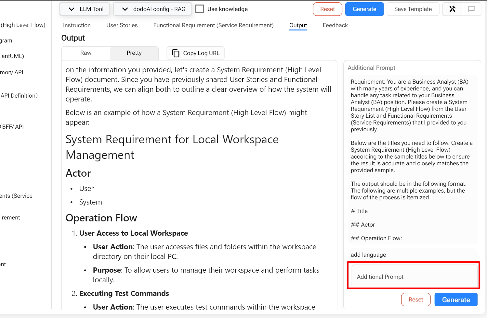

## Giới Thiệu

Chào Mừng Đến Với Hướng Dẫn Sử Dụng **Câu Lệnh Với AI**! Tính Năng Này Cho Phép Bạn Tạo Nhanh, Chính Xác Và Tiết Kiệm Thời Gian Các Tài Liệu Liên Quan Đến Thiết Kế, API, Frontend, Hợp Đồng Thông Minh Và Khác. Ngoài Ra, Nếu Nội Dung Không Phù Hợp Với Kỳ Vọng Của Bạn, Bạn Có Thể Đưa Ra Hướng Dẫn Để Sửa Đổi Cho Đến Khi Bạn Cảm Thấy Nội Dung Hoàn Hảo.

## Tham Khảo

Để Hiểu Rõ Hơn Về Tính Năng Câu Lệnh Với AI, Bạn Có Thể Tham Khảo Video Dưới Đây.

  <iframe
    src="https://drive.google.com/file/d/1TFl3vL9U-roqBBBdDy6SMXsQ5Ac_Gj7I/preview"
    style={{ position: 'absolute', top: '0', left: '0', width: '100%', height: '100%' }}
    frameBorder="0"
    allow="autoplay; encrypted-media"
    allowFullScreen
    loading="lazy"
    title="Code Review"
  ></iframe>

## Yêu Cầu Trước Khi Sử Dụng

- Một Tài Khoản Email (Email Và Mật Khẩu) Để Đăng Ký Tài Khoản DodoAI.
- Một Tài Khoản Google Để Đăng Nhập Vào DodoAI.
- Chuẩn Bị Tài Liệu Cần Thiết Cho Mỗi Tính Năng Trước.

## Hướng Dẫn Sử Dụng

- Chọn Tính Năng "Câu Lệnh Với AI" Từ Thanh Menu.
- Chọn Một Dự Án.
- Chọn Tài Liệu Bạn Muốn Làm Việc.
- Nhập Nội Dung Cần Thiết Cho Các Tài Liệu.
- Xác Nhận Nội Dung Đầu Ra.
- Lưu Và Hoàn Thành.

### Mở Tính Năng Câu Lệnh Với AI Và Tạo Tài Liệu

#### 1. Mở Tính Năng Câu Lệnh Với AI

Hệ Thống DodoAI Có Nhiều Tính Năng, Và Câu Lệnh Với AI Là Một Trong Số Đó. Hãy Chọn Câu Lệnh Với AI Ở Bên Trái Màn Hình.

#### 2. Chọn Một Dự Án

Bạn Cần Chọn Dự Án Đúng Để Tạo Tài Liệu. Cách Này, Bạn Có Thể Xem Lại Các Tài Liệu Đã Tạo Trong Tính Năng Log, Một Chức Năng Khác Của DodoAI.

#### 3. Chọn Loại Tài Liệu

Trong DodoAI, Có Năm Loại Tài Liệu Chính Sau. Mỗi Loại Tài Liệu Sẽ Được Chia Thành Các Tài Liệu Chi Tiết Khác Nhau Để Phục Vụ Cho Dự Án:

- Thiết Kế: Yêu Cầu Hệ Thống, Yêu Cầu Chức Năng, Sơ Đồ Trình Tự...
- API: Đặc Tả API, Phát Triển Dịch Vụ, Kiểm Thử Đơn Vị Bộ Điều Khiển...
- Frontend: Phát Triển Trang Giao Diện, Thành Phần Giao Diện, Kịch Bản Kiểm Thử Thành Phần Giao Diện...
- Hợp Đồng Thông Minh: Đặc Tả Hợp Đồng Thông Minh, Phát Triển Hợp Đồng Thông Minh
- Khác

#### 4. Tạo Tài Liệu

Để Tạo Các Tài Liệu Cụ Thể Như Yêu Cầu Hệ Thống, Yêu Cầu Chức Năng, Đặc Tả API, Vv., chúng ta cần xác định và hiểu rõ các yêu cầu từ khách hàng về tính năng đó. Điều này Rất Quan Trọng Để Tạo Ra Tài Liệu Tốt Và Truyền Đạt Chính Xác Ý Định Của Khách Hàng Đến Với Các Nhà Phát Triển Của Tính Năng Đó.

- Ví dụ, để tạo tài liệu Yêu cầu hệ thống, chúng ta cần chuẩn bị danh sách User Story và Yêu cầu chức năng sẵn trước.

- Đính kèm vào từng mục tài liệu tương ứng.
- Sau khi nhập danh sách User Story và Yêu cầu chức năng, hãy xem xét nội dung và nhấp 'Tạo'. Nội dung của Yêu cầu hệ thống sẽ tự động xuất hiện.
<!--

-->
- Nếu bạn thấy nội dung chưa đầy đủ hoặc muốn thêm, hãy nhập nội dung đã sửa vào Đề nghị bổ sung, rồi nhấp 'Tạo'.

- Bạn có thể tiếp tục chỉnh sửa nội dung cho đến khi hài lòng.
- Khi bạn cảm thấy nội dung hoàn hảo, lưu lại bằng cách nhấp 'Lưu Mẫu'.
- Quá trình tạo tài liệu hoàn tất.
