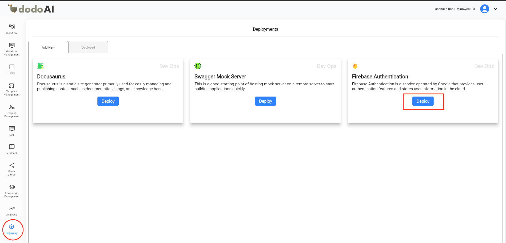
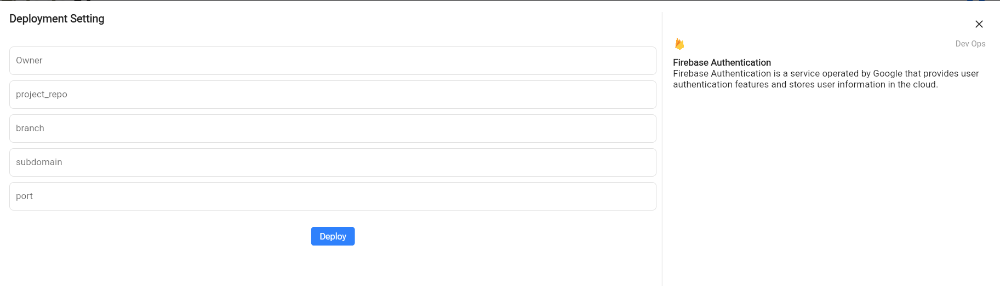
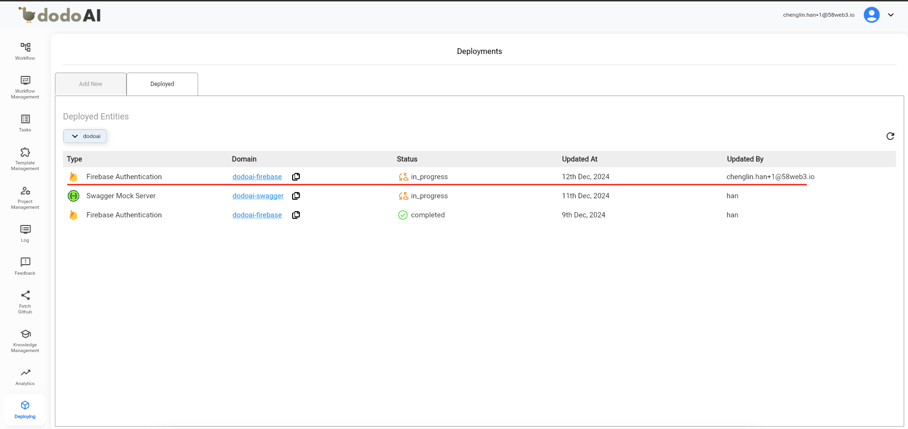

## Giới Thiệu

Để Cài Đặt Giả Lập Xác Thực Firebase Bằng Triển Khai Mẫu

## Yêu Cầu Trước Khi Sử Dụng

- Một Tài Khoản Email (Email Và Mật Khẩu) Để Đăng Ký Tài Khoản DodoAI.
- Một Tài Khoản Google Để Đăng Nhập Vào DodoAI.
- Chuẩn Bị Tài Liệu Cần Thiết Cho Mỗi Tính Năng Trước.

## Hướng Dẫn Sử Dụng

- Truy Cập Triển Khai
- Nhấp Nút Triển Khai
- Nhập Thông Tin Triển Khai Và Triển Khai

### Truy Cập Triển Khai

- Nhấp Mục Triển Khai.

### Nhấp Nút Triển Khai

- Ví Dụ Owner: `58web3`
- Ví Dụ Project Repo: `dodoai`
- Branch: `develop`
- Ví Dụ Subdomain: `dodoai-firebase`
  - URL: `https://dodoai-firebase.58llm.link`
- Port: 9696
  - Hiện Tại, Nhiều Tài Liệu Được Triển Khai Trên Cùng Một EC2, Vì Vậy Nếu Các Port 6000 Bị Trùng Lặp, Hãy Thiết Lập Các Port Khác Nhau.

### Nhập Thông Tin Triển Khai Và Triển Khai

### Cấu Hình Subdomain Trong AWS Route53 Bởi Kỹ Sư Hạ Tầng

- Tên Bản Ghi: Tên Subdomain
- Loại Bản Ghi: A
- Alias: Bật
- Loại Route: Application Và Classic Load Balancer
- Khu Vực: Châu Á Thái Bình Dương (Tokyo)
- Tên ALB: `dualstack.dodoai-dev-617494054.ap-northeast-1.elb.amazonaws.com`
- Chính Sách Route: `Simple routing`

### Truy Cập Trang

URL: `https://dodoai-firebase.58llm.link`
