## Giới Thiệu

Chào Mừng Đến Với Hướng Dẫn Sử Dụng **Quản Lý Mẫu**! Tính Năng Quản Lý Mẫu Trong DodoAI Cho Phép Người Dùng Tạo, Chỉnh Sửa, Tổ Chức, Và Triển Khai Các Mẫu Cho Nhiều Chức Năng Dựa Trên AI. Tính Năng Này Đơn Giản Hóa Quá Trình Tái Sử Dụng Các Cấu Hình Đã Thiết Lập Và Tùy Chỉnh Chức Năng Theo Nhu Cầu Dự Án.

## Tham Khảo

Để Hiểu Rõ Hơn Về Tính Năng Quản Lý Mẫu, Bạn Có Thể Tham Khảo Video Dưới Đây.

  <iframe
    src="https://drive.google.com/file/d/1TvVkX3stRM7Cjmp_GMzqZTtOb0Y9Kw3D/preview"
    style={{ position: 'absolute', top: '0', left: '0', width: '100%', height: '100%' }}
    frameBorder="0"
    allow="autoplay; encrypted-media"
    allowFullScreen
    loading="lazy"
    title="Code Review"
  ></iframe>

## Yêu Cầu Trước Khi Sử Dụng

- Một Tài Khoản Email (Email Và Mật Khẩu) Để Đăng Ký Tài Khoản DodoAI.
- Một Tài Khoản Google Để Đăng Nhập Vào DodoAI.
- Chuẩn Bị Tài Liệu Cần Thiết Cho Mỗi Tính Năng Trước.

## Hướng Dẫn Sử Dụng

- Truy Cập Quản Lý Mẫu.
- Điều Hướng Giao Diện Quản Lý Mẫu.
- Sử Dụng Bảng Điều Kiện Tìm Kiếm.
- Hiểu Danh Sách Nhiệm Vụ.
- Tương Tác Với Danh Sách Nhiệm Vụ.
- Thêm Mẫu Mới.

### Truy Cập Quản Lý Mẫu

#### 1. Mở Nền Tảng DodoAI

Hệ Thống DodoAI Có Nhiều Tính Năng, Và Quản Lý Mẫu Là Một Trong Số Đó. Người Dùng Có Thể Thấy Quản Lý Mẫu Ở Bên Trái Màn Hình.

#### 2. Chọn Chức Năng Quản Lý Mẫu

Trên Menu Điều Hướng Bên Trái, Nhấp Vào "Quản Lý Mẫu" Để Truy Cập Tính Năng Quản Lý Mẫu.

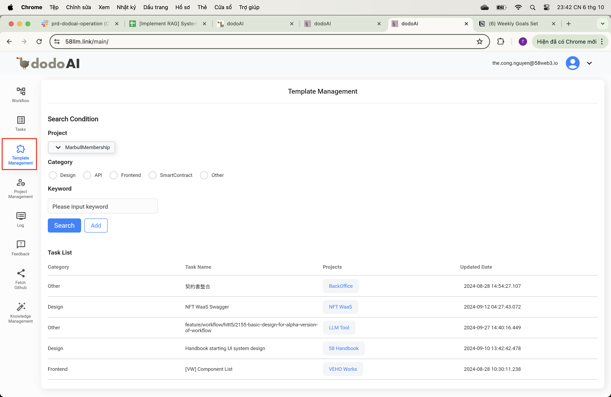

### Điều Hướng Giao Diện Quản Lý Mẫu

Khi Bạn Bước Vào Phần Quản Lý Mẫu, Bạn Sẽ Thấy Các Khu Vực Chính Sau Trên Màn Hình:

- Bảng **Điều Kiện Tìm Kiếm** Ở Đỉnh Trang.
- Phần **Danh Sách Nhiệm Vụ** Ở Giữa Trang.

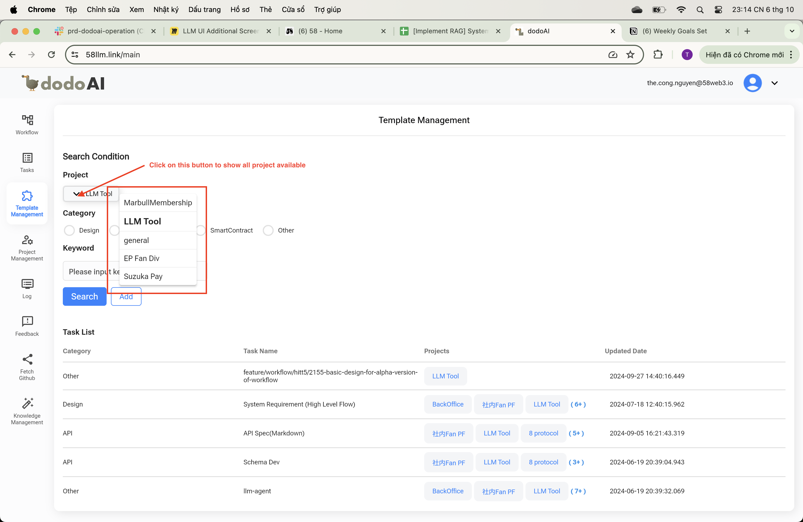

### Sử Dụng Bảng Điều Kiện Tìm Kiếm

Trong Bảng **Điều Kiện Tìm Kiếm**, Bạn Có Thể Tìm Kiếm Và Lọc Các Mẫu Dựa Trên Nhiều Tiêu Chí Khác Nhau:

- **Dự Án**: Bạn Có Thể Chọn Một Dự Án Cụ Thể Từ Menu Thả Xuống Để Lọc Các Mẫu Liên Quan Đến Dự Án Đó.

- **Danh Mục**: Lọc Các Mẫu Theo Danh Mục Như Thiết Kế, API, Frontend, SmartContract, Hoặc Khác Bằng Cách Chọn Hộp Kiểm Tương Ứng.

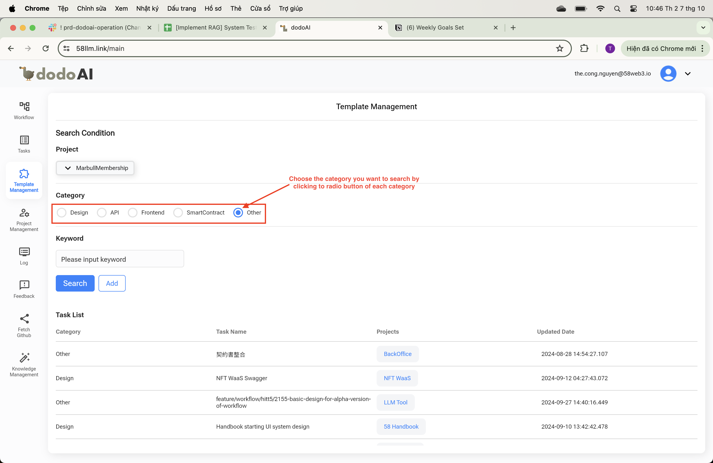

- **Từ Khóa**: Nhập Các Từ Khóa Cụ Thể Để Tìm Kiếm Các Mẫu Liên Quan Đến Các Thuật Ngữ Đó.

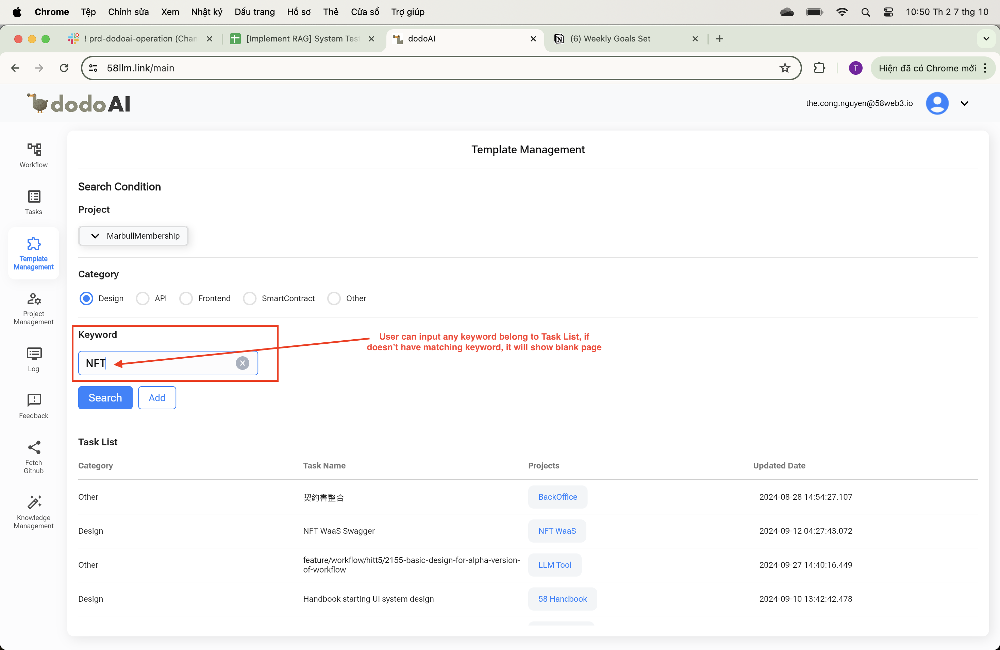

Để Thực Hiện Tìm Kiếm, Nhập Tiêu Chí Của Bạn Và Nhấp Vào Nút **Tìm Kiếm**. Để Tạo Một Nhiệm Vụ Mẫu Mới Dựa Trên Tiêu Chí Tìm Kiếm Của Bạn, Nhấp Vào Nút **Thêm**.

### Hiểu Danh Sách Nhiệm Vụ

Bên Dưới Thẻ Tìm Kiếm Là **Danh Sách Nhiệm Vụ**, Hiển Thị Tất Cả Các Nhiệm Vụ Mẫu Liên Quan Đến Tiêu Chí Tìm Kiếm Của Bạn. Danh Sách Nhiệm Vụ Chứa Các Cột Sau:

- **Danh Mục**: Cho Biết Danh Mục Của Mỗi Nhiệm Vụ.
- **Tên Nhiệm Vụ**: Tên Của Nhiệm Vụ.
- **Dự Án**: Liệt Kê Các Dự Án Liên Quan Đến Nhiệm Vụ.
- **Ngày Cập Nhật**: Hiển Thị Ngày Và Giờ Cập Nhật Gần Nhất Của Nhiệm Vụ.

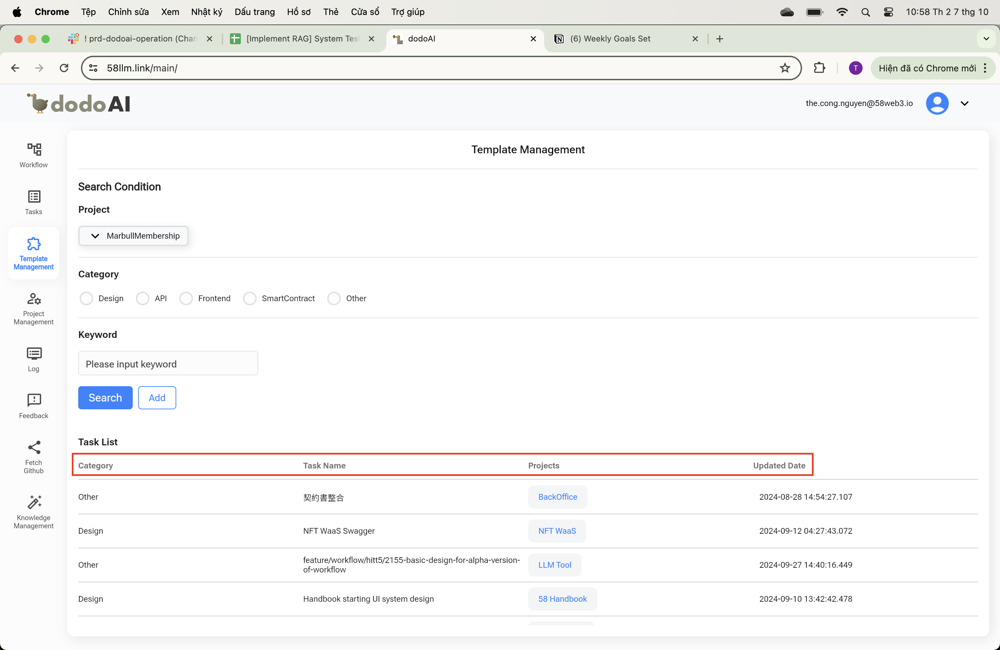

Danh Sách Nhiệm Vụ Cung Cấp Một Bảng Tóm Tắt Về Các Nhiệm Vụ Của Bạn Và Cho Phép Bạn Theo Dõi Tiến Độ Và Cập Nhật Của Chúng.

### Tương Tác Với Danh Sách Nhiệm Vụ

- Để Xem Thêm Chi Tiết Về Một Nhiệm Vụ, Bạn Có Thể Nhấp Vào Tên Nhiệm Vụ Trong Danh Sách Nhiệm Vụ.
- Bạn Có Thể Thấy Các Liên Kết Hoặc Trạng Thái Bên Cạnh Tên Dự Án, Chỉ Rõ Thêm Thông Tin Hoặc Trạng Thái Hiện Tại Của Một Nhiệm Vụ. Chúng Thường Có Thể Nhấp Vào Được Và Có Thể Dẫn Bạn Đến Các Trang Chi Tiết Hơn Trong Hệ Thống DodoAI.

### Thêm Mẫu Mới

#### 1. Truy Cập Thêm Mẫu

- Mở Bảng Điều Khiển DodoAI Của Bạn.
- Từ Thanh Bên Trái, Nhấp Vào Tab "Quản Lý Mẫu", Được Đại Diện Bằng Biểu Tượng Với Một Tờ Giấy Và Một Ngôi Sao. Điều Này Sẽ Đưa Bạn Đến Màn Hình Quản Lý Mẫu.
- Để Tạo Một Nhiệm Vụ Mẫu Mới Dựa Trên Tiêu Chí Tìm Kiếm Của Bạn, Nhấp Vào Nút **Thêm**.

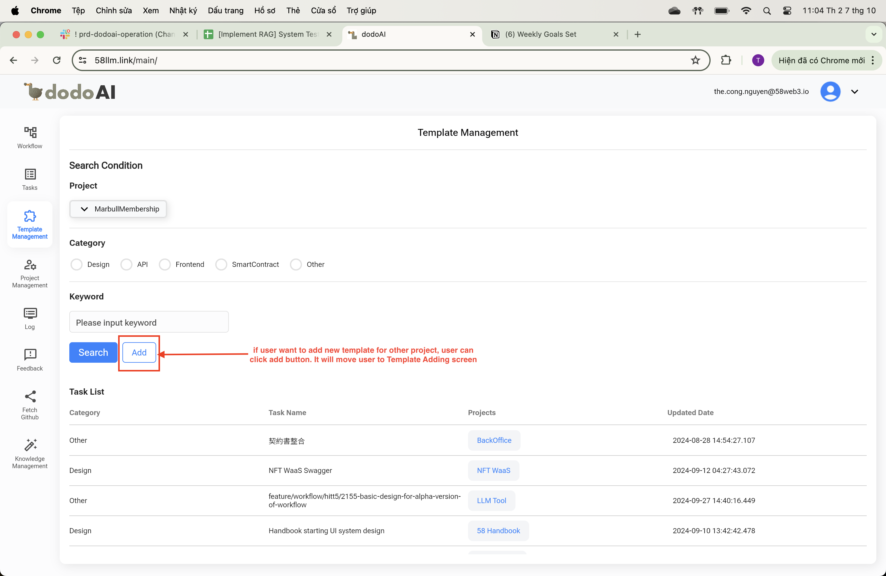

#### 2. Nhập Chi Tiết Mẫu

- **Tên Nhiệm Vụ**: Nhập Một Tên Miêu Tả Cho Nhiệm Vụ Mẫu Của Bạn Vào Trường "Tên Nhiệm Vụ" Ở Đỉnh.

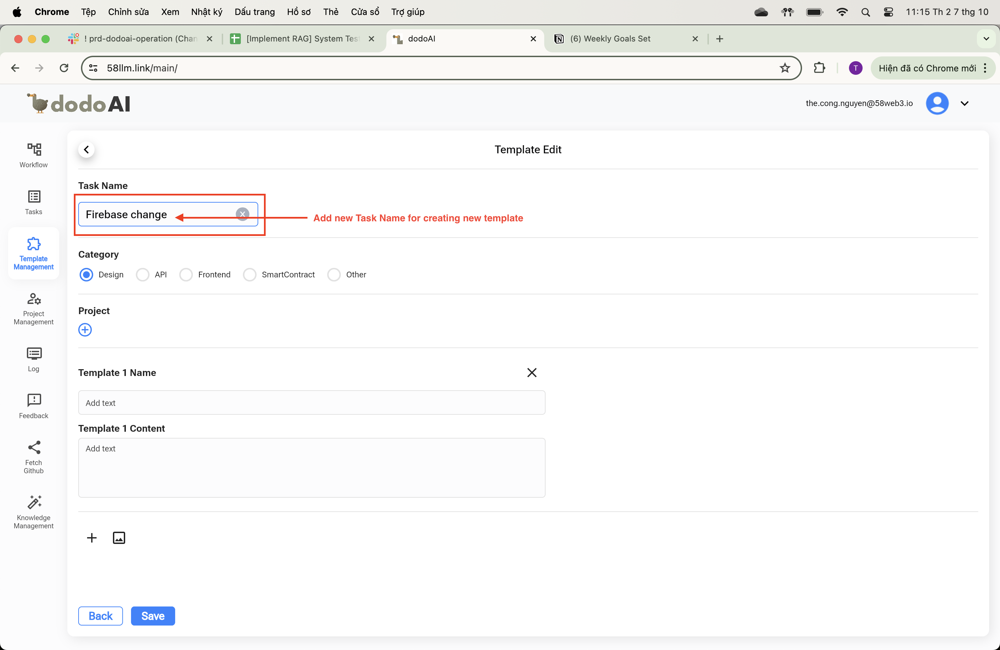

- **Danh Mục**: Chọn Một Danh Mục Cho Mẫu Của Bạn Bằng Cách Đánh Dấu Một Trong Các Hộp Có Ghi 'Thiết Kế', 'API', 'Frontend', 'SmartContract', Hoặc 'Khác' Để Giúp Phân Loại Mẫu Của Bạn.

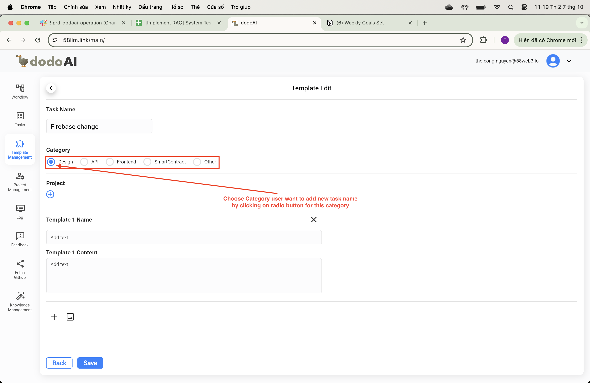

- **Dự Án**: Nếu Mẫu Của Bạn Có Liên Quan Tới Một Dự Án Cụ Thể, Bạn Có Thể Liên Kết Nó Bằng Cách Nhấp Vào Biểu Tượng "+" Bên Cạnh Nhãn 'Dự Án' Và Chọn Dự Án Phù Hợp.

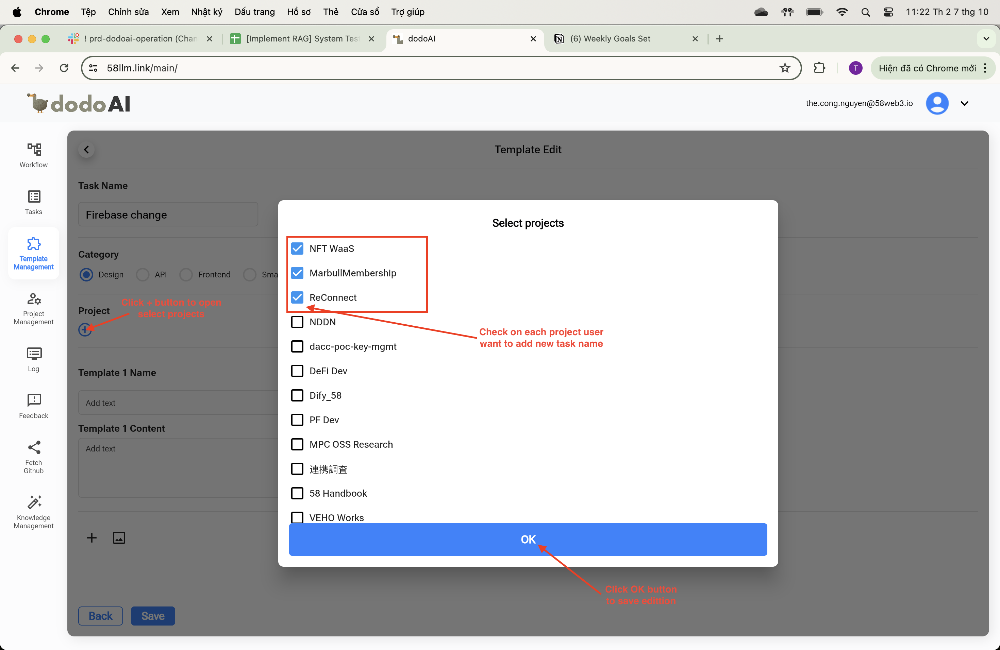

#### 3. Nhập Tên Và Nội Dung Mẫu

- **Tên Mẫu 1**: Nhập Tên Của Mẫu Riêng Lẻ Của Bạn Trong Trường "Tên Mẫu 1".
- **Nội Dung Mẫu 1**: Thêm Nội Dung Của Mẫu Của Bạn Trong Trường "Nội Dung Mẫu 1".
- Nếu Bạn Cần Thêm Nhiều Mẫu Hơn, Sử Dụng Nút "+" Ở Dưới Cùng Của Mục Để Thêm Các Trường Mẫu Mới.

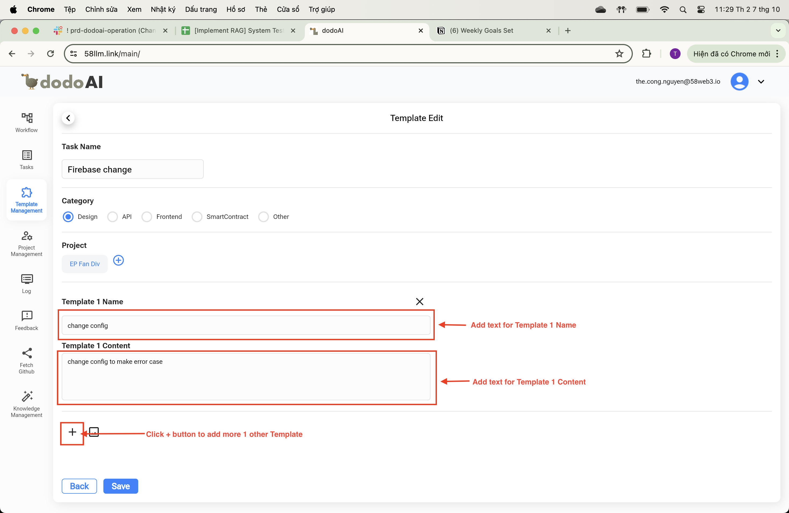

#### 4. Lưu Mẫu

- Khi Bạn Đã Điền Tất Cả Các Thông Tin Mẫu Cần Thiết, Nhấp Nút 'Lưu' Ở Góc Dưới Bên Trái Để Lưu Mẫu Mới Của Bạn.

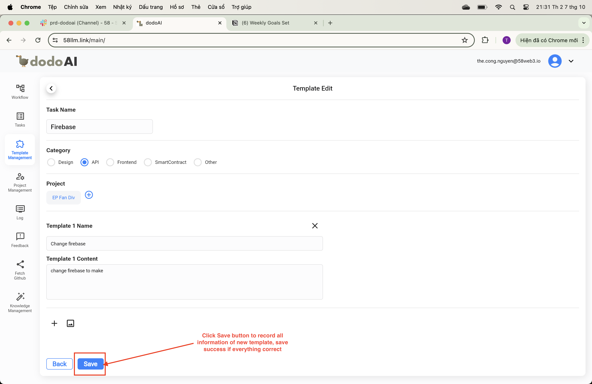

#### 5. Quay Lại Màn Hình Trước Hoặc Tiếp Tục Chỉnh Sửa

- Nếu Bạn Muốn Quay Lại Màn Hình Trước Mà Không Lưu, Nhấp Nút 'Quay Lại' Bên Cạnh 'Lưu'.

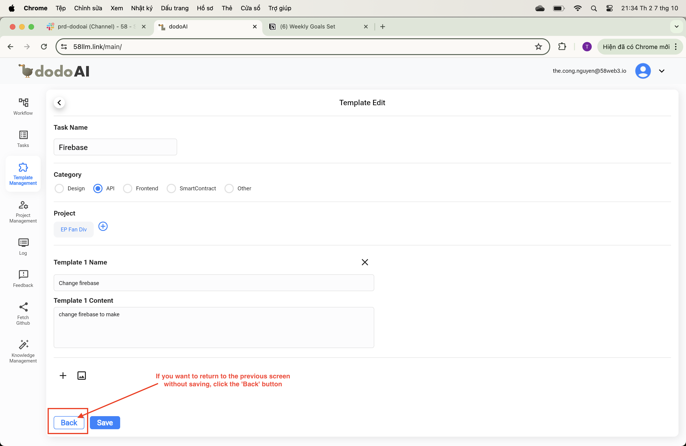

### Kết Luận

Tính Năng Quản Lý Mẫu Của DodoAI Được Thiết Kế Để Giúp Bạn Duy Trì Quy Trình Làm Việc Có Tổ Chức. Bằng Cách Sử Dụng Các Tính Năng Tìm Kiếm, Lọc, Và Xem, Bạn Có Thể Nhanh Chóng Tìm Thấy Các Mẫu Mình Cần Và Theo Dõi Tiến Trình Cũng Như Cập Nhật Của Chúng. Nếu Gặp Phải Bất Kỳ Thách Thức Nào Hoặc Cần Thêm Hỗ Trợ, Hãy Đảm Bảo Tham Khảo Tài Nguyên Hỗ Trợ Hoặc Liên Hệ Với Đội Ngũ Hỗ Trợ Cho Cài Đặt DodoAI Của Bạn.
