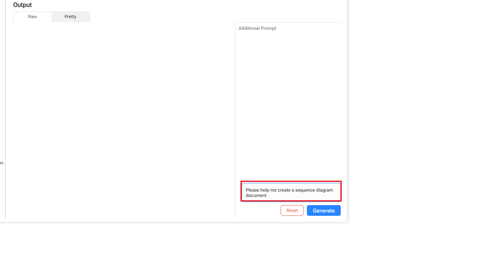
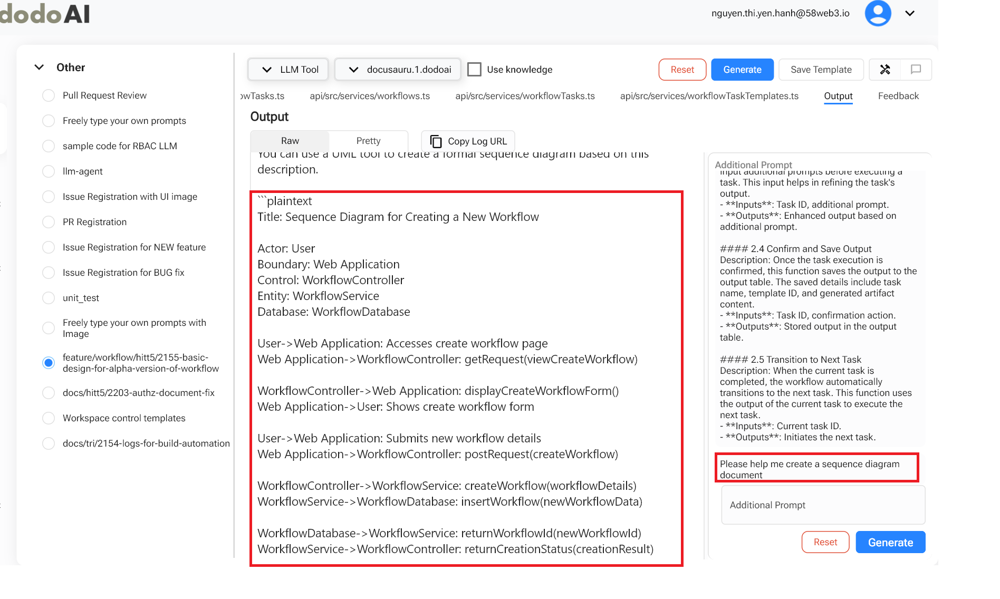
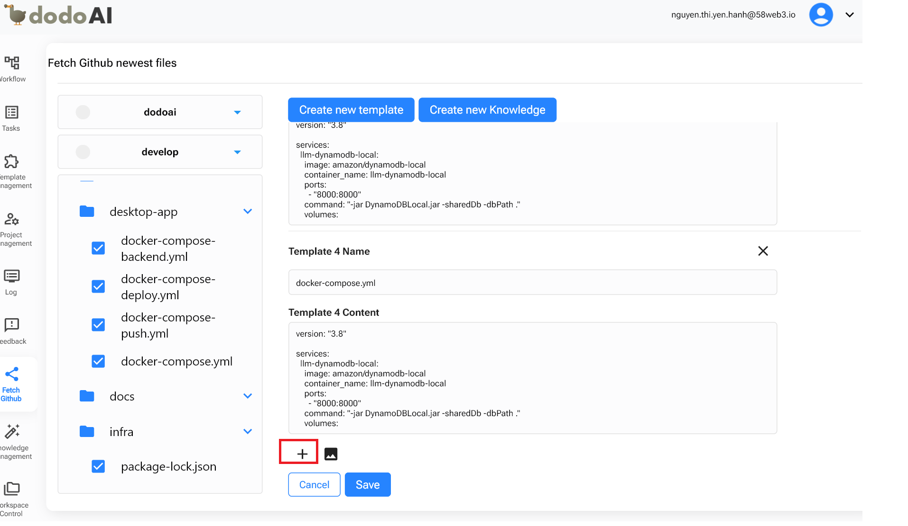
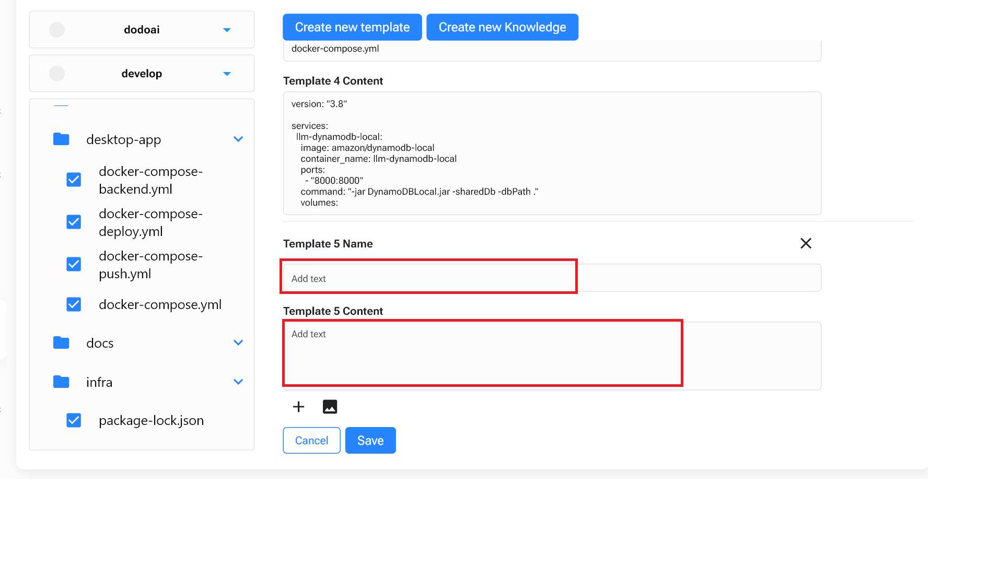
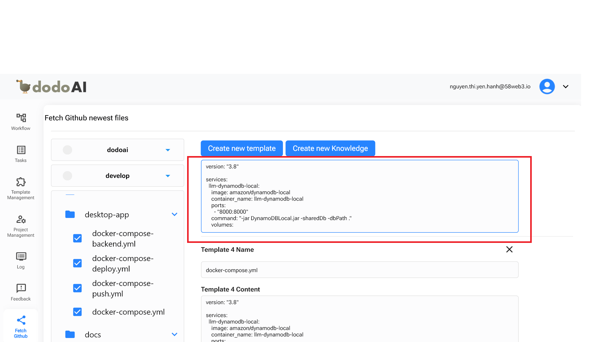

## Giới Thiệu

Fetch GitHub Là Một Tính Năng Được Thiết Kế Để Cải Thiện Hiệu Quả Và Tốc Độ Cập Nhật Tài Liệu Cũng Như Mã Nguồn Trong Một Dự Án. Bằng Cách Cho Phép Người Dùng Sửa Đổi Và Thêm Mã Cũng Như Tài Liệu Trực Tiếp, Fetch GitHub Giúp Tối Thiểu Hóa Thời Gian Cần Thiết Để Thực Hiện Thay Đổi, Đồng Thời Đảm Bảo Rằng Tất Cả Các Sửa Đổi Đều Được Phản Ánh Trên Tất Cả Các Trang Và Tài Liệu Liên Quan.

Fetch GitHub Không Chỉ Là Một Công Cụ Để Lấy Mã Và Tài Liệu; Nó Còn Là Một Phần Quan Trọng Của Quá Trình Phát Triển Phần Mềm, Hỗ Trợ Tất Cả Mọi Thứ Từ Việc Khởi Tạo Các Mẫu Tài Liệu Tới Việc Cải Thiện Và Xác Định Các Yêu Cầu Trong Dự Án.

## Cách Tạo Một Mẫu

- ***[Tạo Mẫu Trong Fetch GitHub](fetch-github.md#create-a-template-in-fetch-github)***

## Mẹo Sử Dụng Fetch GitHub

### 1. Hỗ Trợ Cho Việc Phân Tích Ngược

Giúp Người Dùng Tạo Các Mẫu Tài Liệu Và Sơ Đồ Trình Tự Từ Mã Nguồn Được Lấy, Cho Phép Hiểu Rõ Hơn Về Cấu Trúc Và Quy Trình Của Mã.

#### 1.1 Tạo Mẫu

Chọn Các Tệp Cần Thiết Để Tạo Mẫu.

#### 1.2 Hỏi DodoAI

- Để Tạo Một Sơ Đồ Trình Tự, Chúng Ta Sẽ Hướng Dẫn Tính Năng Này Bằng Cách Nhập Nội Dung 'Vui Lòng Giúp Tôi Tạo Một Tài Liệu Sơ Đồ Trình Tự' Vào Đề Xuất Thêm Rồi Tạo.

- Nội Dung Của Tài Liệu Sơ Đồ Trình Tự Được Tạo Ra.

### 2. Cải Thiện Và Sửa Lỗi

Cho Phép Người Dùng Thêm Tính Năng Và Sửa Lỗi Cho Các Chức Năng Hiện Có Bằng Cách Sử Dụng Mã Nguồn Gốc Làm Mẫu, Giúp Quản Lý Và Cập Nhật Tài Liệu Thiết Kế Dễ Dàng Hơn.

#### 2.1 Tạo Mẫu Mới

Khi Bạn Đã Chọn Tất Cả Nội Dung Cần Thiết, Tiến Hành Tạo Mẫu Bằng Cách Nhấp Vào Nút "Tạo Mẫu Mới" Ở Góc Trên Cùng Của Màn Hình.

#### 2.2 Thêm Mẫu Mới

Sau Khi Xem Xét Các Tệp Đã Chọn, Nếu Bạn Thấy Thiếu Nội Dung, Bạn Có Thể Tạo Tệp Mẫu Mới.

- Ở Dưới Cùng Của Trang, Có Dấu '+'. Nhấp Vào Đó Để Thêm Tệp Mẫu Mới.

- Nhập Tên Mẫu Và Nội Dung Mẫu. Sau Đó, Lưu Lại, Và Bạn Sẽ Thêm Được Một Tệp Mẫu Mới.

- Ngoài Ra, Bạn Có Thể Chỉnh Sửa Nội Dung Của Các Tệp Mẫu Bằng Cách Nhấp Vào Phần Bạn Muốn Chỉnh Sửa Và Sau Đó Thêm Hoặc Xóa Nội Dung.

### 3. Hỗ Trợ Cho Tham Gia Mới

Hỗ Trợ Những Người Không Phải Kỹ Sư Tiếp Cận Dễ Dàng Với Tài Liệu Và Hiểu Rõ Các Yêu Cầu Kỹ Thuật Thông Qua Việc Thiết Lập Các Mẫu Tài Liệu, Nhờ Đó Thúc Đẩy Sự Tham Gia Và Hiểu Biết Về Dự Án.

#### Bước 1. Tạo Mẫu

Chọn Dự Án, Nhánh, Và Tệp Tài Liệu, Sau Đó Tạo Mẫu (Giống Như Trong '1. Hỗ Trợ Cho Việc Phân Tích Ngược' Và '2. Cải Thiện Và Sửa Lỗi').

#### Bước 2. Hỏi DodoAI

- Sau Đó, Mở Tính Năng Nhiệm Vụ Để Chọn Danh Mục Đúng Và Tên Mẫu Vừa Tạo, Và Đầu Ra Sẽ Được Hiển Thị Tự Động.
- Để Tìm Hiểu Thêm Về Các Tính Năng Qua Tài Liệu, Bạn Có Thể Hỏi DodoAI Bằng Cách Nhập Nội Dung Vào Đề Xuất Thêm.
- Bạn Có Thể Hỏi Nhiều Lần Cho Đến Khi Hiểu Đầy Đủ Nội Dung Của Tài Liệu Hoặc Các Tính Năng.

### 4. Khuyến Khích Tương Tác Cho Kỹ Sư Mới

Cung Cấp Công Cụ Cho Kỹ Sư Mới Tải Tài Liệu Và Mã Nguồn, Đồng Thời Khuyến Khích Đặt Câu Hỏi Chi Tiết Để Làm Rõ Yêu Cầu Và Xác Minh Độ Chính Xác.

#### Bước 1. Chọn Tệp Bạn Muốn Khám Phá Sâu

- Là Một Kỹ Sư, Bạn Không Chỉ Nên Lựa Chọn Tài Liệu, Như Đã Nêu Trong '3. Hỗ Trợ Cho Tham Gia Mới', Mà Còn Bao Gồm Cả Mã Nguồn Để Hiểu Rõ Hơn Về Các Tính Năng.

#### Bước 2. Hỏi DodoAI

- Thông Qua Tính Năng Nhiệm Vụ, Bạn Có Thể Yêu Cầu Thêm Thông Tin Chi Tiết Về Nội Dung Của Các Tính Năng Qua Tài Liệu Và Mã.
