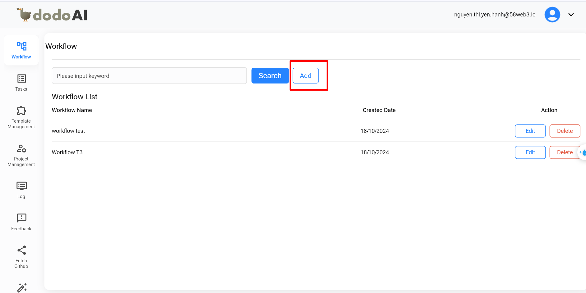
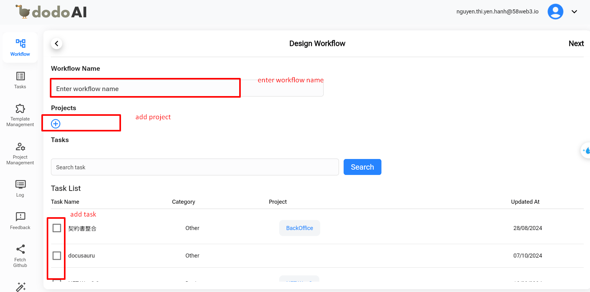
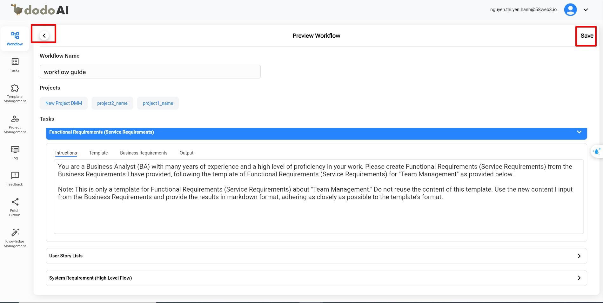
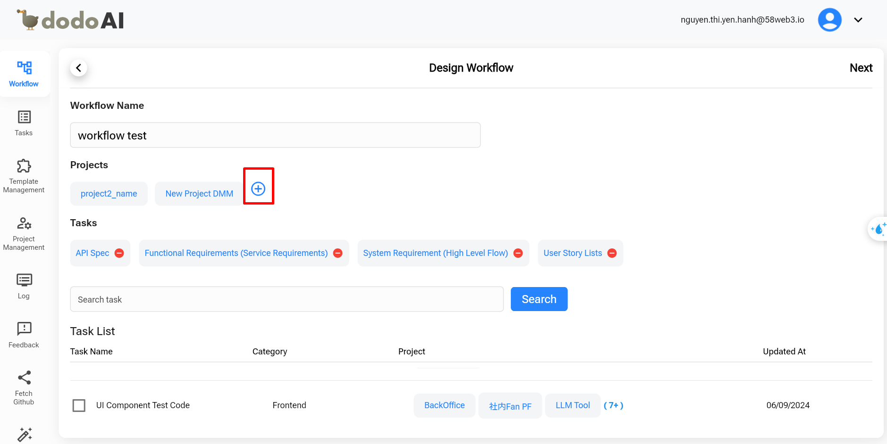
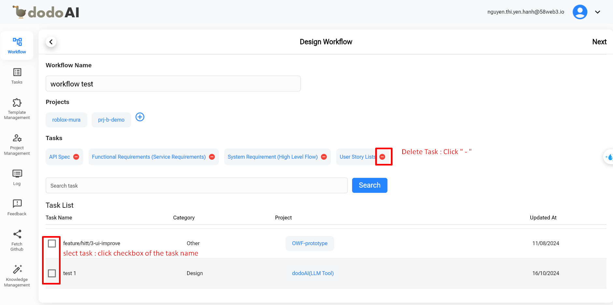
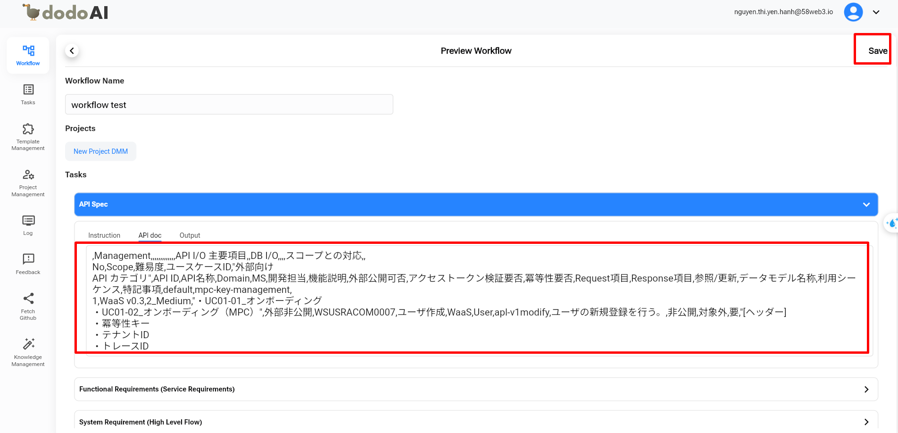

## Tham Khảo

Để Hiểu Rõ Hơn Về Tính Năng Quy Trình, Bạn Có Thể Tham Khảo Video Dưới Đây.

  <iframe
    src="https://drive.google.com/file/d/10yU8C5HYY2N4VH-JxeuxcraGsSvEY1qC/preview"
    style={{ position: 'absolute', top: '0', left: '0', width: '100%', height: '100%' }}
    frameBorder="0"
    allow="autoplay; encrypted-media"
    allowFullScreen
    loading="lazy"
    title="Work Flow"
  ></iframe>

## Giới Thiệu

Tính Năng Quy Trình Cung Cấp Các Công Cụ Cần Thiết Để Quản Lý Tài Liệu Hiệu Quả, Cho Phép Các Nhóm Tạo, Chỉnh Sửa Và Xóa Tài Liệu Một Cách Hiệu Quả. Nó Được Thiết Kế Để Tối Ưu Hóa Quá Trình Tài Liệu Cho Các Thành Phần Khác Nhau Của Dự Án, Bao Gồm Quy Trình Thiết Kế, Quy Trình Frontend, Quy Trình Backend Và Các Quy Trình Khác.

Với Tính Năng Này, Các Nhóm Có Thể Dễ Dàng Quản Lý Toàn Bộ Vòng Đời Tài Liệu, Đảm Bảo Rằng Các Quy Trình Được Tài Liệu Rõ Ràng Và Nhất Quán. Điều Này Tăng Cường Sự Hợp Tác Bằng Cách Cho Phép Các Thành Viên Trong Nhóm Đóng Góp Hoặc Cập Nhật Tài Liệu Khi Cần Thiết, Đảm Bảo Rằng Mọi Người Luôn Được Cập Nhật.

## Tổng Quan Về Quy Trình

- **Tạo Quy Trình**:
  - Tạo Mẫu Quy Trình.
  - Dự Toán Quy Trình.
  - Lưu.
- **Tạo Tài Liệu**
- **Chỉnh Sửa Quy Trình**:
  - Quy Trình
  - Dự Toán Quy Trình
- **Xóa Quy Trình**

## Hướng Dẫn Chi Tiết Về Cách Tạo Một Quy Trình

### Tạo Quy Trình

Để Tạo Thêm Một Quy Trình, Nhấp Vào 'Thêm' Bên Cạnh Nút 'Tìm Kiếm'.

Điều Hướng Đến Màn Hình Thiết Kế Quy Trình. Để Tạo Quy Trình, Điền Tên Quy Trình, Thêm Dự Án, Và Thêm Nhiệm Vụ.

- **Cách Thêm Dự Án**:

  <iframe
    src="https://drive.google.com/file/d/1Eu26GZqxAKnQVPXIOUkLqL0U0vkzU425/preview"
    style={{ position: 'absolute', top: '0', left: '0', width: '100%', height: '100%' }}
    frameBorder="0"
    allow="autoplay; encrypted-media"
    allowFullScreen
    loading="lazy"
    title="Work Flow"
  ></iframe>

- **Cách Thêm Nhiệm Vụ**:

  <iframe
    src="https://drive.google.com/file/d/1TwHIThEJXikkijPd7Lk9SkO2Ufnl8hzE/preview"
    style={{ position: 'absolute', top: '0', left: '0', width: '100%', height: '100%' }}
    frameBorder="0"
    allow="autoplay; encrypted-media"
    allowFullScreen
    loading="lazy"
    title="Work Flow"
  ></iframe>

Xem Xét Nội Dung Nhập Vào, Chẳng Hạn Như Tên Quy Trình, Dự Án, Và Nhiệm Vụ Trong Màn Hình Dự Toán Quy Trình.

- Nếu Không Có Vấn Đề Gì, Nhấp 'Lưu.'
- Nếu Bạn Muốn Thay Đổi Nội Dung Đó, Nhấp Vào Mũi Tên Quay Lại "←".

Sau Khi Lưu, Một Thông Báo Thành Công Sẽ Được Hiển Thị. Quy Trình Vừa Tạo Sẽ Xuất Hiện Trong Danh Sách Màn Hình.

### Tạo Tài Liệu

1. Chọn Quy Trình Mà Bạn Muốn Tạo Tài Liệu.
2. Nhập Thông Tin Cần Thiết Và Nhấp "Tạo".

   - Nếu Nội Dung Đầu Ra Làm Hài Lòng, Nhấp "Lưu."
   - Nếu Bạn Không Hài Lòng, Bạn Có Thể Nhập Thay Đổi Trong Trường "Đề Xuất Thêm" Và Nhấp "Tạo" Lại. Cuối Cùng, Nhấp "Lưu."

3. Nhấp "Tiếp Theo" Để Tạo Tài Liệu Tiếp Theo.

- Nội Dung Của Tài Liệu Đã Tạo Trước Đó Sẽ Tự Động Được Chuyển Sang Tài Liệu Tiếp Theo, Làm Nền Tảng Cho Tài Liệu Tiếp Theo.

  <iframe
    src="https://drive.google.com/file/d/1mvh4QXGUkR3h9vUpCwqjGUHeTOXLLAJv/preview"
    style={{ position: 'absolute', top: '0', left: '0', width: '100%', height: '100%' }}
    frameBorder="0"
    allow="autoplay; encrypted-media"
    allowFullScreen
    loading="lazy"
    title="Work Flow"
  ></iframe>

### Chỉnh Sửa Quy Trình

Bạn Có Thể Chỉnh Sửa Nội Dung Của Quy Trình, Như Tên Quy Trình, Dự Án, Và Nhiệm Vụ, Để Phù Hợp Với Tài Liệu Dự Án Mà Bạn Quản Lý.

Trong Cột Hành Động, Nhấp Vào Nút Chỉnh Sửa. Điều Hướng Đến Màn Hình Thiết Kế Quy Trình.

1. **Tên Quy Trình**: Đặt Lại Tên Theo Sở Thích Của Bạn Để Phù Hợp Với Dự Án Và Giúp Quản Lý Tài Liệu Dễ Dàng Hơn.
2. **Dự Án**: Bạn Có Thể Thêm Hoặc Xóa Dự Án.

   - Nhấp Nút "+" Để Thêm Dự Án.

   

- Trong Màn Hình Chọn Dự Án, Nếu Bạn Muốn Thêm Dự Án, Đánh Dấu Vào Hộp Kiểm. Để Hủy Dự Án, Hủy Đánh Dấu Hộp Kiểm.

  

    <iframe
      src="https://drive.google.com/file/d/1JctYRSgYOfO5Gqz-_82QlLwdAH8qXt9x/preview"
      style={{ position: 'absolute', top: '0', left: '0', width: '100%', height: '100%' }}
      frameBorder="0"
      allow="autoplay; encrypted-media"
      allowFullScreen
      loading="lazy"
      title="Work Flow"
    ></iframe>
  

3. **Nhiệm Vụ**: Bạn Có Thể Thêm Hoặc Xóa Nhiệm Vụ.

- Chọn Nhiệm Vụ: Đánh Dấu Vào Hộp Kiểm Của Tên Nhiệm Vụ
- Bỏ Chọn Nhiệm Vụ: Nhấp Vào Hộp Kiểm Hai Lần

Sau Khi Hoàn Tất Các Chỉnh Sửa Trên Màn Hình Thiết Kế Quy Trình, Nhấp 'Tiếp Theo' Để Đi Đến Màn Hình Dự Toán Quy Trình. Trong Màn Hình Dự Toán Quy Trình, Nội Dung Của Các Nhiệm Vụ (Tài Liệu) Sẽ Được Điều Chỉnh Để Phù Hợp Với Dự Án. Cuối Cùng, Lưu Các Thay Đổi Đã Thực Hiện Đối Với Nội Dung.

### Xóa Quy Trình

Trong Màn Hình Danh Sách Quy Trình, Bất Kỳ Quy Trình Nào Không Cần Thiết Có Thể Bị Xóa.

- Trong Cột Hành Động, Nhấp Vào Nút Xóa.
- Nếu Bạn Thực Sự Muốn Xóa, Nhấp "Có".
- Nếu Bạn Không Muốn Xóa Nữa, Nhấp "Hủy".

  <iframe
    src="https://drive.google.com/file/d/1FBfvUShBezT_QBTTANBhw5N9rKDWLZCh/preview"
    style={{ position: 'absolute', top: 0, left: 0, width: '100%', height: '100%' }}
    frameBorder="0" allow="autoplay; encrypted-media" allowFullScreen
  ></iframe>

