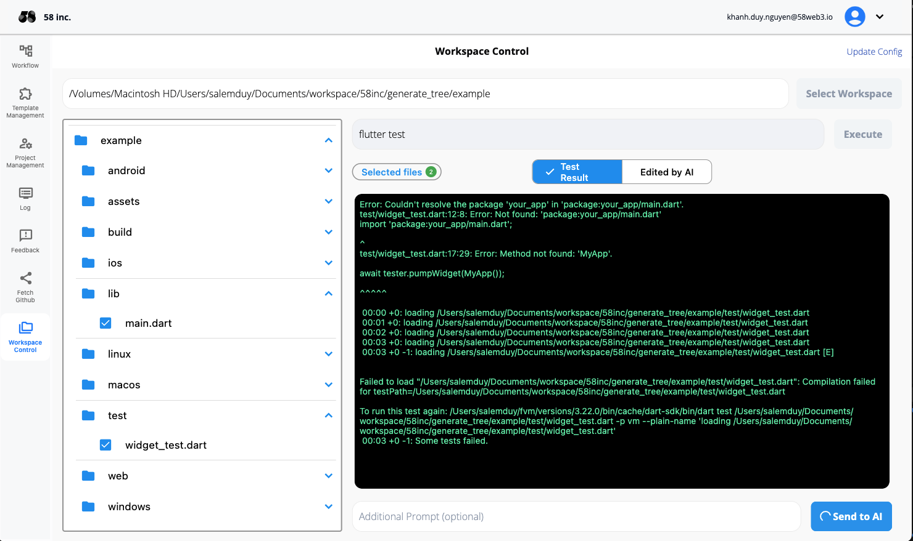
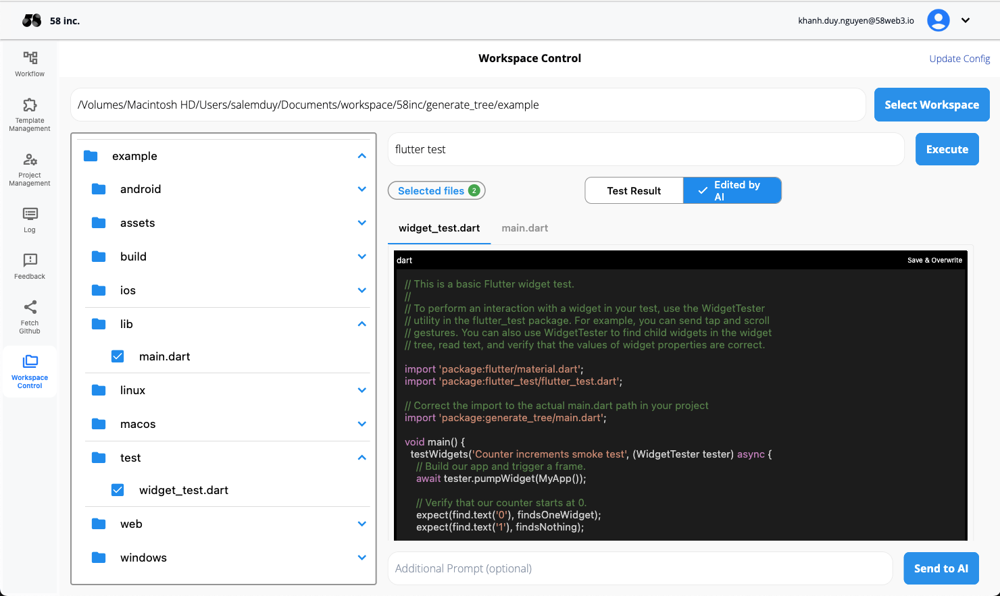
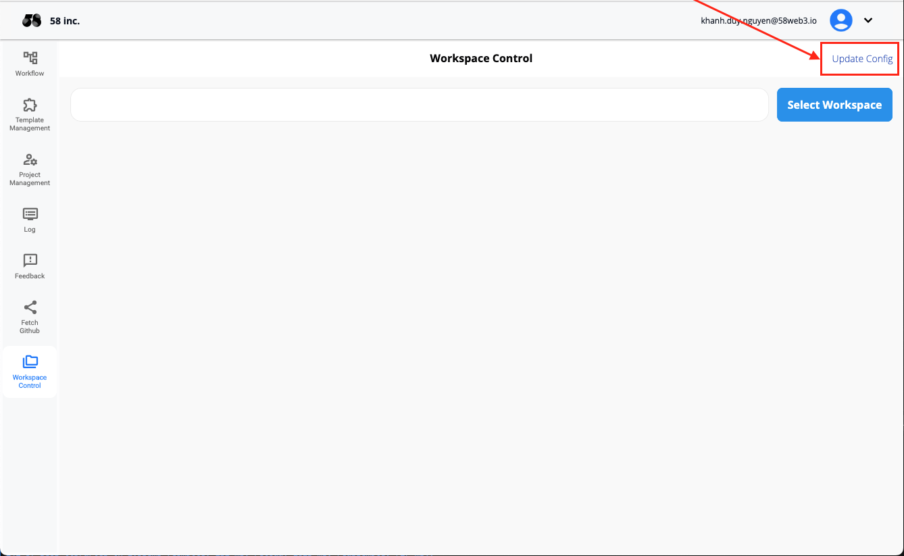

## Giới Thiệu

Chào Mừng Đến Với Hướng Dẫn Sử Dụng **Kiểm Soát Không Gian Làm Việc Đơn Vị Kiểm Thử**! Tính Năng Này Cho Phép Bạn Chạy Kiểm Thử Đơn Vị Trong Dự Án Của Mình Một Cách Dễ Dàng Và Gửi Kết Quả Kiểm Thử Cùng Nội Dung Tệp Tới AI Để Tự Động Chỉnh Sửa Nếu Có Lỗi Được Phát Hiện Trong Quá Trình Kiểm Thử.

## Tham Khảo

  <iframe
    src="https://drive.google.com/file/d/1RSIjPUUzObiGSg0hI0VXHbtFwZGIWvlg/preview"
    style={{ position: 'absolute', top: '0', left: '0', width: '100%', height: '100%' }}
    frameBorder="0"
    allow="autoplay; encrypted-media"
    allowFullScreen
    loading="lazy"
    title="Work Flow"
  ></iframe>

## Bắt Đầu

### Điều Kiện Tiên Quyết

Trước Khi Bắt Đầu Sử Dụng **Kiểm Soát Không Gian Làm Việc Đơn Vị Kiểm Thử**, Hãy Đảm Bảo Bạn Có:

- Một Dự Án Được Thiết Lập Trong Không Gian Làm Việc Của Bạn.
- Tệp Kiểm Thử Đơn Vị Được Đặt Đúng Vị Trí Trong Cấu Trúc Dự Án Của Bạn.
- [Yêu Cầu Ngôn Ngữ Lập Trình/Bộ Biên Dịch Và Phiên Bản].

### Truy Cập Kiểm Soát Không Gian Làm Việc Đơn Vị Kiểm Thử

1. Mở Ứng Dụng.
2. Nhấp Vào **Kiểm Soát Không Gian Làm Việc** Từ Menu Bên.

## Chức Năng Chính

### Chạy Kiểm Thử Đơn Vị Trong Một Dự Án

#### Mô Tả

Chức Năng Này Cho Phép Bạn Thực Thi Tất Cả Các Kiểm Thử Đơn Vị Trong Dự Án Của Bạn Để Xác Minh Sự Chính Xác Của Mã Nguồn.

#### Cách Chạy Kiểm Thử Đơn Vị

1. Nhấp Vào **Kiểm Soát Không Gian Làm Việc** Từ Menu Bên.
2. Nhấp Vào **Chọn Không Gian Làm Việc** Để Chọn Thư Mục Dự Án Của Bạn Và Chờ Để Tải Tất Cả Thư Mục Và Tệp Tin.
3. **Nhập Lệnh Kiểm Thử Dựa Trên Ngôn Ngữ Dự Án Của Bạn**: Tùy Thuộc Vào Ngôn Ngữ Lập Trình Của Dự Án, Bạn Cần Chỉ Định Lệnh Kiểm Thử Để Chạy Các Kiểm Thử Đơn Vị. Dưới Đây Là Một Số Ví Dụ:
   - **JavaScript/TypeScript (Sử Dụng Jest)**: `jest`
   - **Python (Sử Dụng Pytest)**: `pytest`
   - **Java (Sử Dụng Maven)**: `mvn test`
   - **C# (Sử Dụng NUnit)**: `dotnet test`
   - **Ruby (Sử Dụng RSpec)**: `rspec`
   - **Flutter**: `flutter test`
4. Giám Sát Tiến Trình Và Kết Quả Trong Bảng Điều Khiển **Đầu Ra Kiểm Thử**.

#### Ảnh Chụp Màn Hình

### Gửi Kết Quả Kiểm Thử Và Tệp Tới AI Để Chỉnh Sửa

#### Mô Tả

Chức Năng Này Cho Phép Bạn Gửi Kết Quả Kiểm Thử Và Nội Dung Của Các Tệp Đã Chọn Tới Hệ Thống AI, Hệ Thống Này Có Thể Tự Động Chỉnh Sửa Các Tệp Để Khắc Phục Bất Kỳ Lỗi Nào Được Phát Hiện Trong Quá Trình Kiểm Thử.

#### Cách Gửi Kết Quả Kiểm Thử Và Tệp Tới AI

1. Sau Khi Chạy Kiểm Thử, Xem Kết Quả Trong Bảng Điều Khiển **Đầu Ra Kiểm Thử**.
2. Chọn Các Kiểm Thử Chưa Thành Công Và Các Tệp Tương Ứng Mà Bạn Muốn Gửi Đến AI Để Chỉnh Sửa.
3. Nhấp **Gửi Đến AI**.
4. AI Sẽ Xử Lý Các Tệp Và Tự Động Thực Hiện Các Điều Chỉnh Cần Thiết Để Giải Quyết Các Lỗi.
5. Xem Xét Các Tệp Đã Được AI Chỉnh Sửa Và Chạy Lại Kiểm Thử Để Đảm Bảo Các Vấn Đề Đã Được Khắc Phục.

#### Ảnh Chụp Màn Hình

## Khắc Phục Sự Cố

### Vấn Đề Thường Gặp

- **Kiểm Thử Đơn Vị Không Chạy**:
  - **Giải Pháp**: Nếu Bạn Đã Cài Đặt Bất Kỳ Ngôn Ngữ Lập Trình/Bộ Biên Dịch Sau Khi Chạy Ứng Dụng `dodoAI`, Nhấp Vào Nút **Cập Nhật Cấu Hình** Để Tạo Lại Tệp Cấu Hình, Sau Đó Nhấp **Chọn Không Gian Làm Việc** Để Chọn Lại Thư Mục Không Gian Làm Việc Để Đảm Bảo Nó Hoạt Động Đúng Cách.

